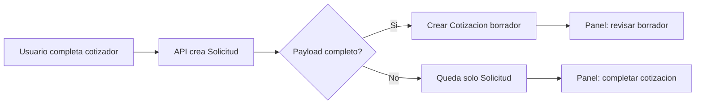
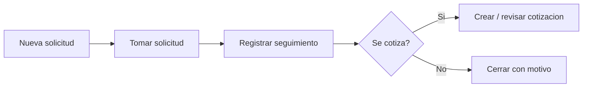
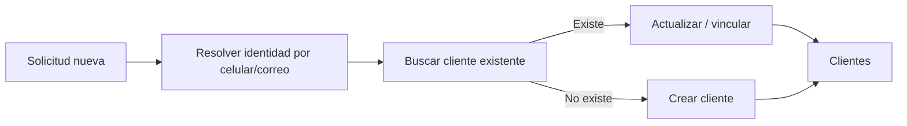
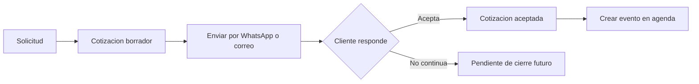
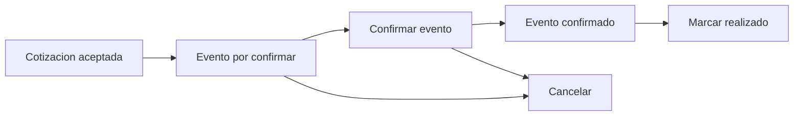

# Bosque Magico - Flujos actuales y guia de uso

**Version:** 0.3  
**Fecha:** 2026-06-04  
**Objetivo:** documentar lo implementado hasta el momento desde la optica operativa del negocio, y dejar una guia simple para el uso diario del panel.

Documentos relacionados:

- `.docs/BOSQUE_LOGICA_NEGOCIO_UX_SIMPLE.md`
- `.docs/MODULOS_ESTADO.md`

---

## 1. Panorama actual

Hoy el sistema ya cubre el flujo comercial base:

1. Un contacto entra desde la landing o se registra manualmente.
2. Se crea una **Solicitud**.
3. El equipo la toma en atencion y da seguimiento.
4. Desde la solicitud se crea o revisa una **Cotizacion**.
5. La cotizacion se envia por WhatsApp o correo.
6. Si el cliente acepta, se genera el **Evento** en **Agenda**.
7. El evento se confirma, realiza o cancela.

Adicionalmente:

- Existe modulo de **Clientes** con reconocimiento por identidad.
- El panel usa **acciones inline al final de la tabla**.
- El detalle operativo se abre en **modal amplio**, para gestionar sin salir del listado.
- Los listados principales conservan contexto con detalle por query string, por ejemplo `?detalle=<id>`.
- Las rutas directas de detalle redirigen al listado con el modal abierto.

---

## 2. Modulos disponibles

### 2.1 Solicitudes (módulo de leads)

Resuelve la **entrada comercial inicial**: es el equivalente operativo al módulo de **leads** de un CRM clásico. Cada fila es un contacto interesado en una fiesta (landing, manual, etc.) antes de que el negocio quede cerrado en agenda.

No confundir con **Clientes**: ese módulo agrupa por identidad (celular/correo) el historial de solicitudes y cotizaciones; no sustituye a Solicitudes, lo complementa.

**Campo visible:** **Estado** (en API/JSON y columnas de BD el atributo sigue siendo `etapa`; solo cambió la etiqueta en panel).

**Tablas BD:** sin prefijo `bosque_magico_` (`solicitudes`, `cotizaciones`, `clientes`, etc.).

Capacidades actuales:

- Listar, buscar y filtrar solicitudes.
- Abrir detalle en modal.
- Tomar solicitud.
- Registrar seguimiento.
- Cerrar solicitud con motivo.
- Detectar posible duplicado desde landing.
- Generar borrador de cotizacion cuando el payload de landing lo permite.
- Crear cotizacion manual o revisar cotizacion vinculada.
- Editar borrador de cotizacion cuando ya existe.
- Ver bitacora de auditoria.

### 2.2 Clientes

Resuelve la vista consolidada por persona o identidad de contacto.

Capacidades actuales:

- Listar clientes.
- Buscar por nombre, celular o correo.
- Ver frecuencia de solicitudes.
- Ver actividad reciente en 24h.
- Abrir detalle en modal.
- Contactar por WhatsApp y correo.
- Copiar enlace del cliente.
- Ver historial de solicitudes por identidad.
- Ver cotizaciones asociadas.
- Mantener el contexto del listado mientras se consulta la ficha.
- Ruta directa `/clientes/:id` redirigida al listado con `?detalle=<id>`.

### 2.3 Cotizaciones

Resuelve la preparacion y seguimiento de propuestas.

Capacidades actuales:

- Listar cotizaciones.
- Filtrar por estado.
- Abrir detalle en modal.
- Crear cotizacion manual.
- Editar borradores existentes.
- Enviar por WhatsApp.
- Enviar por correo.
- Copiar link publico.
- Aceptar cotizacion desde panel.
- Ver bitacora.
- Rutas auxiliares para redirigir formularios y detalle:
  - `/cotizaciones/nueva`
  - `/cotizaciones/:id`
  - `/cotizaciones/:id/editar`

### 2.4 Agenda

Resuelve la operacion de eventos.

Capacidades actuales:

- Vista lista y vista calendario.
- Filtrar por estado.
- Abrir detalle en modal.
- Confirmar evento.
- Marcar realizado.
- Cancelar evento.
- Mantener el contexto del calendario o de la lista mientras se gestiona el evento.

### 2.5 Configuracion

Resuelve reglas de negocio y catalogo.

Capacidades actuales:

- Configuracion general.
- Catalogo de productos.
- Tarifas y parametros operativos.

### 2.6 Usuarios

Resuelve acceso y administracion interna.

Capacidades actuales:

- Listar usuarios.
- Crear o editar usuarios.
- Restringido a admin.

---

## 3. Flujos operativos actuales

## 3.1 Flujo de captacion desde landing

Que ocurre hoy:

- La landing registra la solicitud publica.
- Se evalua identidad por **celular + correo**.
- Si existe una solicitud reciente, se marca como posible duplicado.
- Si el cotizador trae datos suficientes, se genera un borrador automatico.
- La solicitud queda visible en panel para seguimiento.

### Valor operativo

- El equipo no pierde leads.
- El sistema reconoce contactos repetidos.
- Se acelera la respuesta comercial cuando la landing ya trae suficiente informacion.

---

## 3.2 Flujo de gestion comercial de solicitudes

Que hace el usuario en panel:

- Entra a `Solicitudes`.
- Filtra por estado, busca por nombre, celular o correo.
- Usa las acciones inline del final de la fila.
- Puede abrir el detalle desde el nombre del contacto o desde el icono de ver.
- Abre el detalle en modal para ver:
  - datos de contacto
  - canal
  - payload de landing
  - bitacora
  - seguimiento
  - acciones de cierre o cotizacion

### Estados visibles (solicitud)

- `Nueva`
- `En atencion`
- `Cotizada`
- `Cerrada`

---

## 3.3 Flujo de clientes y reconocimiento de identidad

Que resuelve este flujo:

- Evita tratar al mismo contacto como personas separadas.
- Consolida solicitudes por identidad.
- Muestra recurrencia y actividad reciente.

Regla implementada:

- La identidad comercial se reconoce por **celular o correo**.
- La alerta de duplicado reciente usa la ventana de **24h**.

En el panel de clientes hoy se puede:

- abrir ficha en modal
- ver cuantas solicitudes tiene
- ver la primera y ultima solicitud
- ver solicitudes historicas relacionadas
- abrir contacto por WhatsApp o correo
- copiar enlace del registro
- mantener el detalle abierto sin salir del listado

---

## 3.4 Flujo de cotizacion

Que hace el usuario en panel:

- Revisa la cotizacion desde el listado o desde una solicitud.
- Abre detalle en modal.
- Verifica montos, paquete, items y total.
- Si la cotizacion esta en borrador, puede pasar a edicion completa.
- Copia link publico.
- Envia por WhatsApp o correo.
- Marca aceptada desde panel cuando corresponde.

Comportamiento actual de navegacion:

- `Ver cotizacion` abre el modal sobre el listado.
- `Editar borrador` lleva al flujo de edicion completa.
- Las rutas directas de detalle redirigen a `cotizaciones?detalle=<id>`.

### Estados visibles (cotización)

- `Borrador`
- `Enviada`
- `Aceptada`
- `Cerrada`

---

## 3.5 Flujo de agenda / evento

Que hace el usuario en panel:

- Entra a `Agenda`.
- Usa vista lista o calendario.
- Abre el detalle en modal.
- Confirma, realiza o cancela.

### Estados visibles (evento)

- `Por confirmar`
- `Confirmado`
- `Realizado`
- `Cancelado`

---

## 4. Patron UX vigente del panel

Para mantener consistencia, hoy el panel sigue estas reglas:

### 4.1 Alta y edición en modal

Cualquier **nuevo registro** o **edición de datos** debe usar el componente **`Modal`** compartido (no páginas de formulario sueltas ni SweetAlert2 para formularios largos).

Ejemplos: `NuevaSolicitudModal`, `CerrarSolicitudModal`, `ProductoFormModal`, formularios de usuario en modal.

Excepción temporal: edición amplia de cotización en borrador puede estar en ruta dedicada hasta migrarla a modal.

### 4.2 Detalle en modal

El detalle operativo debe abrirse en modal cuando el usuario necesita:

- consultar informacion
- ejecutar acciones frecuentes
- mantener contexto del listado
- resolver la mayor parte del trabajo sin navegar a otra pantalla

Ya esta aplicado en:

- Solicitudes
- Clientes
- Cotizaciones
- Agenda

Patron tecnico usado:

- componente compartido `DetalleModal`
- apertura desde nombre, codigo o accion de ver
- cierre sin perder filtros del listado
- soporte de apertura por query string `?detalle=id` en listados principales
- rutas directas que redirigen al listado con el modal abierto cuando aplica

### 4.3 Acciones al final de la tabla

Las acciones rapidas deben mostrarse directamente al final de cada fila cuando haya espacio.

Patron usado:

- WhatsApp
- Correo
- Copiar enlace o referencia
- Ver detalle
- Acciones especificas del modulo

Objetivo del patron:

- reducir menus escondidos cuando hay espacio disponible
- hacer mas rapido el trabajo repetitivo
- mantener consistencia visual entre modulos

### 4.3 Uso de WhatsApp

Se usa el logo visual de WhatsApp y un modal previo para revisar el mensaje antes de abrir `wa.me`.

---

## 5. Guia paso a paso de uso

## 5.1 Flujo diario recomendado para ventas

### Paso 1. Revisar solicitudes nuevas

1. Ir a `Solicitudes`.
2. Filtrar por estado `Nueva`.
3. Abrir el detalle en modal del contacto, haciendo clic en el nombre o en el icono de ver.
4. Revisar canal, fecha tentativa, turno, ninos y notas.
5. Si aplica, usar WhatsApp o correo desde la fila o desde el modal.

### Paso 2. Tomar la solicitud

1. En la fila o en el modal, usar `Tomar solicitud`.
2. Confirmar que la solicitud pase a `En atencion`.
3. Registrar notas de seguimiento si ya hubo contacto.

### Paso 3. Revisar si ya existe cotizacion

1. Si la solicitud vino completa desde landing, puede tener borrador automatico.
2. Si existe, usar `Ver cotizacion` o `Editar borrador`, segun el estado de la cotizacion.
3. Si no existe, usar `Crear cotizacion` o `Completar cotizacion`.

### Paso 4. Preparar y enviar la cotizacion

1. Abrir el detalle de la cotizacion.
2. Verificar paquete, cantidad de ninos, items y total.
3. Si esta en borrador y requiere cambios amplios, usar `Editar borrador`.
4. Copiar el link publico si hace falta compartirlo manualmente.
5. Enviar por WhatsApp o correo.

### Paso 5. Gestionar la respuesta del cliente

1. Si el cliente sigue interesado, mantener la solicitud visible para seguimiento.
2. Si acepta, marcar la cotizacion como aceptada.
3. Si no continua, cerrar solicitud con motivo.

### Paso 6. Revisar agenda

1. Ir a `Agenda`.
2. Buscar el evento generado.
3. Abrir el detalle en modal del evento.
4. Confirmar o cancelar segun corresponda.
5. Cuando termine la fiesta, marcar `Realizado`.

---

## 5.2 Uso del modulo Clientes

### Cuando usarlo

Usar `Clientes` cuando el objetivo sea entender el historial del contacto, no solo la solicitud puntual.

### Pasos

1. Ir a `Clientes`.
2. Buscar por nombre, celular o correo.
3. Abrir el detalle en modal.
4. Revisar:
   - total de solicitudes
   - primera y ultima solicitud
   - historial de solicitudes
   - cotizaciones asociadas
5. Contactar por WhatsApp o correo desde la fila.

### Caso practico

Si un cliente vuelve a escribir:

1. Buscarlo en `Clientes`.
2. Ver si ya cotizo antes.
3. Revisar si tiene actividad reciente.
4. Retomar la conversacion con mas contexto.

---

## 5.3 Uso de modales de detalle

### Regla operativa

Si el usuario esta trabajando desde un listado, debe intentar resolver primero desde el modal.

Esto aplica especialmente en:

- `Solicitudes`
- `Clientes`
- `Cotizaciones`
- `Agenda`

### Esto permite

- no perder el contexto
- trabajar mas rapido
- reducir navegacion innecesaria
- mantener un patron consistente entre modulos

### Excepcion

Solo deben ir a pantalla completa los flujos que realmente necesitan mas espacio o edicion extendida, por ejemplo:

- nueva cotizacion
- editar borrador de cotizacion
- configuraciones amplias
- formularios administrativos mas largos

### Apertura por URL

En algunos modulos el detalle puede abrirse manteniendo el listado debajo mediante query string:

- `clientes?detalle=<id>`
- `cotizaciones?detalle=<id>`

Esto permite compartir contexto sin perder filtros ni flujo de trabajo.

Ademas:

- `/clientes/:id` redirige al listado con detalle abierto
- `/cotizaciones/:id` redirige al listado con detalle abierto
- `/cotizaciones/:id/editar` entra al flujo de edicion completa

---

## 6. Limitaciones actuales y siguientes mejoras naturales

Lo que ya esta resuelto:

- flujo base comercial completo
- clientes con identidad
- detalle en modal
- acciones inline
- envio por WhatsApp y correo
- apertura de detalle manteniendo contexto de listado
- edicion de borrador desde solicitudes y cotizaciones
- API levantada con rutas publicas, panel y Swagger operativos en entorno local

Lo que todavia puede crecer despues:

- cierre formal de cotizacion con motivo
- edicion mas profunda del cliente dentro del modal o formulario dedicado desde panel
- dashboard con KPIs comerciales
- integracion Meta Lead Ads
- reportes y exportaciones

---

## 7. Recomendacion de uso para el equipo

Orden sugerido para el trabajo diario:

1. `Solicitudes` para priorizar lo nuevo.
2. `Cotizaciones` para enviar y hacer seguimiento.
3. `Agenda` para ejecutar lo vendido.
4. `Clientes` para contexto historico y recompra.

En resumen:

- **Solicitudes** = entrada y seguimiento
- **Cotizaciones** = propuesta comercial
- **Agenda** = operacion del evento
- **Clientes** = memoria comercial del contacto

