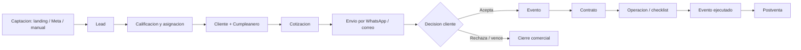
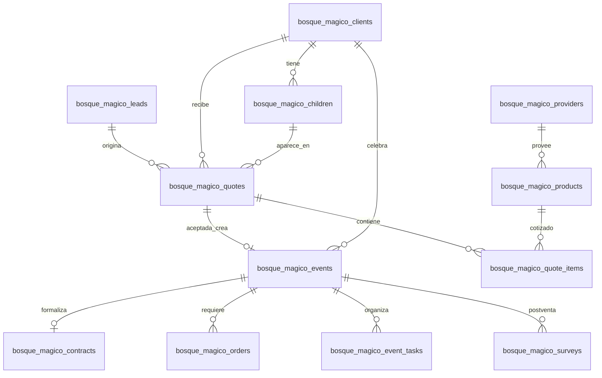

# Bosque Magico - Logica de Negocio y Modelo de Datos

**Version:** 0.1  
**Fecha:** 2026-06-03  
**Enfoque:** planificacion funcional y de datos con vision **gentle-ai** para el modulo Bosque Magico dentro del panel Refugio.  
**Fuentes consideradas:** `.docs/BOSQUE_PLAN.md`, `.docs/PROPUESTA.md`, `.docs/BOSQUE_COMMANDS.md` y prototipo `CRM Fiestas Infantiles prototipo` (`crm fiestas.html`, `database/schema.sql`, `crm/index.php`, `quote.php`, `includes/helpers.php`).

---

## 1. Proposito del documento

Este documento define, antes de implementar, la logica de negocio objetivo y el modelo de datos especifico para Bosque Magico. La intencion no es copiar el CRM PHP como una pantalla unica, sino transformar su conocimiento operativo en un modulo ordenado, trazable y mantenible dentro de Refugio.

Decisiones base ya asumidas:

- El dominio Bosque Magico usa tablas propias con prefijo `bosque_magico_*`.
- No se mezclan datos con `comercial_*`.
- El panel vive bajo la ruta `/bosque-magico`.
- Los permisos dedicados son `bosque_magico:view` y `bosque_magico:manage` como base.
- `bosque_magico_config` centraliza parametros de negocio no secretos.
- Los pagos quedan fuera del primer alcance; se documentan solo como futuro.
- La landing y Meta Lead Ads ingresan al mismo embudo comercial, pero con canales y trazabilidad separados.

---

## 2. Vision gentle-ai aplicada al negocio

En este proyecto, **gentle-ai** se interpreta como una arquitectura que ayuda al equipo sin ocultar decisiones, sin forzar automatismos opacos y sin romper el flujo humano de venta. El sistema debe asistir, sugerir, validar y dejar rastro, pero el cierre comercial sigue bajo control del equipo.

Principios funcionales:

- **Humano en control:** la IA o automatizacion puede sugerir prioridad, proximo paso, resumen o alerta, pero no confirma eventos, contratos ni cambios criticos sin accion del usuario autorizado.
- **Trazabilidad completa:** cada ingreso, cambio de estado, envio, aceptacion y origen comercial debe quedar consultable.
- **Submodulos por caso de uso:** leads, configuracion, clientes, cotizaciones, eventos, catalogo, contratos, operaciones y postventa se modelan como piezas separadas.
- **Reglas centralizadas:** tarifas, limites de ninos, turnos y montos base se leen desde configuracion o servicios de negocio, no desde valores duplicados en UI.
- **Datos explicables:** los totales calculados guardan base, adicionales y total final para auditoria.
- **Integraciones suaves:** landing, Meta, WhatsApp y correo alimentan el flujo sin convertirse en dependencias duras para operar manualmente.
- **Crecimiento por fases:** primero captacion y control; luego cotizacion/evento; despues contratos, operaciones y postventa.

---

## 3. Mapa de actores

| Actor | Rol en el negocio | Acciones principales |
|---|---|---|
| Cliente / apoderado | Persona interesada en una fiesta infantil | Cotiza desde landing, responde contacto, acepta/rechaza cotizacion, recibe contrato |
| Vendedor | Gestion comercial diaria | Crea o califica leads, arma cotizaciones, da seguimiento, cambia estados |
| Administrador | Responsable de configuracion y control | Gestiona permisos, catalogo, tarifas, vendedores, reportes |
| Operaciones | Equipo que prepara el evento | Revisa evento confirmado, checklist, pedidos, proveedores y estado operativo |
| Proveedor | Entrega shows, catering o extras | Recibe solicitudes internas, confirma disponibilidad/costo |
| Landing Bosque Magico | Canal publico de cotizacion | Captura datos y envia solicitud al backend |
| Meta Lead Ads | Canal automatico de captacion | Notifica `leadgen_id`, el backend consulta Graph API y crea lead |
| Sistema Refugio | Plataforma central | Autenticacion, permisos, API, persistencia y panel |

---

## 4. Ciclo de vida del negocio

Flujo principal:



Regla importante: una solicitud puede iniciar como lead sin datos completos. El sistema debe permitir completar progresivamente cliente, cumpleanero, fecha, turno, paquete, show, catering, contrato y postventa.

---

## 5. Casos de uso considerados

### 5.1 Configurar parametros de negocio

**Actor principal:** administrador.  
**Objetivo:** mantener tarifas, limites y textos operativos sin redeploy.

Flujo:

1. El administrador abre `/bosque-magico/config`.
2. Consulta claves activas de `bosque_magico_config`.
3. Modifica valores permitidos segun permiso `bosque_magico:manage`.
4. El sistema valida tipo de dato, rango y formato JSON.
5. Las reglas de calculo usan esos valores en siguientes cotizaciones/eventos.

Reglas:

- No guardar secretos en esta tabla.
- Tokens Meta, SMTP, APIs y credenciales van en variables de entorno o secret manager.
- Las claves iniciales recomendadas son:
  - `pricing.weekday_base_rate = 380`
  - `pricing.weekend_base_rate = 580`
  - `pricing.extra_child_rate = 25`
  - `children.base_min = 10`
  - `children.base_max = 25`
  - `children.extra_max = 35`
  - `contract.advance_amount = 500`
  - `contract.warranty_amount = 500`
  - `shifts.turno_1`, `shifts.turno_2`, `shifts.turno_3`

### 5.2 Capturar solicitud desde landing

**Actor principal:** cliente.  
**Canal:** landing Astro / formulario publico.

Datos capturados:

- Nombre del cliente.
- Celular.
- Correo.
- Nombre del cumpleanero.
- Edad.
- Fecha del evento.
- Turno.
- Cantidad de ninos.
- Tematica.
- Paquete.
- Show.
- Catering.
- Extras / observaciones.
- Totales mostrados en UI, solo como referencia.

Flujo:

1. Cliente completa formulario.
2. Landing envia payload al endpoint publico del backend.
3. Backend valida campos, rangos, fecha y formato.
4. Backend recalcula totales; no confia en el total enviado por el navegador.
5. Se crea `bosque_magico_leads` con canal `landing`.
6. Si hay datos suficientes, se puede crear una `quote_request_payload` o cotizacion en borrador segun fase.
7. El lead queda visible en panel para seguimiento.

Reglas:

- Endpoint publico sin JWT de panel, pero con rate limit, honeypot/captcha si aplica y limite de tamano.
- El celular o correo se usa para detectar duplicados.
- La disponibilidad de fecha/turno se muestra como tentativa hasta que exista evento confirmado.

### 5.3 Ingestar lead desde Meta Lead Ads

**Actor principal:** Meta.  
**Actor secundario:** vendedor.

Flujo:

1. Meta verifica webhook con `hub.verify_token`.
2. Meta envia evento `leadgen` con `leadgen_id`.
3. Backend consulta Graph API con token seguro desde env.
4. Se mapean campos: nombre, telefono, correo, fecha, ninos, turno si existen.
5. Se crea lead con canal `meta_lead_ads`.
6. Se registra auditoria en `bosque_magico_meta_lead_logs`.
7. Si el `leadgen_id` ya existe, se marca duplicado y no se crea otro lead.

Reglas:

- `leadgen_id` es idempotente.
- Guardar payload crudo y payload Graph para depuracion.
- Si faltan datos minimos, crear lead con nombre fallback y nota explicativa.

### 5.4 Crear lead manual

**Actor principal:** vendedor.

Flujo:

1. Vendedor abre submodulo Leads.
2. Registra contacto que llego por WhatsApp, referido, llamada, visita o redes.
3. Asigna canal, origen, fecha tentativa, turno y cantidad aproximada de ninos.
4. Define estado inicial.
5. Guarda notas comerciales.

Reglas:

- Nombre y telefono son minimos recomendados.
- Si el vendedor no se especifica, el lead puede quedar `Por asignar`.
- Canal y origen deben separarse: canal agrupado para reporte, detalle libre para campana/anuncio/referido.

### 5.5 Asignar y calificar lead

**Actor principal:** vendedor o administrador.

Flujo:

1. El equipo revisa leads nuevos.
2. Asigna vendedor responsable.
3. Contacta al cliente.
4. Actualiza estado y notas.
5. Si hay interes, avanza a cliente/cumpleanero y cotizacion.
6. Si no hay interes, marca perdido con motivo.

Estados del lead:

- `Nuevo`
- `Por asignar`
- `Asignado`
- `Contactado`
- `Interesado`
- `Cotizacion enviada`
- `Seguimiento`
- `Convertido`
- `Perdido`

Reglas:

- `Convertido` requiere vinculo con cliente o cotizacion/evento.
- `Perdido` debe tener motivo o nota.
- Cambios de estado relevantes deben quedar auditables.

### 5.6 Convertir lead en cliente y cumpleanero

**Actor principal:** vendedor.

Flujo:

1. Desde el lead, el vendedor crea o vincula cliente.
2. Si corresponde, registra cumpleanero.
3. Se heredan datos: nombre, telefono, correo, fecha tentativa, ninos, tematica.
4. El lead queda asociado al cliente.

Reglas:

- Un cliente puede tener varios cumpleaneros.
- Un cumpleanero pertenece a un cliente.
- Un cliente puede tener varios eventos historicos.
- La deduplicacion debe priorizar telefono y correo.

### 5.7 Crear cotizacion

**Actor principal:** vendedor.

Flujo:

1. Vendedor selecciona cliente y, opcionalmente, lead/cumpleanero.
2. Ingresa fecha, turno, cantidad de ninos, paquete, tematica.
3. Selecciona show, catering y extras si aplica.
4. Backend calcula base, adicionales y total.
5. Se genera `quote_code` y `public_token`.
6. La cotizacion inicia en `Borrador`.

Reglas:

- Codigo sugerido:
  - Con lead: `COT-L00001`.
  - Sin lead: `COT-00001`.
- `public_token` debe ser unico, no secuencial y apto para URL publica.
- El total guardado debe descomponerse en base, ninos extra e items adicionales.
- La cotizacion puede tener destinatario diferente al cliente registrado.

### 5.8 Calcular precios

**Actor principal:** sistema.

Formula base del prototipo:

```text
base = S/ 380 si fecha es lunes a viernes
base = S/ 580 si fecha es sabado o domingo
extra_ninos = max(min(ninos, 35) - 25, 0) * S/ 25
total = base + extra_ninos + suma(items cotizados)
```

Reglas:

- Capacidad base: 10 a 25 ninos.
- Ninos adicionales permitidos: 26 a 35.
- Por encima de 35, el sistema debe bloquear o requerir aprobacion administrativa; no calcular silenciosamente.
- Catering minimo: 18 unidades por item de catering.
- El backend es fuente de verdad del calculo.
- La UI puede mostrar calculo preliminar, pero el API recalcula.

### 5.9 Enviar cotizacion

**Actor principal:** vendedor.

Canales:

- WhatsApp: abre enlace con mensaje listo.
- Correo: envia HTML y PDF adjunto si SMTP esta configurado.

Flujo:

1. Vendedor revisa cotizacion.
2. Selecciona canal y destinatario.
3. Sistema registra envio en `bosque_magico_message_logs`.
4. Cotizacion pasa a `Enviada`.
5. Cliente recibe enlace publico.

Reglas:

- Si el correo destino esta vacio, bloquear envio email.
- Registrar exito/fallo del proveedor.
- El link publico permite ver detalle, descargar/imprimir PDF y aceptar.

### 5.10 Aceptar, rechazar o vencer cotizacion

**Actor principal:** cliente o vendedor.

Flujo de aceptacion publica:

1. Cliente abre link con `public_token`.
2. Revisa detalle.
3. Presiona aceptar.
4. Sistema marca cotizacion como `Aceptada`.
5. Si no existe evento para esa cotizacion, crea evento.
6. Si no existe contrato para ese evento, genera contrato base.
7. Se registra mensaje/accion.

Reglas:

- La aceptacion debe ser idempotente: repetir click no duplica evento ni contrato.
- Antes de crear evento, validar disponibilidad de fecha + turno + zona.
- Si el slot ya fue tomado, bloquear aceptacion y pedir contacto del equipo.
- `Rechazada` o `Vencida` no crea evento.

### 5.11 Gestionar evento

**Actor principal:** vendedor / operaciones.

Flujo:

1. Evento se crea desde cotizacion aceptada o manualmente.
2. Se valida fecha, turno y zona.
3. Se asigna vendedor y responsables.
4. Se completan datos operativos: tema, paquete, ninos, adultos, notas.
5. Se actualiza estado hasta ejecucion o cancelacion.

Estados del evento:

- `Pre reserva`
- `Reservado`
- `Contrato enviado`
- `Confirmado`
- `En produccion`
- `Ejecutado`
- `Cancelado`
- `Reprogramado`

Reglas:

- No puede haber doble reserva para la misma combinacion `event_date + shift + zone_name`.
- Cambiar fecha o turno debe revalidar disponibilidad.
- Cancelacion o reprogramacion debe conservar historial.
- Estado `Ejecutado` habilita postventa.

### 5.12 Consultar calendario y disponibilidad

**Actor principal:** vendedor / operaciones.

Flujo:

1. Usuario abre calendario.
2. Sistema lista eventos por rango de fechas.
3. Muestra estado, turno, cliente y paquete.
4. Permite detectar conflictos antes de cotizar o confirmar.

Reglas:

- Confirmados, reservados y contrato enviado deben bloquear slot.
- Cancelados no bloquean slot.
- Reprogramados deben apuntar a nuevo slot y conservar referencia anterior.

### 5.13 Generar contrato

**Actor principal:** vendedor / sistema.

Flujo:

1. Se acepta cotizacion o vendedor genera contrato desde evento.
2. Sistema crea numero `BM-CT-00001` o similar.
3. Calcula:
   - total del evento.
   - adelanto `S/ 500`.
   - saldo pendiente `max(total - adelanto, 0)`.
   - garantia `S/ 500`.
4. Define tipo de comprobante y documento tributario si aplica.
5. Genera PDF o vista imprimible.
6. Envia por correo o WhatsApp.

Reglas:

- Contrato pertenece a un evento.
- Un evento debe tener como maximo un contrato activo.
- Terminos base:
  - Adelanto de S/ 500 para reservar.
  - Reserva minima con 2 semanas de anticipacion.
  - Saldo antes del inicio del evento.
  - Modificaciones con 14 dias calendario previos.
  - Cancelacion dentro de 7 dias: adelanto queda a favor del proveedor.
  - Reprogramacion dentro del mes posterior y sujeta a disponibilidad.
  - Garantia de S/ 500 al inicio; devolucion hasta 2 dias habiles.
  - No ingreso de alimentos ni bebidas externas.
  - Respeto estricto del horario reservado.

### 5.14 Administrar catalogo

**Actor principal:** administrador.

Catalogo:

- Shows.
- Catering.
- Extras.
- Paquetes.
- Espacio.
- Otros.

Datos clave:

- Nombre.
- Categoria.
- Tipo propio/proveedor.
- Proveedor.
- Costo.
- Precio lunes-viernes.
- Precio sabado-domingo.
- Unidad.
- Cantidad minima.
- Capacidad maxima.
- Duracion.
- Descripcion.
- Imagen.
- Estado.

Reglas:

- Solo productos `active` se ofrecen en cotizaciones.
- Catering respeta minimo de 18 unidades.
- Shows pueden tener capacidad y duracion.
- Los precios del catalogo deben sumarse como items, no como texto libre, cuando se implemente Fase 2.

### 5.15 Gestionar proveedores y pedidos operativos

**Actor principal:** operaciones / administrador.

Flujo:

1. Desde evento confirmado se crean pedidos internos o a proveedor.
2. Cada pedido apunta a producto, area responsable y fecha requerida.
3. Se registra costo y estado.
4. Operaciones actualiza avance hasta cierre.

Estados de pedido:

- `Pendiente`
- `Solicitado`
- `Confirmado`
- `En proceso`
- `Entregado`
- `Cerrado`
- `Cancelado`

Areas:

- `ventas`
- `operaciones`
- `decoracion`
- `catering`
- `shows/proveedores`
- `administracion`

### 5.16 Gestionar checklist por areas

**Actor principal:** operaciones.

Flujo:

1. Al confirmar evento, sistema puede crear tareas por defecto.
2. Cada tarea tiene area, responsable, vencimiento, estado y notas.
3. Operaciones marca avance.
4. Bloqueos se visibilizan en dashboard/evento.

Estados:

- `pendiente`
- `en proceso`
- `completado`
- `bloqueado`

### 5.17 Gestionar postventa

**Actor principal:** vendedor / operaciones.

Flujo:

1. Evento pasa a `Ejecutado`.
2. Se crea registro de encuesta.
3. Se envia encuesta por WhatsApp o correo.
4. Cliente responde satisfaccion, recomendacion, comentarios y reclamos.
5. Equipo cierra seguimiento.

Estados:

- `Pendiente`
- `Enviado`
- `Respondido`
- `Cerrado`

Reglas:

- Postventa no debe abrirse antes del evento ejecutado salvo excepcion manual.
- Mensajes enviados se registran en log.

### 5.18 Dashboard y metricas

**Actor principal:** administrador / vendedor.

Metricas iniciales:

- Leads del periodo.
- Leads por canal.
- Leads por estado.
- Cotizaciones enviadas.
- Cotizaciones aceptadas.
- Tasa de conversion lead -> cotizacion -> evento.
- Eventos del mes.
- Eventos proximos.
- Eventos confirmados.
- Contratos enviados/firmados.
- Postventas pendientes.

Reglas:

- Un vendedor solo ve sus leads/eventos si el rol asi lo requiere.
- Administrador ve todo.
- KPIs deben usar fechas normalizadas y estados oficiales.

### 5.19 Gestionar usuarios, vendedores y permisos

**Actor principal:** administrador.

Reglas:

- La autenticacion se apoya en Refugio, no se porta la tabla `users` del CRM PHP como fuente principal.
- Un vendedor puede representarse como perfil interno vinculado a usuario Refugio, si se necesita telefono, firma o estado comercial.
- Permisos minimos:
  - `bosque_magico:view`: lectura de submodulos activos.
  - `bosque_magico:manage`: crear/editar datos operativos.
  - Opcional futuro: `bosque_magico:admin` para configuracion, catalogo y usuarios.

---

## 6. Estados normalizados

| Entidad | Estados |
|---|---|
| Lead | `Nuevo`, `Por asignar`, `Asignado`, `Contactado`, `Interesado`, `Cotizacion enviada`, `Seguimiento`, `Convertido`, `Perdido` |
| Cotizacion | `Borrador`, `Enviada`, `Aceptada`, `Rechazada`, `Vencida` |
| Evento | `Pre reserva`, `Reservado`, `Contrato enviado`, `Confirmado`, `En produccion`, `Ejecutado`, `Cancelado`, `Reprogramado` |
| Contrato | `Borrador`, `Enviado`, `Aprobado`, `Firmado`, `Anulado` |
| Producto | `active`, `inactive` |
| Pedido | `Pendiente`, `Solicitado`, `Confirmado`, `En proceso`, `Entregado`, `Cerrado`, `Cancelado` |
| Tarea | `pendiente`, `en proceso`, `completado`, `bloqueado` |
| Encuesta | `Pendiente`, `Enviado`, `Respondido`, `Cerrado` |
| Mensaje | `success`, `failed` |
| Meta lead log | `received`, `imported`, `duplicate`, `error` |

Nota tecnica: se puede implementar con `Enum` en Pydantic y `String`/`Enum` en SQLAlchemy segun la convencion del backend. Lo importante es no duplicar strings sueltos en frontend/backend.

---

## 7. Modelo de datos objetivo

### 7.1 Convenciones

- Todas las tablas del dominio usan prefijo `bosque_magico_`.
- Campos comunes recomendados: `id`, `created_at`, `updated_at`.
- Borrado fisico solo para datos claramente descartables; para entidades de negocio usar estado.
- Montos en `NUMERIC(10,2)`.
- Payloads externos en `JSONB`.
- Fechas de evento como `DATE`; instantes de envio/auditoria como `TIMESTAMPTZ`.
- Referencias a usuarios Refugio: `created_by_user_id`, `updated_by_user_id`, `assigned_user_id` cuando aplique.

### 7.2 Relaciones principales



---

## 8. Diccionario de datos

### 8.1 `bosque_magico_config`

Guarda parametros no secretos del modulo.

| Campo | Tipo sugerido | Requerido | Descripcion |
|---|---:|---:|---|
| `id` | UUID / BIGSERIAL | Si | Identificador interno |
| `key` | VARCHAR(120) | Si | Clave unica, ejemplo `pricing.weekday_base_rate` |
| `value` | JSONB | Si | Valor flexible: numero, texto, booleano, arreglo u objeto |
| `description` | TEXT | No | Explicacion para administradores |
| `is_public` | BOOLEAN | Si | Indica si puede exponerse a landing |
| `updated_by_user_id` | BIGINT | No | Usuario que modifico |
| `created_at` | TIMESTAMPTZ | Si | Fecha de creacion |
| `updated_at` | TIMESTAMPTZ | Si | Fecha de actualizacion |

Indices:

- `UNIQUE(key)`

### 8.2 `bosque_magico_leads`

Representa una oportunidad comercial inicial.

| Campo | Tipo sugerido | Requerido | Descripcion |
|---|---:|---:|---|
| `id` | UUID / BIGSERIAL | Si | Identificador |
| `entry_date` | DATE | Si | Fecha de ingreso comercial |
| `contact_name` | VARCHAR(150) | Si | Nombre de contacto |
| `phone` | VARCHAR(40) | Si | Celular o telefono |
| `email` | VARCHAR(150) | No | Correo |
| `channel` | VARCHAR(40) | Si | `landing`, `meta_lead_ads`, `whatsapp`, `referido`, `manual`, `otro` |
| `source_detail` | VARCHAR(250) | No | Instagram, Facebook, campana, referido, etc. |
| `tentative_event_date` | DATE | No | Fecha tentativa |
| `shift_interest` | VARCHAR(30) | No | `Turno 1`, `Turno 2`, `Turno 3` |
| `estimated_children` | SMALLINT | No | Cantidad aproximada de ninos |
| `status` | VARCHAR(40) | Si | Estado comercial del lead |
| `assigned_user_id` | BIGINT | No | Vendedor responsable |
| `client_id` | FK | No | Cliente vinculado al convertir |
| `lost_reason` | VARCHAR(160) | No | Motivo si se pierde |
| `notes` | TEXT | No | Observaciones |
| `raw_payload` | JSONB | No | Payload original de landing/Meta/manual |
| `created_at` | TIMESTAMPTZ | Si | Creacion |
| `updated_at` | TIMESTAMPTZ | Si | Actualizacion |

Indices:

- `idx_bm_leads_status`
- `idx_bm_leads_channel`
- `idx_bm_leads_phone`
- `idx_bm_leads_email`
- `idx_bm_leads_assigned_user`

### 8.3 `bosque_magico_meta_lead_logs`

Auditoria e idempotencia de Meta Lead Ads.

| Campo | Tipo sugerido | Requerido | Descripcion |
|---|---:|---:|---|
| `id` | UUID / BIGSERIAL | Si | Identificador |
| `leadgen_id` | VARCHAR(80) | Si | ID unico de Meta |
| `page_id` | VARCHAR(80) | No | Pagina de Meta |
| `form_id` | VARCHAR(80) | No | Formulario de Meta |
| `campaign_name` | VARCHAR(180) | No | Campana |
| `ad_name` | VARCHAR(180) | No | Anuncio |
| `raw_payload` | JSONB | No | Webhook crudo |
| `graph_payload` | JSONB | No | Respuesta Graph API |
| `mapped_name` | VARCHAR(150) | No | Nombre mapeado |
| `mapped_phone` | VARCHAR(40) | No | Telefono mapeado |
| `mapped_email` | VARCHAR(150) | No | Correo mapeado |
| `lead_id` | FK | No | Lead creado |
| `status` | VARCHAR(30) | Si | `received`, `imported`, `duplicate`, `error` |
| `error_message` | TEXT | No | Error de procesamiento |
| `created_at` | TIMESTAMPTZ | Si | Creacion |
| `updated_at` | TIMESTAMPTZ | Si | Actualizacion |

Indices:

- `UNIQUE(leadgen_id)`
- `idx_bm_meta_lead_logs_status`

### 8.4 `bosque_magico_clients`

Ficha del adulto responsable.

| Campo | Tipo sugerido | Requerido | Descripcion |
|---|---:|---:|---|
| `id` | UUID / BIGSERIAL | Si | Identificador |
| `full_name` | VARCHAR(150) | Si | Nombre completo |
| `document_type` | VARCHAR(20) | No | `DNI`, `RUC`, `OTRO` |
| `document_number` | VARCHAR(30) | No | Documento |
| `phone` | VARCHAR(40) | Si | Telefono principal |
| `email` | VARCHAR(150) | No | Correo |
| `address` | VARCHAR(220) | No | Direccion |
| `district` | VARCHAR(100) | No | Distrito |
| `notes` | TEXT | No | Preferencias u observaciones |
| `created_by_user_id` | BIGINT | No | Usuario creador |
| `created_at` | TIMESTAMPTZ | Si | Creacion |
| `updated_at` | TIMESTAMPTZ | Si | Actualizacion |

Indices:

- `idx_bm_clients_phone`
- `idx_bm_clients_email`
- `idx_bm_clients_document`

### 8.5 `bosque_magico_children`

Cumpleaneros asociados a clientes.

| Campo | Tipo sugerido | Requerido | Descripcion |
|---|---:|---:|---|
| `id` | UUID / BIGSERIAL | Si | Identificador |
| `client_id` | FK | Si | Cliente responsable |
| `full_name` | VARCHAR(120) | Si | Nombre del cumpleanero |
| `age` | SMALLINT | No | Edad al momento de registro/cotizacion |
| `birthday_date` | DATE | No | Fecha de nacimiento o cumpleanos |
| `favorite_theme` | VARCHAR(120) | No | Tematica favorita |
| `notes` | TEXT | No | Observaciones |
| `created_at` | TIMESTAMPTZ | Si | Creacion |
| `updated_at` | TIMESTAMPTZ | Si | Actualizacion |

Indices:

- `idx_bm_children_client_id`

### 8.6 `bosque_magico_providers`

Proveedores de shows, catering y extras.

| Campo | Tipo sugerido | Requerido | Descripcion |
|---|---:|---:|---|
| `id` | UUID / BIGSERIAL | Si | Identificador |
| `provider_name` | VARCHAR(140) | Si | Nombre comercial |
| `service_type` | VARCHAR(120) | Si | Tipo de servicio |
| `contact_person` | VARCHAR(120) | No | Contacto |
| `phone` | VARCHAR(40) | No | Telefono |
| `email` | VARCHAR(150) | No | Correo |
| `document_number` | VARCHAR(30) | No | RUC/DNI |
| `payment_terms` | VARCHAR(180) | No | Condiciones de pago proveedor |
| `notes` | TEXT | No | Observaciones |
| `status` | VARCHAR(20) | Si | `active`, `inactive` |
| `created_at` | TIMESTAMPTZ | Si | Creacion |
| `updated_at` | TIMESTAMPTZ | Si | Actualizacion |

### 8.7 `bosque_magico_products`

Catalogo de servicios y productos cotizables/operativos.

| Campo | Tipo sugerido | Requerido | Descripcion |
|---|---:|---:|---|
| `id` | UUID / BIGSERIAL | Si | Identificador |
| `code` | VARCHAR(40) | No | Codigo interno unico |
| `name` | VARCHAR(140) | Si | Nombre |
| `category` | VARCHAR(30) | Si | `show`, `catering`, `extra`, `package`, `space`, `other` |
| `type` | VARCHAR(20) | Si | `propio`, `proveedor` |
| `provider_id` | FK | No | Proveedor asociado |
| `cost` | NUMERIC(10,2) | Si | Costo interno |
| `sale_price_weekday` | NUMERIC(10,2) | Si | Precio L-V |
| `sale_price_weekend` | NUMERIC(10,2) | Si | Precio S-D |
| `unit` | VARCHAR(50) | Si | `servicio`, `unidad`, etc. |
| `presentation` | VARCHAR(120) | No | Presentacion |
| `min_qty` | INTEGER | Si | Cantidad minima |
| `max_qty` | INTEGER | No | Cantidad maxima |
| `max_capacity` | INTEGER | No | Capacidad maxima |
| `duration_minutes` | INTEGER | No | Duracion |
| `description` | TEXT | No | Descripcion comercial |
| `image_path` | VARCHAR(255) | No | Imagen o asset |
| `status` | VARCHAR(20) | Si | `active`, `inactive` |
| `created_at` | TIMESTAMPTZ | Si | Creacion |
| `updated_at` | TIMESTAMPTZ | Si | Actualizacion |

Indices:

- `UNIQUE(code)` cuando exista.
- `idx_bm_products_category_status`

### 8.8 `bosque_magico_quotes`

Cotizacion comercial.

| Campo | Tipo sugerido | Requerido | Descripcion |
|---|---:|---:|---|
| `id` | UUID / BIGSERIAL | Si | Identificador |
| `quote_code` | VARCHAR(40) | Si | Codigo unico |
| `lead_id` | FK | No | Lead origen |
| `public_token` | VARCHAR(100) | Si | Token publico unico |
| `client_id` | FK | Si | Cliente |
| `recipient_name` | VARCHAR(150) | No | Destinatario visible |
| `recipient_email` | VARCHAR(150) | No | Correo destino |
| `child_id` | FK | No | Cumpleanero |
| `event_date` | DATE | Si | Fecha del evento |
| `shift` | VARCHAR(30) | Si | Turno |
| `children_qty` | SMALLINT | Si | Cantidad de ninos |
| `theme` | VARCHAR(120) | No | Tematica |
| `package_name` | VARCHAR(80) | No | Basico/Estandar/Premium u otro |
| `base_amount` | NUMERIC(10,2) | Si | Tarifa base calculada |
| `extra_children_amount` | NUMERIC(10,2) | Si | Adicional por ninos |
| `items_amount` | NUMERIC(10,2) | Si | Suma de items |
| `total_amount` | NUMERIC(10,2) | Si | Total |
| `status` | VARCHAR(30) | Si | Estado |
| `sent_channel` | VARCHAR(20) | No | `whatsapp`, `email` |
| `sent_at` | TIMESTAMPTZ | No | Fecha de envio |
| `accepted_at` | TIMESTAMPTZ | No | Fecha de aceptacion |
| `rejected_at` | TIMESTAMPTZ | No | Fecha de rechazo |
| `expires_at` | TIMESTAMPTZ | No | Vencimiento |
| `notes` | TEXT | No | Observaciones |
| `created_by_user_id` | BIGINT | No | Usuario creador |
| `created_at` | TIMESTAMPTZ | Si | Creacion |
| `updated_at` | TIMESTAMPTZ | Si | Actualizacion |

Indices:

- `UNIQUE(quote_code)`
- `UNIQUE(public_token)`
- `idx_bm_quotes_status`
- `idx_bm_quotes_event_slot(event_date, shift)`

### 8.9 `bosque_magico_quote_items`

Detalle normalizado de productos/servicios en una cotizacion.

| Campo | Tipo sugerido | Requerido | Descripcion |
|---|---:|---:|---|
| `id` | UUID / BIGSERIAL | Si | Identificador |
| `quote_id` | FK | Si | Cotizacion |
| `product_id` | FK | No | Producto del catalogo |
| `item_type` | VARCHAR(30) | Si | `show`, `catering`, `extra`, `manual`, `space`, `package` |
| `name` | VARCHAR(160) | Si | Nombre congelado al cotizar |
| `quantity` | INTEGER | Si | Cantidad |
| `unit_price` | NUMERIC(10,2) | Si | Precio unitario |
| `subtotal` | NUMERIC(10,2) | Si | `quantity * unit_price` |
| `notes` | TEXT | No | Notas del item |
| `created_at` | TIMESTAMPTZ | Si | Creacion |

Reglas:

- El nombre y precio se congelan para preservar historico aunque el catalogo cambie.
- Catering valida `quantity >= min_qty`.

### 8.10 `bosque_magico_events`

Evento operativo que ocupa agenda.

| Campo | Tipo sugerido | Requerido | Descripcion |
|---|---:|---:|---|
| `id` | UUID / BIGSERIAL | Si | Identificador |
| `quote_id` | FK | No | Cotizacion origen |
| `client_id` | FK | Si | Cliente |
| `child_id` | FK | No | Cumpleanero |
| `assigned_user_id` | BIGINT | No | Vendedor/responsable |
| `event_date` | DATE | Si | Fecha |
| `shift` | VARCHAR(30) | Si | Turno |
| `zone_name` | VARCHAR(80) | Si | Default `Bosque Magico` |
| `theme` | VARCHAR(120) | No | Tematica |
| `package_name` | VARCHAR(80) | No | Paquete |
| `children_qty` | SMALLINT | Si | Ninos |
| `adults_qty` | SMALLINT | No | Adultos |
| `base_cost` | NUMERIC(10,2) | Si | Base |
| `extra_children_cost` | NUMERIC(10,2) | Si | Adicional ninos |
| `items_cost` | NUMERIC(10,2) | Si | Items |
| `total_cost` | NUMERIC(10,2) | Si | Total |
| `status` | VARCHAR(40) | Si | Estado operativo |
| `previous_event_id` | FK | No | Referencia si fue reprogramado |
| `notes` | TEXT | No | Observaciones |
| `created_at` | TIMESTAMPTZ | Si | Creacion |
| `updated_at` | TIMESTAMPTZ | Si | Actualizacion |

Indices:

- `UNIQUE(event_date, shift, zone_name)` para eventos bloqueantes activos o indice parcial por estados bloqueantes en PostgreSQL.
- `idx_bm_events_status`
- `idx_bm_events_date`

### 8.11 `bosque_magico_contracts`

Contrato asociado a evento.

| Campo | Tipo sugerido | Requerido | Descripcion |
|---|---:|---:|---|
| `id` | UUID / BIGSERIAL | Si | Identificador |
| `event_id` | FK | Si | Evento |
| `contract_number` | VARCHAR(50) | Si | Numero unico |
| `issue_date` | DATE | Si | Fecha de emision |
| `total_amount` | NUMERIC(10,2) | Si | Total contratado |
| `advance_amount` | NUMERIC(10,2) | Si | Adelanto |
| `pending_amount` | NUMERIC(10,2) | Si | Saldo pendiente informativo |
| `warranty_amount` | NUMERIC(10,2) | Si | Garantia |
| `receipt_type` | VARCHAR(20) | No | `Boleta`, `Factura` |
| `tax_document` | VARCHAR(30) | No | Documento tributario |
| `conditions_text` | TEXT | No | Terminos |
| `status` | VARCHAR(30) | Si | Estado |
| `sent_at` | TIMESTAMPTZ | No | Fecha de envio |
| `signed_at` | TIMESTAMPTZ | No | Fecha de firma |
| `created_at` | TIMESTAMPTZ | Si | Creacion |
| `updated_at` | TIMESTAMPTZ | Si | Actualizacion |

Indices:

- `UNIQUE(contract_number)`
- `UNIQUE(event_id)` si solo se permite un contrato activo por evento.

### 8.12 `bosque_magico_orders`

Pedidos operativos por evento.

| Campo | Tipo sugerido | Requerido | Descripcion |
|---|---:|---:|---|
| `id` | UUID / BIGSERIAL | Si | Identificador |
| `event_id` | FK | Si | Evento |
| `product_id` | FK | No | Producto relacionado |
| `type` | VARCHAR(20) | Si | `interno`, `proveedor` |
| `quantity` | INTEGER | Si | Cantidad |
| `responsible_area` | VARCHAR(40) | Si | Area responsable |
| `required_date` | DATE | No | Fecha requerida |
| `cost` | NUMERIC(10,2) | Si | Costo |
| `status` | VARCHAR(30) | Si | Estado |
| `notes` | TEXT | No | Observaciones |
| `created_at` | TIMESTAMPTZ | Si | Creacion |
| `updated_at` | TIMESTAMPTZ | Si | Actualizacion |

### 8.13 `bosque_magico_event_tasks`

Checklist de preparacion por area.

| Campo | Tipo sugerido | Requerido | Descripcion |
|---|---:|---:|---|
| `id` | UUID / BIGSERIAL | Si | Identificador |
| `event_id` | FK | Si | Evento |
| `area` | VARCHAR(40) | Si | Area |
| `task_name` | VARCHAR(180) | Si | Tarea |
| `assigned_to` | VARCHAR(120) | No | Responsable textual o usuario futuro |
| `status` | VARCHAR(30) | Si | Estado |
| `due_date` | DATE | No | Vencimiento |
| `notes` | TEXT | No | Observaciones |
| `created_at` | TIMESTAMPTZ | Si | Creacion |
| `updated_at` | TIMESTAMPTZ | Si | Actualizacion |

### 8.14 `bosque_magico_surveys`

Postventa y satisfaccion.

| Campo | Tipo sugerido | Requerido | Descripcion |
|---|---:|---:|---|
| `id` | UUID / BIGSERIAL | Si | Identificador |
| `event_id` | FK | Si | Evento |
| `sent_date` | DATE | No | Fecha de envio |
| `survey_sent` | BOOLEAN | Si | Indica si se envio encuesta |
| `satisfaction_score` | SMALLINT | No | Puntuacion |
| `would_recommend` | BOOLEAN | No | Recomienda |
| `comments` | TEXT | No | Comentarios |
| `claim_text` | TEXT | No | Reclamo |
| `allow_promotions` | BOOLEAN | No | Autoriza promociones |
| `referred_someone` | BOOLEAN | No | Refiere a alguien |
| `status` | VARCHAR(30) | Si | Estado |
| `created_at` | TIMESTAMPTZ | Si | Creacion |
| `updated_at` | TIMESTAMPTZ | Si | Actualizacion |

### 8.15 `bosque_magico_assets`

Biblioteca comercial.

| Campo | Tipo sugerido | Requerido | Descripcion |
|---|---:|---:|---|
| `id` | UUID / BIGSERIAL | Si | Identificador |
| `title` | VARCHAR(160) | Si | Titulo |
| `asset_type` | VARCHAR(40) | Si | `foto`, `brochure_pdf`, `catalogo_show`, `ficha_catering`, `imagen_paquete`, `plantilla_whatsapp`, `plantilla_correo` |
| `file_path` | VARCHAR(255) | No | Ruta archivo |
| `external_url` | VARCHAR(255) | No | URL externa |
| `text_template` | TEXT | No | Plantilla |
| `status` | VARCHAR(20) | Si | `active`, `inactive` |
| `created_at` | TIMESTAMPTZ | Si | Creacion |
| `updated_at` | TIMESTAMPTZ | Si | Actualizacion |

### 8.16 `bosque_magico_message_logs`

Registro de envios.

| Campo | Tipo sugerido | Requerido | Descripcion |
|---|---:|---:|---|
| `id` | UUID / BIGSERIAL | Si | Identificador |
| `module_name` | VARCHAR(40) | Si | `quotes`, `contracts`, `surveys`, etc. |
| `entity_id` | UUID / BIGINT | Si | ID de entidad relacionada |
| `channel` | VARCHAR(20) | Si | `email`, `whatsapp` |
| `recipient` | VARCHAR(180) | Si | Destinatario |
| `status` | VARCHAR(20) | Si | `success`, `failed` |
| `provider_response` | TEXT | No | Respuesta/debug |
| `created_at` | TIMESTAMPTZ | Si | Fecha de registro |

### 8.17 `bosque_magico_audit_logs`

Bitacora transversal recomendada para gentle-ai y trazabilidad.

| Campo | Tipo sugerido | Requerido | Descripcion |
|---|---:|---:|---|
| `id` | UUID / BIGSERIAL | Si | Identificador |
| `entity_type` | VARCHAR(60) | Si | Tipo de entidad |
| `entity_id` | VARCHAR(80) | Si | ID de entidad |
| `action` | VARCHAR(80) | Si | Accion realizada |
| `actor_user_id` | BIGINT | No | Usuario Refugio |
| `actor_kind` | VARCHAR(30) | Si | `user`, `system`, `public_client`, `meta` |
| `before_data` | JSONB | No | Estado anterior |
| `after_data` | JSONB | No | Estado posterior |
| `metadata` | JSONB | No | IP, user-agent, origen, etc. |
| `created_at` | TIMESTAMPTZ | Si | Fecha |

Uso:

- Cambios de estado.
- Aceptacion publica.
- Recalculos.
- Acciones automaticas.
- Sugerencias IA aplicadas o descartadas en el futuro.

### 8.18 `bosque_magico_payments` (fuera de alcance inicial)

El prototipo tiene pagos, pero la propuesta actual los excluye de la primera ola. Si se reabre, debe definirse con detalle contable antes de crear tabla.

Campos del prototipo a considerar en futuro:

- `event_id`
- `total_amount`
- `advance_amount`
- `pending_amount`
- `warranty_amount`
- `payment_date`
- `payment_method`
- `operation_number`
- `receipt_file`
- `status`

---

## 9. Endpoints conceptuales

No son contrato final de API, pero orientan la implementacion.

| Caso | Endpoint sugerido | Acceso |
|---|---|---|
| Crear lead desde landing | `POST /api/public/bosque-magico/leads` | Publico protegido por rate limit |
| Webhook Meta verify | `GET /api/webhooks/meta/bosque-magico` | Publico con verify token |
| Webhook Meta leadgen | `POST /api/webhooks/meta/bosque-magico` | Publico con validacion |
| Listar leads | `GET /api/bosque-magico/leads` | JWT + view |
| Crear lead manual | `POST /api/bosque-magico/leads` | JWT + manage |
| Actualizar lead | `PATCH /api/bosque-magico/leads/{id}` | JWT + manage |
| Config | `GET/PATCH /api/bosque-magico/config` | View/manage |
| Clientes | `GET/POST/PATCH /api/bosque-magico/clients` | View/manage |
| Cumpleaneros | `GET/POST/PATCH /api/bosque-magico/children` | View/manage |
| Cotizaciones | `GET/POST/PATCH /api/bosque-magico/quotes` | View/manage |
| Enviar cotizacion | `POST /api/bosque-magico/quotes/{id}/send` | Manage |
| Ver cotizacion publica | `GET /api/public/bosque-magico/quotes/{token}` | Publico tokenizado |
| Aceptar cotizacion | `POST /api/public/bosque-magico/quotes/{token}/accept` | Publico tokenizado |
| Eventos | `GET/POST/PATCH /api/bosque-magico/events` | View/manage |
| Calendario | `GET /api/bosque-magico/events/calendar` | View |
| Contratos | `GET/POST /api/bosque-magico/contracts` | View/manage |
| Catalogo | `GET/POST/PATCH /api/bosque-magico/catalog/products` | View/manage |
| Dashboard | `GET /api/bosque-magico/dashboard` | View |

---

## 10. Orden recomendado de implementacion

### Fase 1 - Base funcional minima

1. Permisos y ruta `/bosque-magico`.
2. `bosque_magico_config` con semilla.
3. `bosque_magico_leads`.
4. Endpoint publico landing.
5. Panel Leads.
6. Dashboard minimo de leads.
7. Auditoria basica.

### Fase 1b - Meta Lead Ads

1. Webhook verify/post.
2. `bosque_magico_meta_lead_logs`.
3. Mapeo a lead.
4. Idempotencia por `leadgen_id`.

### Fase 2 - CRM comercial

1. Clientes y cumpleaneros.
2. Catalogo base.
3. Cotizaciones con items.
4. Envio por WhatsApp/correo.
5. Vista publica de cotizacion.
6. Aceptacion que crea evento.
7. Calendario y disponibilidad.

### Fase 3 - Formalizacion y operacion

1. Contratos.
2. Pedidos operativos.
3. Checklist por areas.
4. Biblioteca comercial.
5. Postventa.

### Fase futura - Pagos

1. Definir alcance contable.
2. Definir comprobantes, medios y conciliacion.
3. Crear tabla `bosque_magico_payments` solo con decision explicita.

---

## 11. Preguntas abiertas para cerrar antes de implementar

- ¿La aceptacion publica de cotizacion debe crear contrato automaticamente desde el primer MVP o solo en Fase 3?
- ¿El vendedor se modelara como usuario Refugio con permisos o como perfil adicional `bosque_magico_seller_profiles`?
- ¿Los paquetes Basico/Estandar/Premium tendran precios propios o solo agrupan items?
- ¿La landing enviara IDs de catalogo o nombres libres en la primera integracion?
- ¿Se requiere bloqueo de disponibilidad al cotizar o solo al aceptar/confirmar?
- ¿Se permitiran eventos de mas de 35 ninos con aprobacion manual?
- ¿Cuales son los motivos oficiales para lead perdido, cotizacion rechazada y evento cancelado?

---

## 12. Conclusiones

El negocio de Bosque Magico debe modelarse como un embudo completo: captacion, calificacion, cotizacion, aceptacion, evento, contrato, operacion y postventa. La arquitectura gentle-ai aporta orden al evitar automatismos irreversibles, preservar trazabilidad, centralizar reglas y permitir que el equipo avance por fases sin mezclar este dominio con Comercial generico.

El modelo de datos propuesto toma el aprendizaje del prototipo PHP/MySQL, lo adapta a PostgreSQL/FastAPI/React y mantiene la decision clave del proyecto: persistencia aislada en tablas `bosque_magico_*`, con integraciones publicas controladas y backend como fuente de verdad para calculos y estados.
