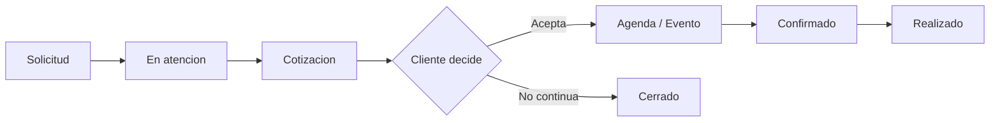

# Bosque Magico - Logica de Negocio Simplificada para UX

**Version:** 0.1  
**Fecha:** 2026-06-03  
**Objetivo:** proponer una version mas simple de la logica de negocio y estados del CRM Bosque Magico, evitando que la complejidad operativa afecte la experiencia del usuario interno.  
**Documento relacionado:** `.docs/BOSQUE_LOGICA_NEGOCIO_MODELO_DATOS.md`

---

## 1. Criterio principal

La primera version del modulo debe ser **operativamente util y facil de usar**. El CRM no debe obligar al vendedor a entender todos los estados posibles del prototipo PHP. La UX debe guiar el trabajo diario con pocas etapas claras.

Principio de diseno:

> Mostrar al usuario solo los estados que necesita para decidir la siguiente accion. Guardar el detalle fino como dato interno, historial, motivo o nota.

Esto permite:

- Menos friccion para registrar solicitudes.
- Menos errores al cambiar estados.
- Menos pantallas iniciales.
- Mejor adopcion por vendedores.
- Modelo tecnico preparado para crecer sin sobrecargar la UI.

---

## 2. Problema detectado en la version completa

El modelo completo identifica correctamente todo el negocio, pero para una primera UX puede sentirse pesado:

- Muchos estados por entidad.
- Muchos modulos separados desde el inicio.
- Diferencia poco clara entre lead, cliente, cotizacion, evento y contrato para usuarios no tecnicos.
- Riesgo de que el vendedor tenga que "administrar el sistema" en vez de vender.
- Riesgo de que el equipo ignore campos o use estados de forma inconsistente.

La simplificacion propuesta no elimina trazabilidad; solo separa:

- **Estado visible:** simple, accionable, orientado a UX.
- **Detalle interno:** motivo, origen, log, subestado tecnico, historial.

---

## 3. Flujo UX objetivo

En vez de muchos submodulos iniciales, la primera UX puede organizarse en 4 espacios:

| Espacio UX | Que resuelve | Entidades internas |
|---|---|---|
| **Solicitudes** | Todo lo que llega desde landing, Meta, WhatsApp o registro manual | `bosque_magico_leads`, `bosque_magico_clients`, `bosque_magico_children` |
| **Cotizaciones** | Armar, enviar y cerrar propuestas | `bosque_magico_quotes`, `bosque_magico_quote_items` |
| **Agenda** | Ver disponibilidad y eventos confirmados | `bosque_magico_events` |
| **Configuracion** | Tarifas, turnos, limites y catalogo basico | `bosque_magico_config`, `bosque_magico_products` |

Contratos, checklist, postventa, proveedores y biblioteca comercial pueden entrar despues, cuando el flujo base ya este validado.

---

## 4. Flujo de negocio simplificado

Lectura para el usuario:

1. Entra una **Solicitud**.
2. El vendedor la pone **En atencion**.
3. Si hay interes, crea una **Cotizacion**.
4. Si el cliente acepta, pasa a **Agenda**.
5. La fiesta se marca **Confirmada** y luego **Realizada**.
6. Si no avanza, se cierra con motivo.

---

## 5. Estados visibles simplificados

### 5.1 Solicitud

Nombre UX recomendado: **Solicitud** en vez de Lead.

| Estado visible | Significado | Accion principal |
|---|---|---|
| `Nueva` | Aun no fue gestionada | Contactar o asignar |
| `En atencion` | Ya hay gestion comercial | Registrar seguimiento o cotizar |
| `Cotizada` | Ya existe una cotizacion enviada o en preparacion | Revisar respuesta |
| `Cerrada` | No requiere mas accion comercial | Ver motivo |

Campos complementarios:

- `closed_reason`: `ganada`, `perdida`, `duplicada`, `sin respuesta`, `otro`.
- `assigned_user_id`: vendedor responsable.
- `last_contact_at`: ultimo contacto.
- `next_follow_up_at`: proximo seguimiento.

Mapeo desde estados completos:

| Estados completos | Estado UX simple |
|---|---|
| `Nuevo`, `Por asignar` | `Nueva` |
| `Asignado`, `Contactado`, `Interesado`, `Seguimiento` | `En atencion` |
| `Cotizacion enviada` | `Cotizada` |
| `Convertido`, `Perdido` | `Cerrada` |

### 5.2 Cotizacion

| Estado visible | Significado | Accion principal |
|---|---|---|
| `Borrador` | Aun se esta preparando | Completar y enviar |
| `Enviada` | Cliente ya recibio la propuesta | Hacer seguimiento |
| `Aceptada` | Cliente acepto | Crear o revisar evento |
| `Cerrada` | No continua | Ver motivo |

Campos complementarios:

- `closed_reason`: `rechazada`, `vencida`, `reemplazada`, `otro`.
- `sent_channel`: `whatsapp` o `email`.
- `sent_at`, `accepted_at`, `closed_at`.

Mapeo desde estados completos:

| Estados completos | Estado UX simple |
|---|---|
| `Borrador` | `Borrador` |
| `Enviada` | `Enviada` |
| `Aceptada` | `Aceptada` |
| `Rechazada`, `Vencida` | `Cerrada` |

### 5.3 Evento / Agenda

| Estado visible | Significado | Accion principal |
|---|---|---|
| `Por confirmar` | Fecha separada o pendiente de cierre | Confirmar datos |
| `Confirmado` | Evento aprobado para operar | Preparar evento |
| `Realizado` | Fiesta ejecutada | Cerrar o postventa futura |
| `Cancelado` | No se realizara | Ver motivo |

Campos complementarios:

- `cancel_reason`: motivo de cancelacion.
- `rescheduled_from_event_id`: si fue reprogramado.
- `confirmed_at`, `completed_at`, `cancelled_at`.
- `internal_phase`: opcional para operaciones futuras.

Mapeo desde estados completos:

| Estados completos | Estado UX simple |
|---|---|
| `Pre reserva`, `Reservado`, `Contrato enviado` | `Por confirmar` |
| `Confirmado`, `En produccion` | `Confirmado` |
| `Ejecutado` | `Realizado` |
| `Cancelado`, `Reprogramado` | `Cancelado` o nuevo evento `Por confirmar` |

### 5.4 Catalogo

El usuario comercial no necesita ver muchos estados de catalogo.

| Estado visible | Uso |
|---|---|
| `Activo` | Disponible para cotizar |
| `Inactivo` | Oculto para nuevas cotizaciones |

### 5.5 Mensajes y logs

No deben sentirse como estados principales.

| Dato interno | UX sugerida |
|---|---|
| `message_logs.status = success` | Mostrar "Enviado" en historial |
| `message_logs.status = failed` | Mostrar alerta accionable "No se pudo enviar" |
| `meta_lead_logs.status` | Solo visible en pantalla tecnica/integraciones |
| `audit_logs` | Solo historial o soporte |

---

## 6. Estados que no conviene mostrar en la primera UX

Estos estados pueden existir como motivo, log o campo interno, pero no como selector principal:

- `Por asignar`: se resuelve con "Sin vendedor asignado".
- `Asignado`: se resuelve mostrando vendedor responsable.
- `Contactado`: se resuelve con `last_contact_at`.
- `Interesado`: se resuelve con estado `En atencion` + nota.
- `Seguimiento`: se resuelve con `next_follow_up_at`.
- `Contrato enviado`: se resuelve con un indicador de documento, no estado principal del evento.
- `En produccion`: util para operaciones futuras, no para MVP comercial.
- `Reprogramado`: se resuelve creando nuevo evento vinculado y motivo.
- `Vencida`: motivo de cierre de cotizacion.
- `Rechazada`: motivo de cierre de cotizacion.

---

## 7. Casos de uso MVP simplificados

### 7.1 Registrar solicitud

Entradas:

- Landing.
- Meta Lead Ads.
- WhatsApp/manual.

UX:

- Formulario corto.
- Campos minimos: nombre, celular, canal, fecha tentativa, turno, ninos.
- Estado automatico: `Nueva`.

Reglas:

- Si viene de landing o Meta, guardar payload crudo.
- Si telefono/correo coincide, alertar posible duplicado.
- No obligar a crear cliente todavia.

### 7.2 Atender solicitud

UX:

- Boton "Tomar solicitud" o selector de vendedor.
- Campo de nota rapida.
- Fecha de proximo seguimiento.
- Boton "Crear cotizacion".

Reglas:

- Al tomarla, pasa a `En atencion`.
- Si se crea cotizacion, pasa a `Cotizada`.
- Si no continua, pasa a `Cerrada` con motivo.

### 7.3 Crear cotizacion

UX:

- Un solo formulario guiado.
- Datos del cliente y cumpleanero se capturan dentro del flujo.
- Calculo de precio visible en panel lateral.
- Boton "Guardar borrador" y "Enviar".

Reglas:

- Backend recalcula siempre.
- La UI no debe pedir campos contables ni contractuales.
- Items avanzados pueden aparecer como seccion desplegable.

### 7.4 Enviar cotizacion

UX:

- Acciones claras: "Enviar por WhatsApp" y "Enviar por correo".
- Mostrar vista previa simple.
- Despues de enviar, estado `Enviada`.

Reglas:

- Registrar log de envio.
- Si falla email, mostrar alerta con accion.
- WhatsApp puede abrir chat con mensaje prearmado.

### 7.5 Aceptar cotizacion

UX:

- Cliente abre link publico.
- Boton "Aceptar cotizacion".
- Mensaje claro si la fecha ya no esta disponible.

Reglas:

- Si acepta, cotizacion `Aceptada`.
- Crear evento `Por confirmar`.
- No duplicar evento si el cliente presiona varias veces.

### 7.6 Gestionar agenda

UX:

- Vista calendario/lista.
- Filtros simples: fecha, turno, estado.
- Acciones: confirmar, marcar realizado, cancelar.

Reglas:

- No permitir doble reserva activa en la misma fecha + turno + zona.
- Cancelados no bloquean agenda.
- Reprogramar crea o vincula nuevo evento.

### 7.7 Configurar tarifas y limites

UX:

- Pantalla simple solo para administradores.
- Campos editables con nombres humanos:
  - Tarifa lunes a viernes.
  - Tarifa sabado/domingo.
  - Precio por nino adicional.
  - Minimo de ninos.
  - Maximo base.
  - Maximo permitido.
  - Adelanto referencial.
  - Garantia referencial.

Reglas:

- Guardar en `bosque_magico_config`.
- Validar numeros positivos.
- No mostrar JSON al usuario final.

---

## 8. Modelo de datos simplificado

El modelo puede mantener tablas separadas, pero la UX no debe exponerlas todas como modulos independientes.

### 8.1 Tablas MVP

| Tabla | Proposito | Visible como |
|---|---|---|
| `bosque_magico_config` | Parametros de negocio | Configuracion |
| `bosque_magico_leads` | Solicitudes comerciales | Solicitudes |
| `bosque_magico_clients` | Datos del apoderado | Dentro de solicitud/cotizacion |
| `bosque_magico_children` | Datos del cumpleanero | Dentro de solicitud/cotizacion |
| `bosque_magico_quotes` | Cotizaciones | Cotizaciones |
| `bosque_magico_quote_items` | Detalle de servicios cotizados | Detalle de cotizacion |
| `bosque_magico_events` | Agenda y eventos | Agenda |
| `bosque_magico_products` | Catalogo cotizable | Configuracion / Catalogo |
| `bosque_magico_message_logs` | Historial de envios | Historial |
| `bosque_magico_audit_logs` | Trazabilidad | Interno |

### 8.2 Tablas para despues

| Tabla | Motivo para postergar |
|---|---|
| `bosque_magico_contracts` | Puede iniciar como documento generado desde cotizacion/evento; no requiere modulo completo al inicio |
| `bosque_magico_orders` | Operaciones puede entrar cuando haya eventos reales validados |
| `bosque_magico_event_tasks` | Checklist util despues de confirmar flujo comercial |
| `bosque_magico_surveys` | Postventa puede entrar luego de ejecutar eventos |
| `bosque_magico_assets` | Biblioteca comercial no bloquea MVP |
| `bosque_magico_payments` | Pagos estan fuera de alcance inicial |

---

## 9. Diccionario de datos ajustado a UX

### 9.1 `bosque_magico_leads`

Campos principales:

| Campo | UX | Nota |
|---|---|---|
| `contact_name` | Nombre | Requerido |
| `phone` | Celular | Requerido |
| `email` | Correo | Opcional |
| `channel` | Canal | Lista corta |
| `source_detail` | Detalle origen | Opcional |
| `tentative_event_date` | Fecha tentativa | Opcional |
| `shift_interest` | Turno de interes | Opcional |
| `estimated_children` | Ninos aprox. | Opcional |
| `stage` | Estado visible | `Nueva`, `En atencion`, `Cotizada`, `Cerrada` |
| `closed_reason` | Motivo de cierre | Solo si `stage = Cerrada` |
| `assigned_user_id` | Vendedor | Opcional |
| `last_contact_at` | Ultimo contacto | Interno/seguimiento |
| `next_follow_up_at` | Proximo seguimiento | Accionable |
| `notes` | Notas | Libre |
| `raw_payload` | Payload original | Interno |

Recomendacion: usar `stage` como estado UX en vez de `status` si se quiere diferenciar de estados tecnicos.

### 9.2 `bosque_magico_quotes`

Campos principales:

| Campo | UX | Nota |
|---|---|---|
| `quote_code` | Codigo | Automatico |
| `lead_id` | Solicitud origen | Opcional |
| `client_id` | Cliente | Requerido al guardar |
| `child_id` | Cumpleanero | Opcional |
| `event_date` | Fecha | Requerida |
| `shift` | Turno | Requerido |
| `children_qty` | Ninos | Requerido |
| `theme` | Tematica | Opcional |
| `package_name` | Paquete | Opcional |
| `base_amount` | Tarifa base | Calculado |
| `extra_children_amount` | Ninos extra | Calculado |
| `items_amount` | Servicios adicionales | Calculado |
| `total_amount` | Total | Calculado |
| `stage` | Estado visible | `Borrador`, `Enviada`, `Aceptada`, `Cerrada` |
| `closed_reason` | Motivo de cierre | Rechazada/vencida/etc. |
| `public_token` | Link publico | Interno |
| `sent_channel` | Canal envio | Interno/visible en historial |

### 9.3 `bosque_magico_events`

Campos principales:

| Campo | UX | Nota |
|---|---|---|
| `quote_id` | Cotizacion origen | Opcional |
| `client_id` | Cliente | Requerido |
| `child_id` | Cumpleanero | Opcional |
| `event_date` | Fecha | Requerida |
| `shift` | Turno | Requerido |
| `zone_name` | Zona | Default `Bosque Magico` |
| `theme` | Tematica | Opcional |
| `children_qty` | Ninos | Requerido |
| `total_cost` | Total | Calculado/congelado |
| `stage` | Estado visible | `Por confirmar`, `Confirmado`, `Realizado`, `Cancelado` |
| `cancel_reason` | Motivo | Solo si cancela |
| `rescheduled_from_event_id` | Reprogramacion | Opcional |
| `notes` | Notas | Libre |

---

## 10. Reglas de negocio que se mantienen

Aunque se simplifique la UX, estas reglas no cambian:

- Tarifa base L-V: S/ 380.
- Tarifa base S-D: S/ 580.
- Ninos base: 10 a 25.
- Ninos adicionales: 26 a 35 con S/ 25 por nino.
- Mas de 35 ninos: no calcular silenciosamente; pedir aprobacion o bloquear.
- Catering minimo: 18 unidades.
- Adelanto referencial: S/ 500.
- Garantia referencial: S/ 500.
- No doble reserva activa en la misma fecha + turno + zona.
- Backend recalcula totales.
- Landing y Meta no son fuente confiable del total.
- Pagos no se implementan en MVP.

---

## 11. Pantallas recomendadas para MVP

### 11.1 Dashboard simple

Tarjetas:

- Solicitudes nuevas.
- Solicitudes en atencion.
- Cotizaciones enviadas.
- Eventos proximos.

Accesos rapidos:

- Nueva solicitud.
- Nueva cotizacion.
- Ver agenda.

### 11.2 Solicitudes

Vista:

- Lista con filtros: estado, canal, vendedor, fecha tentativa.
- Acciones: tomar, contactar, cotizar, cerrar.
- Detalle lateral en vez de muchas pantallas.

### 11.3 Cotizaciones

Vista:

- Lista por estado.
- Crear/editar en formulario guiado.
- Vista previa del total.
- Acciones: enviar, aceptar manualmente, cerrar.

### 11.4 Agenda

Vista:

- Calendario o lista semanal.
- Turnos claros.
- Colores por estado simple.
- Acciones: confirmar, realizar, cancelar.

### 11.5 Configuracion

Vista:

- Tarifas y limites.
- Turnos.
- Catalogo basico.
- Solo para administradores.

---

## 12. Recomendacion de implementacion

La implementacion debe empezar con un **modelo suficiente**, no con todo el CRM completo.

Orden recomendado:

1. `bosque_magico_config`.
2. `bosque_magico_leads` con `stage` simplificado.
3. Endpoint publico para landing.
4. Pantalla Solicitudes.
5. `bosque_magico_clients` y `bosque_magico_children` integrados dentro del flujo de cotizacion.
6. `bosque_magico_quotes` + calculadora.
7. Envio por WhatsApp/correo.
8. `bosque_magico_events` + agenda simple.
9. Contrato/documento como accion, no como modulo completo.

---

## 13. Decision propuesta

Para proteger la UX, se recomienda adoptar estos estados visibles:

| Entidad UX | Estados finales recomendados |
|---|---|
| Solicitud | `Nueva`, `En atencion`, `Cotizada`, `Cerrada` |
| Cotizacion | `Borrador`, `Enviada`, `Aceptada`, `Cerrada` |
| Evento | `Por confirmar`, `Confirmado`, `Realizado`, `Cancelado` |
| Catalogo | `Activo`, `Inactivo` |

Y mover el resto a:

- Motivos (`closed_reason`, `cancel_reason`).
- Fechas (`sent_at`, `accepted_at`, `last_contact_at`, `next_follow_up_at`).
- Responsables (`assigned_user_id`).
- Historial (`message_logs`, `audit_logs`).
- Notas (`notes`).

---

## 14. Conclusiones

La version optima para iniciar no es la mas completa, sino la que el equipo pueda usar sin friccion. Bosque Magico necesita cubrir el embudo comercial completo, pero la UI debe mostrarlo como un flujo simple: **Solicitud -> Cotizacion -> Agenda -> Realizado/Cerrado**.

El modelo tecnico puede conservar trazabilidad y prepararse para contratos, operaciones y postventa, pero la primera experiencia debe estar enfocada en vender, cotizar y reservar sin obligar al usuario a navegar una estructura de CRM demasiado pesada.
