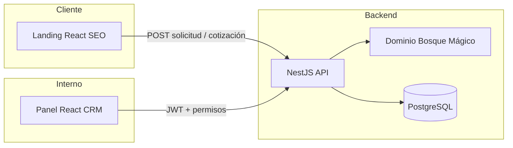
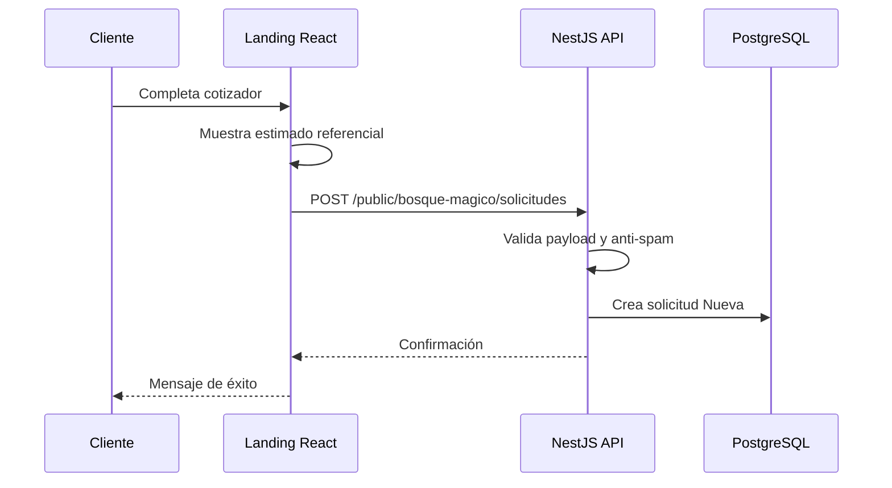
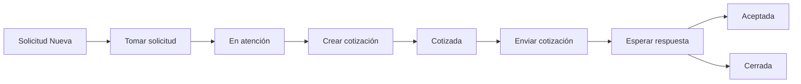
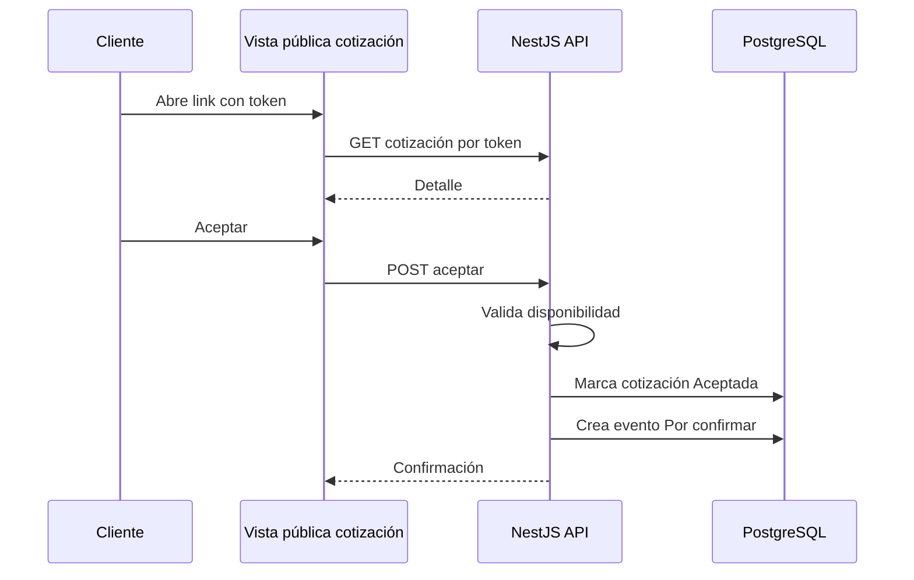
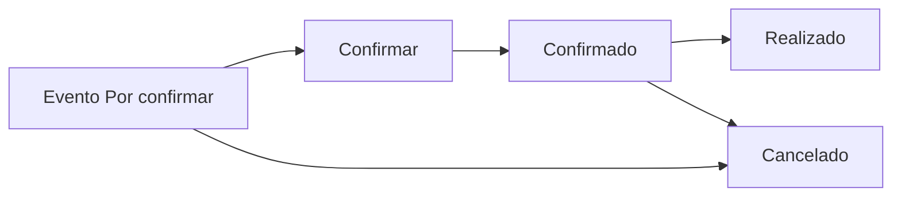

# Bosque Mágico - Plan de Implementación React + NestJS

**Versión:** 0.1  
**Fecha:** 2026-06-04  
**Objetivo:** planificar la implementación de Bosque Mágico con landing pública, panel administrativo y backend NestJS, manteniendo una arquitectura limpia, una UX simple y un modelo de datos en español alineado al negocio.  
**Insumos:** logo `logo-bm.png`, `.docs/BOSQUE_LOGICA_NEGOCIO_UX_SIMPLE.md`, `.docs/BOSQUE_LOGICA_NEGOCIO_MODELO_DATOS.md`, `.docs/PROPUESTA.md`.

---

## 1. Decisión de arquitectura

La implementación se plantea como un producto web completo con tres aplicaciones principales:

| Aplicación | Stack | Rol |
|---|---|---|
| **Landing cliente** | React + TypeScript + Vite | Web pública SEO-first para mostrar Bosque Mágico, paquetes, beneficios y cotizador |
| **Panel administrativo** | React + TypeScript + Vite | CRM interno para solicitudes, cotizaciones, agenda y configuración |
| **Backend API** | NestJS + TypeScript + PostgreSQL | API, reglas de negocio, persistencia, autenticación e integraciones |

Base de datos:

- PostgreSQL.
- Tablas propias con prefijo `bosque_magico_`.
- No mezclar con tablas comerciales genéricas.
- Pagos fuera del MVP.

Principio rector:

> Primero una experiencia simple y funcional; luego crecer en operación, contratos, postventa e integraciones.

---

## 2. Identidad visual basada en el logo

El logo comunica bosque, madera, naturaleza, aves, flores y una sensación familiar. La UI debe ser profesional, cálida y premium, sin volverse caricaturesca.

Paleta sugerida:

| Uso | Color sugerido | Inspiración |
|---|---|---|
| Verde principal | `#2F4F1F` | contorno/hojas oscuras |
| Verde medio | `#5F7F2A` | copa de árbol |
| Verde suave | `#EEF4DC` | fondos suaves |
| Madera | `#8A5A13` | letrero |
| Madera oscura | `#5A3510` | sombra/contorno |
| Crema | `#FFF8DC` | texto del logo |
| Dorado/flor | `#E5A824` | flores/acento |
| Naranja ave | `#D85A1B` | acentos puntuales |
| Fondo claro | `#FFFCF2` | landing/panel |

Lineamientos UI:

- Bordes redondeados.
- Cards limpias con sombra suave.
- Botones principales verde bosque.
- Botones secundarios crema/madera.
- Badges de estado con colores suaves.
- Ilustraciones o formas orgánicas, no exceso de dibujos infantiles.
- Buena legibilidad para padres y usuarios internos.

---

## 3. Arquitectura general



Separación de responsabilidades:

- La landing vende y captura intención.
- El panel gestiona operación comercial.
- El backend valida, calcula, guarda, integra y protege.
- La base de datos conserva trazabilidad y reglas del negocio.

---

## 4. Estructura recomendada del repositorio

```text
proyecto-bosque-magio/
├── apps/
│   ├── landing/
│   │   ├── src/
│   │   ├── public/
│   │   └── package.json
│   ├── panel/
│   │   ├── src/
│   │   ├── public/
│   │   └── package.json
│   └── api/
│       ├── src/
│       ├── prisma/
│       └── package.json
├── packages/
│   ├── ui/
│   ├── config/
│   └── shared-types/
├── .docs/
└── logo-bm.png
```

Notas:

- `packages/ui` es opcional, pero útil para compartir botones, badges, inputs, modal y estilos entre landing y panel.
- `packages/shared-types` puede contener tipos de DTO públicos si se desea compartir contratos front/back.
- Si se prefiere máxima velocidad inicial, se puede crear primero `apps/landing`, `apps/panel` y `apps/api`, dejando `packages/` para Fase 2.

---

## 5. Stack frontend

### 5.1 Base común React

Tecnologías:

- React.
- TypeScript.
- Vite.
- React Router.
- Axios.
- TanStack Query.
- Tailwind CSS.
- Formik.
- Yup.
- SweetAlert2.
- React Select.
- React Dropzone.
- date-fns.
- Lucide React o React Icons.
- clsx / class-variance-authority para variantes visuales.

Buenas prácticas:

- Componentes pequeños y reutilizables.
- Formularios con validación declarativa.
- Servicios HTTP separados de componentes.
- Hooks por caso de uso.
- Manejo de errores centralizado.
- Tipos explícitos para DTOs.
- Evitar lógica de negocio de precios crítica en frontend; solo cálculo preliminar.

---

## 6. Landing pública

### 6.1 Objetivo

La landing debe vender la experiencia y capturar solicitudes. Debe ser rápida, clara, SEO-friendly y mobile-first.

### 6.2 Arquitectura de carpetas

```text
apps/landing/src/
├── app/
│   ├── App.tsx
│   ├── router.tsx
│   └── providers.tsx
├── assets/
│   └── img/
│       └── logo-bm.png
├── components/
│   ├── layout/
│   ├── sections/
│   ├── forms/
│   └── ui/
├── features/
│   └── quote-request/
│       ├── api/
│       ├── components/
│       ├── hooks/
│       ├── schemas/
│       └── types.ts
├── lib/
│   ├── axios.ts
│   ├── seo.ts
│   └── formatters.ts
└── styles/
    └── globals.css
```

### 6.3 Secciones de la landing

1. **Hero**
   - Logo.
   - Mensaje principal.
   - CTA: "Cotizar mi fiesta".
   - CTA secundario: WhatsApp.

2. **Beneficios**
   - Espacio privado.
   - Turnos definidos.
   - Ambiente natural y seguro.
   - Shows, catering y extras.

3. **Paquetes**
   - Básico.
   - Estándar.
   - Premium.
   - Mostrar diferencias simples, no demasiada tabla técnica.

4. **Shows y extras**
   - Cards visuales.
   - Servicios disponibles.

5. **Catering**
   - Opciones infantiles.
   - Mínimo de unidades si aplica.

6. **Cotizador**
   - Formulario Formik.
   - React Select para turnos, paquete, show y catering.
   - Resumen lateral de precio estimado.
   - Enviar solicitud al backend.

7. **Términos principales**
   - Adelanto.
   - Garantía.
   - Horarios.
   - Capacidad.

8. **FAQ**
   - Preguntas frecuentes.

9. **CTA final**
   - Cotizar.
   - WhatsApp.

### 6.4 SEO

Requisitos:

- Title por página.
- Meta description.
- Open Graph.
- Twitter card.
- Canonical URL.
- `robots.txt`.
- `sitemap.xml`.
- JSON-LD de negocio local / servicio.
- Imágenes optimizadas.
- Buen Core Web Vitals.
- Texto real indexable, no solo imágenes.

Ejemplo de intención SEO:

- "fiestas infantiles en Lima"
- "cumpleaños infantiles en Refugio"
- "Bosque Mágico fiestas infantiles"
- "fiestas infantiles con shows y catering"

### 6.5 Datos que envía el cotizador

```ts
type SolicitudLandingPayload = {
  cliente: {
    nombre: string;
    celular: string;
    correo?: string;
  };
  cumpleanero?: {
    nombre?: string;
    edad?: number;
  };
  evento: {
    fechaTentativa?: string;
    turno?: "turno_1" | "turno_2" | "turno_3";
    cantidadNinos?: number;
    tematica?: string;
    paquete?: string;
  };
  preferencias?: {
    showId?: string;
    cateringIds?: string[];
    extras?: string;
    observaciones?: string;
  };
  origen: "landing";
};
```

---

## 7. Panel administrativo

### 7.1 Objetivo

El panel debe permitir gestionar el flujo comercial sin fricción:

**Solicitud -> Cotización -> Agenda -> Realizado/Cerrado**

### 7.2 Arquitectura de carpetas

```text
apps/panel/src/
├── app/
│   ├── App.tsx
│   ├── router.tsx
│   └── providers.tsx
├── components/
│   ├── layout/
│   ├── navigation/
│   └── ui/
├── features/
│   └── bosque-magico/
│       ├── dashboard/
│       ├── solicitudes/
│       ├── cotizaciones/
│       ├── agenda/
│       ├── configuracion/
│       ├── api/
│       ├── hooks/
│       ├── schemas/
│       ├── tables/
│       └── types.ts
├── lib/
│   ├── axios.ts
│   ├── auth.ts
│   ├── query-client.ts
│   └── alerts.ts
└── styles/
    └── globals.css
```

### 7.3 Rutas

| Ruta | Pantalla |
|---|---|
| `/bosque-magico` | Dashboard |
| `/bosque-magico/solicitudes` | Solicitudes |
| `/bosque-magico/cotizaciones` | Cotizaciones |
| `/bosque-magico/agenda` | Agenda |
| `/bosque-magico/configuracion` | Configuración |

### 7.4 Componentes principales

Layout:

- Sidebar con logo.
- Header con usuario y acciones.
- Breadcrumb simple.
- Contenedor responsive.

UI:

- `Button`.
- `Input`.
- `SelectField`.
- `DateField`.
- `Textarea`.
- `StatusBadge`.
- `KpiCard`.
- `DataTable`.
- `Drawer`.
- `Modal`.
- `EmptyState`.
- `ConfirmDialog`.

Librerías:

- TanStack Query para fetch/cache/mutations.
- TanStack Table para tablas.
- Formik + Yup para formularios.
- SweetAlert2 para confirmaciones y feedback.
- React Select para selects enriquecidos.
- Dropzone para carga de imágenes en catálogo futuro.

### 7.5 Estados visibles

| Entidad | Estados UX |
|---|---|
| Solicitud | `Nueva`, `En atención`, `Cotizada`, `Cerrada` |
| Cotización | `Borrador`, `Enviada`, `Aceptada`, `Cerrada` |
| Evento | `Por confirmar`, `Confirmado`, `Realizado`, `Cancelado` |
| Catálogo | `Activo`, `Inactivo` |

Los detalles extra se manejan como:

- Motivos.
- Fechas.
- Responsables.
- Notas.
- Historial.
- Logs.

---

## 8. Backend NestJS

### 8.1 Stack backend

Tecnologías:

- NestJS.
- TypeScript.
- PostgreSQL.
- Prisma ORM.
- class-validator.
- class-transformer.
- Passport JWT.
- ConfigModule.
- ThrottlerModule.
- Swagger/OpenAPI.
- EventEmitter o CQRS ligero si se requiere.
- Nodemailer o proveedor externo de correo.
- Integración WhatsApp como link inicial; API formal después.

Decisión ORM:

- **Prisma** recomendado por tipado fuerte, migraciones y claridad de esquema.
- TypeORM también es válido, pero Prisma simplifica el MVP.

### 8.2 Arquitectura limpia por módulo

```text
apps/api/src/
├── main.ts
├── app.module.ts
├── config/
├── common/
│   ├── decorators/
│   ├── filters/
│   ├── guards/
│   ├── interceptors/
│   └── pipes/
├── auth/
├── users/
├── bosque-magico/
│   ├── domain/
│   │   ├── entities/
│   │   ├── value-objects/
│   │   ├── enums/
│   │   └── services/
│   ├── application/
│   │   ├── use-cases/
│   │   ├── ports/
│   │   └── dto/
│   ├── infrastructure/
│   │   ├── prisma/
│   │   ├── mail/
│   │   └── integrations/
│   └── presentation/
│       ├── controllers/
│       └── presenters/
└── prisma/
```

Regla:

- Controllers reciben HTTP.
- Use cases orquestan.
- Domain valida reglas del negocio.
- Infrastructure persiste o integra.
- Prisma no debe contaminar componentes de UI ni reglas de dominio.

### 8.3 Módulos backend

| Módulo | Responsabilidad |
|---|---|
| `AuthModule` | Login, JWT, permisos |
| `UsersModule` | Usuarios internos y vendedores |
| `BosqueMagicoModule` | Módulo raíz |
| `SolicitudesModule` | Captación landing/manual/Meta |
| `CotizacionesModule` | Cotizar, calcular, enviar, aceptar |
| `AgendaModule` | Eventos, disponibilidad y calendario |
| `ConfiguracionModule` | Tarifas, turnos, límites |
| `CatalogoModule` | Shows, catering, extras |
| `IntegracionesModule` | Meta Lead Ads, correo, WhatsApp |

Para el MVP se pueden implementar como carpetas internas dentro de `bosque-magico` y separarlas en módulos Nest cuando crezcan.

---

## 9. Casos de uso

### 9.1 Landing

| Caso de uso | Actor | Resultado |
|---|---|---|
| Ver landing | Cliente | Conoce propuesta y paquetes |
| Calcular estimado | Cliente | Ve precio referencial |
| Enviar solicitud | Cliente | Se crea solicitud `Nueva` |
| Contactar por WhatsApp | Cliente | Abre conversación prearmada |

### 9.2 Panel

| Caso de uso | Actor | Resultado |
|---|---|---|
| Ver dashboard | Vendedor/admin | KPIs y próximos eventos |
| Tomar solicitud | Vendedor | Solicitud pasa a `En atención` |
| Crear solicitud manual | Vendedor | Solicitud `Nueva` o `En atención` |
| Cerrar solicitud | Vendedor | Solicitud `Cerrada` con motivo |
| Crear cotización | Vendedor | Cotización `Borrador` |
| Enviar cotización | Vendedor | Cotización `Enviada` y log |
| Aceptar cotización manual | Vendedor | Cotización `Aceptada` y evento |
| Gestionar agenda | Vendedor/admin | Evento confirmado, realizado o cancelado |
| Configurar tarifas | Admin | Reglas actualizadas |
| Administrar catálogo | Admin | Servicios activos/inactivos |

### 9.3 Backend

| Caso de uso | Entrada | Salida |
|---|---|---|
| Registrar solicitud pública | Payload landing | Solicitud creada |
| Recalcular precio | Fecha, niños, items | Totales confiables |
| Validar disponibilidad | Fecha, turno, zona | Disponible/no disponible |
| Generar código cotización | Lead o secuencia | `COT-00001` |
| Generar token público | Cotización | Link seguro |
| Enviar mensaje | Canal y entidad | Log de envío |
| Aceptar cotización pública | Token | Cotización aceptada + evento |

---

## 10. Flujos principales

### 10.1 Solicitud desde landing



### 10.2 Gestión comercial



### 10.3 Aceptación de cotización



### 10.4 Agenda



---

## 11. Modelo de datos en español

### 11.1 Entidades MVP

| Tabla | Nombre negocio | Propósito |
|---|---|---|
| `bosque_magico_configuraciones` | Configuración | Tarifas, límites y turnos |
| `bosque_magico_solicitudes` | Solicitudes | Contactos entrantes |
| `bosque_magico_clientes` | Clientes | Datos del apoderado |
| `bosque_magico_cumpleaneros` | Cumpleañeros | Datos del niño/niña |
| `bosque_magico_cotizaciones` | Cotizaciones | Propuesta comercial |
| `bosque_magico_items_cotizacion` | Ítems de cotización | Shows, catering, extras |
| `bosque_magico_eventos` | Eventos | Agenda y reserva |
| `bosque_magico_productos` | Catálogo | Servicios disponibles |
| `bosque_magico_logs_mensajes` | Logs de mensajes | Registro de envíos |
| `bosque_magico_auditorias` | Auditoría | Historial de acciones |

Nota: si se desea mantener nombres en inglés por convención técnica, el diccionario de dominio puede seguir en español. Si el objetivo es máxima claridad para negocio, usar nombres físicos en español también es válido.

### 11.2 `bosque_magico_configuraciones`

| Campo | Tipo | Descripción |
|---|---|---|
| `id` | UUID | Identificador |
| `clave` | string | Clave única, ejemplo `tarifas.base_lunes_viernes` |
| `valor` | jsonb | Valor flexible |
| `descripcion` | string | Explicación visible para admin |
| `es_publico` | boolean | Si puede exponerse a landing |
| `creado_en` | datetime | Fecha de creación |
| `actualizado_en` | datetime | Fecha de actualización |

### 11.3 `bosque_magico_solicitudes`

| Campo | Tipo | Descripción |
|---|---|---|
| `id` | UUID | Identificador |
| `fecha_ingreso` | date | Fecha de ingreso |
| `nombre_contacto` | string | Nombre del apoderado/contacto |
| `celular` | string | Teléfono principal |
| `correo` | string | Correo |
| `canal` | enum | `landing`, `whatsapp`, `meta`, `referido`, `manual`, `otro` |
| `detalle_origen` | string | Campaña, referido, red social |
| `fecha_tentativa` | date | Fecha deseada |
| `turno_interes` | enum | `turno_1`, `turno_2`, `turno_3` |
| `cantidad_ninos_estimada` | number | Cantidad aproximada |
| `etapa` | enum | `nueva`, `en_atencion`, `cotizada`, `cerrada` |
| `motivo_cierre` | enum/string | Ganada, perdida, duplicada, sin respuesta |
| `usuario_asignado_id` | UUID | Vendedor |
| `ultimo_contacto_en` | datetime | Último contacto |
| `proximo_seguimiento_en` | datetime | Próxima acción |
| `notas` | text | Observaciones |
| `payload_origen` | jsonb | Payload crudo |
| `creado_en` | datetime | Creación |
| `actualizado_en` | datetime | Actualización |

### 11.4 `bosque_magico_clientes`

| Campo | Tipo | Descripción |
|---|---|---|
| `id` | UUID | Identificador |
| `nombre_completo` | string | Nombre del apoderado |
| `tipo_documento` | enum | DNI, RUC, otro |
| `numero_documento` | string | Documento |
| `celular` | string | Teléfono |
| `correo` | string | Email |
| `direccion` | string | Dirección |
| `distrito` | string | Distrito |
| `notas` | text | Preferencias |
| `creado_en` | datetime | Creación |
| `actualizado_en` | datetime | Actualización |

### 11.5 `bosque_magico_cumpleaneros`

| Campo | Tipo | Descripción |
|---|---|---|
| `id` | UUID | Identificador |
| `cliente_id` | UUID | Cliente responsable |
| `nombre` | string | Nombre del cumpleañero |
| `edad` | number | Edad |
| `fecha_cumpleanos` | date | Cumpleaños |
| `tematica_favorita` | string | Tema preferido |
| `notas` | text | Observaciones |
| `creado_en` | datetime | Creación |
| `actualizado_en` | datetime | Actualización |

### 11.6 `bosque_magico_cotizaciones`

| Campo | Tipo | Descripción |
|---|---|---|
| `id` | UUID | Identificador |
| `codigo` | string | Código visible, ejemplo `COT-00001` |
| `solicitud_id` | UUID | Solicitud origen |
| `cliente_id` | UUID | Cliente |
| `cumpleanero_id` | UUID | Cumpleañero |
| `token_publico` | string | Token para link público |
| `fecha_evento` | date | Fecha del evento |
| `turno` | enum | Turno |
| `cantidad_ninos` | number | Número de niños |
| `tematica` | string | Temática |
| `paquete` | string | Básico, estándar, premium |
| `monto_base` | decimal | Tarifa base |
| `monto_ninos_extra` | decimal | Adicional por niños |
| `monto_items` | decimal | Suma de servicios |
| `monto_total` | decimal | Total |
| `etapa` | enum | `borrador`, `enviada`, `aceptada`, `cerrada` |
| `motivo_cierre` | string | Rechazada, vencida, reemplazada |
| `canal_envio` | enum | WhatsApp, email |
| `enviada_en` | datetime | Fecha envío |
| `aceptada_en` | datetime | Fecha aceptación |
| `cerrada_en` | datetime | Fecha cierre |
| `notas` | text | Observaciones |
| `creado_en` | datetime | Creación |
| `actualizado_en` | datetime | Actualización |

### 11.7 `bosque_magico_items_cotizacion`

| Campo | Tipo | Descripción |
|---|---|---|
| `id` | UUID | Identificador |
| `cotizacion_id` | UUID | Cotización |
| `producto_id` | UUID | Producto si existe |
| `tipo` | enum | show, catering, extra, manual |
| `nombre` | string | Nombre congelado |
| `cantidad` | number | Cantidad |
| `precio_unitario` | decimal | Precio |
| `subtotal` | decimal | Total línea |
| `notas` | text | Observaciones |

### 11.8 `bosque_magico_eventos`

| Campo | Tipo | Descripción |
|---|---|---|
| `id` | UUID | Identificador |
| `cotizacion_id` | UUID | Cotización origen |
| `cliente_id` | UUID | Cliente |
| `cumpleanero_id` | UUID | Cumpleañero |
| `fecha_evento` | date | Fecha |
| `turno` | enum | Turno |
| `zona` | string | Default Bosque Mágico |
| `tematica` | string | Temática |
| `cantidad_ninos` | number | Niños |
| `monto_total` | decimal | Total congelado |
| `etapa` | enum | `por_confirmar`, `confirmado`, `realizado`, `cancelado` |
| `motivo_cancelacion` | string | Si cancela |
| `evento_reprogramado_desde_id` | UUID | Evento anterior si aplica |
| `confirmado_en` | datetime | Fecha confirmación |
| `realizado_en` | datetime | Fecha realización |
| `cancelado_en` | datetime | Fecha cancelación |
| `notas` | text | Observaciones |

### 11.9 `bosque_magico_productos`

| Campo | Tipo | Descripción |
|---|---|---|
| `id` | UUID | Identificador |
| `codigo` | string | Código interno |
| `nombre` | string | Nombre |
| `categoria` | enum | show, catering, extra, paquete, espacio |
| `tipo` | enum | propio, proveedor |
| `costo` | decimal | Costo interno |
| `precio_lunes_viernes` | decimal | Precio L-V |
| `precio_fin_semana` | decimal | Precio S-D |
| `unidad` | string | Servicio, unidad |
| `cantidad_minima` | number | Mínimo |
| `capacidad_maxima` | number | Capacidad |
| `duracion_minutos` | number | Duración |
| `descripcion` | text | Descripción |
| `imagen_url` | string | Imagen |
| `etapa` | enum | `activo`, `inactivo` |

---

## 12. Reglas de negocio

### 12.1 Precios

```text
base = S/ 380 si fecha es lunes a viernes
base = S/ 580 si fecha es sábado o domingo
ninos_extra = max(cantidad_ninos - 25, 0)
monto_ninos_extra = ninos_extra * S/ 25
total = base + monto_ninos_extra + monto_items
```

Reglas:

- Mínimo sugerido: 10 niños.
- Capacidad base: hasta 25 niños.
- Máximo regular: 35 niños.
- Más de 35 niños requiere bloqueo o aprobación manual.
- Catering mínimo: 18 unidades.
- Adelanto referencial: S/ 500.
- Garantía referencial: S/ 500.

### 12.2 Disponibilidad

No se permite doble reserva activa para:

```text
fecha_evento + turno + zona
```

Bloquean disponibilidad:

- `por_confirmar`
- `confirmado`

No bloquean:

- `cancelado`
- eventos reprogramados hacia otra fecha.

### 12.3 Seguridad

- Landing usa endpoint público con rate limit.
- Panel usa JWT.
- Permisos mínimos:
  - `bosque_magico:view`
  - `bosque_magico:manage`
  - `bosque_magico:admin`
- Secrets solo en variables de entorno.
- Payloads externos se guardan, pero no se confían para totales.

---

## 13. API propuesta

### 13.1 Pública

| Método | Endpoint | Uso |
|---|---|---|
| `POST` | `/api/public/bosque-magico/solicitudes` | Crear solicitud desde landing |
| `GET` | `/api/public/bosque-magico/cotizaciones/:token` | Ver cotización pública |
| `POST` | `/api/public/bosque-magico/cotizaciones/:token/aceptar` | Aceptar cotización |

### 13.2 Panel

| Método | Endpoint | Uso |
|---|---|---|
| `GET` | `/api/bosque-magico/dashboard` | KPIs |
| `GET` | `/api/bosque-magico/solicitudes` | Listar solicitudes |
| `POST` | `/api/bosque-magico/solicitudes` | Crear solicitud manual |
| `PATCH` | `/api/bosque-magico/solicitudes/:id` | Actualizar solicitud |
| `POST` | `/api/bosque-magico/solicitudes/:id/tomar` | Tomar solicitud |
| `POST` | `/api/bosque-magico/solicitudes/:id/cerrar` | Cerrar solicitud |
| `GET` | `/api/bosque-magico/cotizaciones` | Listar cotizaciones |
| `POST` | `/api/bosque-magico/cotizaciones` | Crear cotización |
| `PATCH` | `/api/bosque-magico/cotizaciones/:id` | Editar cotización |
| `POST` | `/api/bosque-magico/cotizaciones/:id/enviar` | Enviar cotización |
| `POST` | `/api/bosque-magico/cotizaciones/:id/aceptar` | Aceptación manual |
| `GET` | `/api/bosque-magico/eventos` | Listar eventos |
| `GET` | `/api/bosque-magico/eventos/agenda` | Agenda |
| `PATCH` | `/api/bosque-magico/eventos/:id` | Actualizar evento |
| `POST` | `/api/bosque-magico/eventos/:id/confirmar` | Confirmar evento |
| `POST` | `/api/bosque-magico/eventos/:id/realizar` | Marcar realizado |
| `POST` | `/api/bosque-magico/eventos/:id/cancelar` | Cancelar |
| `GET` | `/api/bosque-magico/configuracion` | Ver configuración |
| `PATCH` | `/api/bosque-magico/configuracion` | Actualizar configuración |
| `GET` | `/api/bosque-magico/productos` | Catálogo |
| `POST` | `/api/bosque-magico/productos` | Crear producto |
| `PATCH` | `/api/bosque-magico/productos/:id` | Editar producto |

---

## 14. Fases de implementación

### Fase 0 - Preparación

- Crear estructura `apps/landing`, `apps/panel`, `apps/api`.
- Configurar TypeScript, ESLint, Prettier.
- Configurar Tailwind.
- Configurar variables `.env.example`.
- Copiar logo a assets públicos.
- Definir tema visual.

### Fase 1 - Backend base

- NestJS base.
- Prisma + PostgreSQL.
- ConfigModule.
- Swagger.
- Auth JWT.
- Permisos.
- Migraciones iniciales:
  - configuraciones.
  - solicitudes.
  - auditorías.
- Seed de configuración:
  - tarifas.
  - turnos.
  - límites.

### Fase 2 - Landing MVP

- Hero.
- Beneficios.
- Paquetes.
- Shows/extras.
- Cotizador Formik.
- SEO base.
- Endpoint público de solicitudes.
- Confirmación con SweetAlert2.

### Fase 3 - Panel Solicitudes

- Layout panel.
- Sidebar Bosque Mágico.
- Dashboard simple.
- Tabla de solicitudes con TanStack Table.
- Formulario manual.
- Tomar solicitud.
- Cerrar solicitud.
- Seguimiento.

### Fase 4 - Cotizaciones

- Clientes y cumpleañeros integrados.
- Crear cotización.
- Items de cotización.
- Calculadora backend.
- Vista previa.
- Envío por WhatsApp/email.
- Link público de cotización.

### Fase 5 - Agenda

- Crear evento desde cotización aceptada.
- Validar disponibilidad.
- Vista agenda.
- Confirmar, realizar, cancelar.
- Colores por estado.

### Fase 6 - Configuración y catálogo

- Pantalla configuración.
- Catálogo productos.
- Dropzone para imágenes.
- React Select para categorías.
- Activar/desactivar productos.

### Fase 7 - Endurecimiento

- Tests unitarios de reglas de precio.
- Tests de casos de uso backend.
- Validación de seguridad pública.
- Rate limiting.
- Manejo de errores.
- Auditoría.
- Revisión responsive.
- SEO final.

---

## 15. Pruebas mínimas

Backend:

- Precio lunes-viernes.
- Precio fin de semana.
- Niños extra.
- Límite mayor a 35.
- No doble reserva.
- Aceptación idempotente de cotización.
- Crear solicitud pública.

Frontend landing:

- Formulario válido.
- Formulario inválido.
- Resumen de precio.
- Envío exitoso.
- Error API.
- SEO tags.

Frontend panel:

- Listar solicitudes.
- Filtrar por etapa.
- Tomar solicitud.
- Crear cotización.
- Enviar cotización.
- Confirmar evento.

---

## 16. Riesgos y mitigación

| Riesgo | Mitigación |
|---|---|
| UX demasiado compleja | Mantener estados simples y detalles como motivos/logs |
| Duplicidad entre landing y panel | Backend como fuente de verdad |
| Totales manipulados desde frontend | Recalcular siempre en backend |
| Sobrecargar MVP con contratos/pagos | Postergar módulos no críticos |
| SEO pobre por SPA pura | Pre-render/SSR futuro o buena estrategia Vite + metadata + sitemap; evaluar Next si SEO exige SSR |
| Integración WhatsApp compleja | Empezar con link prearmado, API formal después |

---

## 17. Nota sobre SEO y React

React + Vite puede funcionar para landing si se cuidan metadatos, rendimiento y contenido indexable. Sin embargo, si SEO orgánico será crítico desde el primer día, se recomienda evaluar **Next.js** para la landing por SSR/SSG.

Como el requerimiento actual es ReactJS, la ruta propuesta es:

1. Implementar landing en React + Vite con SEO técnico correcto.
2. Mantener secciones indexables y buen rendimiento.
3. Si se necesita SEO avanzado, migrar landing a Next.js sin afectar panel ni API.

---

## 18. Cierre

La implementación recomendada separa la experiencia pública y la operación interna, pero comparte reglas de negocio desde NestJS. La landing debe vender y capturar; el panel debe simplificar el trabajo comercial; el backend debe proteger la consistencia, recalcular precios y validar disponibilidad.

La prioridad del MVP es:

```text
Landing con cotizador -> Solicitudes -> Cotizaciones -> Agenda
```

Todo lo demás debe entrar después de validar que el flujo comercial principal funciona bien y no complica la UX.
