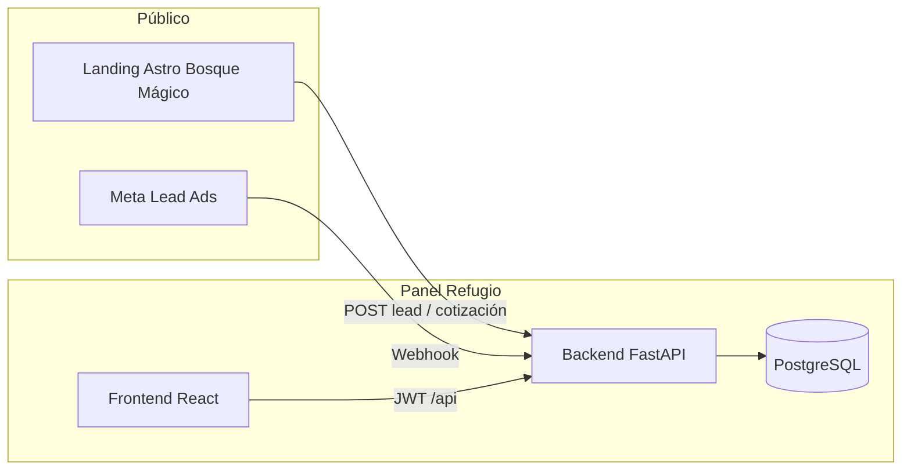

# Propuesta: Bosque Mágico (Fiestas infantiles) en el panel centralizado Refugio

**Versión:** 1.2  
**Fecha:** 2026-05-08  
**Alcance:** Integración operativa y de datos entre el proyecto *Bosque Mágico* y el stack centralizado (`backend/` FastAPI + PostgreSQL, `frontend/` React/Vite), sin sustituir de golpe la landing ni el CRM prototipo salvo donde se acuerde migración explícita.

---

## Decisiones cerradas (iteración)

| Tema | Decisión |
|------|----------|
| **Aislamiento en base de datos** | El módulo **no reutiliza** tablas `comercial_*` ni mezcla filas con el módulo Comercial. Toda la persistencia de Bosque Mágico vive en tablas propias. |
| **Prefijo de tablas** | Todas las tablas del dominio usan el prefijo **`bosque_magico_`** (ej. `bosque_magico_leads`, `bosque_magico_clients`, …). |
| **Ruta del panel** | **`/bosque-magico`** (frontend), con permisos dedicados (p. ej. `bosque_magico:view` / `bosque_magico:manage`). |
| **Pagos** | **Fuera de alcance por ahora**: no se implementa módulo de pagos en esta primera ola; se puede reabrir en una fase posterior. |
| **Submódulos** | El módulo se **parte en submódulos** alineados a **casos de uso** (rutas anidadas bajo `/bosque-magico`, routers/servicios acotados en backend). Cada fase del plan activa uno o más submódulos, sin “monolito” de pantallas. |
| **Configuración** | Tabla **`bosque_magico_config`** (clave + valor) para parámetros de negocio y de módulo **no secretos** (tarifas base, textos de turnos, flags de funciones, etc.). Secretos (tokens Meta, etc.) siguen en **variables de entorno** / secret manager; la tabla solo referencia *qué* está activo, no credenciales. |

La base de datos es la **misma instancia** que usa Refugio (un solo motor PostgreSQL), pero el **espacio de tablas es lógicamente independiente**: solo objetos `bosque_magico_*`, sin FKs ni uniones obligatorias con `comercial_reservas` / `comercial_eventos`.

---

## 1. Resumen ejecutivo

Hoy existen tres piezas relacionadas pero desacopladas:

| Pieza | Ubicación en el repo | Rol |
|--------|----------------------|-----|
| Landing comercial | `fiestas-infatntiles-project/landing-bosque-magico/` | Astro 5 + React (islas), cotizador con estado en Nanostores; documentada como *API-ready* (`README_ARCHITECTURE.md`). El formulario publica hacia `/api/quote` (ruta prevista en Astro). |
| CRM prototipo | `fiestas-infatntiles-project/CRM Fiestas Infantiles prototipo/` | PHP + MySQL: leads, clientes, cotizaciones, eventos, contratos, pagos, catálogo, webhook Meta Lead Ads, etc. (`database/schema.sql`, `README.md`). |
| Panel Refugio | `frontend/` + `backend/` | SPA con layout, RBAC por permisos (`comercial:view`, `comercial:manage`, …). Módulo **Comercial** con modelos `ComercialReserva` / `ComercialEvento` orientados a captación genérica (incluye tipo de evento *Fiestas Infantiles*), no al flujo completo Bosque Mágico (turnos, paquetes, niños extra, contrato, etc.). |

La propuesta es **un módulo nuevo** en el mismo panel y API Refugio, **organizado en submódulos** por caso de uso bajo `/bosque-magico`, con tabla **`bosque_magico_config`** para parámetros no secretos, e implementación **paso a paso** por fases: MVP con leads (landing + opcional Meta), después cotizaciones / eventos / calendario según el prototipo, **sin mezclar datos** con Comercial genérico y **sin módulo de pagos** hasta nueva decisión.

---

## 2. Objetivos

### 2.1 Negocio

- Un solo lugar para el equipo interno: ver y gestionar solicitudes de Bosque Mágico junto al resto de herramientas Refugio.
- Reducir duplicidad de datos entre formulario público, hojas sueltas y un CRM PHP separado.
- Mantener trazabilidad de origen (landing, Meta, WhatsApp, referido).

### 2.2 Técnicos

- Persistencia en la **misma base** que el backend Refugio (PostgreSQL / SQLAlchemy), **exclusivamente** en tablas `bosque_magico_*`; no en MySQL del prototipo salvo migración puntual de datos históricos si se requiere.
- Endpoints REST bajo prefijo `/api`, con autenticación JWT y permisos dedicados.
- UI coherente con `MainLayout`, rutas privadas y skill **frontend-refugio** (React 19, TanStack Query, Tailwind).
- La landing Astro puede seguir desplegada aparte; se conecta al backend Refugio vía URL configurable (CORS y/o reverse proxy).

---

## 3. Submódulos, configuración y forma de trabajo

### 3.1 Submódulos por caso de uso

Cada submódulo corresponde a un **caso de uso** acotado: su propia área en el panel (ruta hija), endpoints API agrupados y, cuando aplique, tablas `bosque_magico_*` dedicadas. La lista evoluciona con el plan; referencia inicial:

| Submódulo (caso de uso) | Ruta panel (ejemplo) | Rol | Fase prevista |
|-------------------------|----------------------|-----|----------------|
| **Leads / captación** | `/bosque-magico/leads` | Lista, detalle, estados, origen (landing, manual, Meta). | 1 (+ 1b Meta) |
| **Configuración** | `/bosque-magico/config` | Lectura/edición de claves en `bosque_magico_config` (según permiso `manage`). | 1 (mínimo: semilla + lectura) |
| **Clientes y cumpleañeros** | `/bosque-magico/clientes` (y subvistas) | Fichas vinculadas a leads y eventos. | 2 |
| **Cotizaciones** | `/bosque-magico/cotizaciones` | Borradores, envío, totales. | 2 |
| **Eventos y calendario** | `/bosque-magico/eventos`, `/bosque-magico/calendario` | Slots, conflictos fecha+turno+zona. | 2 |
| **Catálogo** | `/bosque-magico/catalogo` | Productos/servicios/proveedores. | 2 |
| **Integraciones** | Webhook Meta (sin pantalla obligatoria al inicio) | Ingesta automática de leads. | 1b |

Patrón front: layout padre `BosqueMagicoLayout` con `<Outlet />` y subrutas (análogo a `SisaReservasLayout`). Patrón back: un `APIRouter` principal incluye sub-routers o tags por submódulo para mantener archivos legibles.

### 3.2 Tabla `bosque_magico_config`

Propósito: **centralizar tunables del módulo** sin redeploy por cada cambio menor, y tener una sola fuente para precios públicos vs panel cuando el backend recalcule totales.

- **Nombre:** `bosque_magico_config` (respeta prefijo acordado).
- **Campos sugeridos:** `key` (`VARCHAR` único, p. ej. `pricing.weekday_base`, `pricing.weekend_extra_child`), `value` (`JSONB` para flexibilidad: número, objeto, lista), `description` opcional, `updated_at`.
- **Contenido típico:** montos base L/V vs fin de semana, precio por niño extra, límites de niños, etiquetas de turnos, flags (`features.meta_webhook_enabled` solo como *visibilidad*; el token real en env).
- **Qué no guardar aquí:** contraseñas, `access_token` de Meta, API keys; usar `config`/env del backend.

Semilla inicial en migración o script idempotente para que Fase 1 no dependa de inserts manuales.

### 3.3 Ejecución paso a paso (respecto al plan)

- Se implementa **estrictamente por fases** acordadas: cerrar verticalmente cada paso (BD → API → UI → prueba) antes de abrir el siguiente submódulo grande.
- **Orden recomendado dentro de Fase 1:** permisos y entrada en sidebar → tabla `bosque_magico_config` + API de lectura → `bosque_magico_leads` + endpoints panel → endpoint público landing → endurecimiento (rate limit, validación).
- **No anticipar** tablas ni pantallas de Fase 2 en el mismo PR que el MVP de leads salvo stubs documentados.
- Tras cada fase: checklist corto de regresión (permisos, rutas 404, creación de lead de prueba).

---

## 4. Situación actual del panel centralizado

- **Rutas:** `frontend/src/router/AppRoutes.tsx` — ejemplo de módulo aislado por permiso: `/comercial` con `comercial:view`, `/sisa-reservas` con subrutas anidadas.
- **Navegación:** `frontend/src/components/layout/MainLayout.tsx` — ítems de sidebar con `permission` y `themeKey` por módulo.
- **Backend comercial genérico:** `backend/app/api/comercial.py`, modelos `ComercialReserva` / `ComercialEvento` — sirven solo como **referencia de código** (routers delgados, permisos, paginación). **No se extienden** para Bosque Mágico; ese producto tiene su propio router y tablas `bosque_magico_*`.

Conclusión: módulo **Bosque Mágico** acotado, ruta de panel **`/bosque-magico`**, permisos `bosque_magico:view` y `bosque_magico:manage` (nombres finales según `init_db`).

---

## 5. Relación con el CRM prototipo (PHP)

El archivo `CRM Fiestas Infantiles prototipo/database/schema.sql` es la **fuente de verdad funcional** del negocio Bosque Mágico: enums de estado, reglas de costo, relaciones lead → quote → event → contract/payment, integración Meta (`webhooks/meta_leads.php`, `meta_leads_migration.sql`).

**Estrategia recomendada:** tratar el CRM PHP como **especificación ejecutable** para la fase de diseño: portar el esquema a modelos SQLAlchemy (PostgreSQL), adaptando tipos (`ENUM` MySQL → `Enum` SQLAlchemy o `String` + validación Pydantic según convención del proyecto). No es obligatorio mantener el PHP en producción una vez alcanzada paridad de funciones críticas.

---

## 6. Relación con la landing Astro

Según `landing-bosque-magico/README_ARCHITECTURE.md`, el flujo previsto es: `eventDetails` + `items` + `totals` → POST JSON. Hoy el cliente apunta a `/api/quote` relativo al origen de la landing.

Para integrar con Refugio:

1. **Variable de entorno** en la landing: `PUBLIC_REFUGIO_API_URL` (o similar) + ruta pública, por ejemplo `POST /api/public/bosque-magico/leads` o `POST /api/public/bosque-magico/quote-requests`.
2. **Endpoint público** en FastAPI: sin JWT de usuario panel, pero con **rate limiting**, validación estricta del payload (Pydantic), y opcionalmente **clave de sitio** / hCaptcha o firma HMAC si el riesgo de spam lo justifica.
3. **Duplicar reglas de precio** solo si no se centralizan en backend: idealmente el backend **recalcula** totales a partir de líneas seleccionadas y fecha (fuente única de verdad), y la landing envía identificadores de ítems + cantidades, no solo el total confiado del cliente.

---

## 6.1 Meta Lead Ads: qué aporta en la lógica de negocio

En campañas de **Facebook / Instagram Lead Ads**, la persona completa un formulario incrustado en el anuncio. Meta **no envía** en el webhook todos los campos del formulario de golpe: envía un aviso (`leadgen`) con un **`leadgen_id`**. El CRM prototipo (`webhooks/meta_leads.php`) implementa exactamente este flujo:

1. **Verificación (GET):** Meta llama la URL del webhook con `hub.mode=subscribe` y `hub.verify_token`. El servidor compara el token con un secreto configurado y devuelve `hub.challenge`. Sin esto no se activa la suscripción.
2. **Notificación (POST):** Meta envía un JSON con `entry[].changes[]` donde `field === "leadgen"` y en `value` viene al menos `leadgen_id` (y a veces `form_id`, `ad_name`, `campaign_name`, etc., según versión).
3. **Enriquecimiento vía Graph API:** el backend usa un **`access_token`** de la app (con permisos de lectura de leads) y consulta el lead por ID en la API de Graph. Así obtiene nombre, teléfono, correo y campos personalizados del formulario.
4. **Persistencia:** con esos datos se crea o actualiza un registro de **lead** en el CRM (en Refugio: tabla `bosque_magico_leads` o equivalente), con canal tipo *redes sociales* y `source_detail` enriquecido (campaña / anuncio) para priorizar y medir.
5. **Auditoría:** conviene una tabla `bosque_magico_meta_lead_logs` (payload crudo, estado, errores, idempotencia por `leadgen_id`) para depurar y evitar duplicados.

**En resumen:** Meta Lead Ads sirve para **ingestar automáticamente** en el mismo embudo que la landing a las personas que dejaron datos en anuncios, sin que ventas tenga que copiar manualmente desde el administrador de Meta. No sustituye la cotización completa del sitio: suele crear un lead en estado inicial (*Nuevo* / *Por asignar*) para que el equipo contacte y complete el proceso en panel.

Opcionalmente, webhook + landing pueden convivir: ambos escriben en `bosque_magico_*` con distinto `channel` / `source_detail`.

---

## 7. Alcance por fases

### Fase 0 — Ajustes de producto menores

- Copy en UI (“Bosque Mágico”, íconos, orden en sidebar).
- Criterios de duplicidad de leads (mismo celular / correo).

### Fase 1 — MVP panel + ingesta landing (valor rápido)

- Tablas mínimas: **`bosque_magico_config`** (semilla de tarifas/reglas editables con el tiempo) y **`bosque_magico_leads`** (fecha de ingreso, contacto, canal, fecha tentativa, turno, niños estimados, estado, notas, JSON opcional del carrito / payload).
- Router FastAPI montado con prefijo de API coherente (p. ej. `/api/bosque-magico/...`), organizado por **submódulo** (`/leads`, `/config`).
- Endpoint público para la landing (ver sección 6).
- Frontend: layout **`/bosque-magico`** con **subrutas**; submódulo **Leads** (`/bosque-magico/leads`) lista + detalle + estados; submódulo **Config** mínimo (lectura para `view`, escritura para `manage`).
- Seed de permisos en `init_db.py` / script de parche (patrón `patch_db_comercial.py`).

### Fase 1b — Meta Lead Ads (si negocio lo prioriza)

- Submódulo **Integraciones**: endpoint webhook público tipo `POST /api/webhooks/meta/bosque-magico` (nombre final a convenir), `verify_token` y **`access_token` en env/secrets**, no en `bosque_magico_config`.
- Tabla `bosque_magico_meta_lead_logs` + inserción idempotente en `bosque_magico_leads`.

### Fase 2 — Operación tipo CRM (sin pagos)

- Activar **submódulos** de clientes, cotizaciones, eventos/calendario y catálogo según prioridad (cada uno: tablas `bosque_magico_*` + rutas hijas).
- Extender **`bosque_magico_config`** con claves nuevas si el pricing por catálogo lo requiere.
- Calendario / conflictos fecha + turno + zona.
- PDF cotización (reemplazo de `quote_pdf.php`) si se requiere.

### Fase 3 — Post–MVP (sin pagos por ahora)

- Contratos, postventa, checklist, encuestas, etc., **siempre** bajo prefijo `bosque_magico_`.
- **Módulo de pagos explícitamente excluido** hasta definición de alcance y normativa contable; no crear tablas `bosque_magico_payments` en esta ola.

### Fase 4 — Consolidación

- Retirada o archivado del CRM PHP cuando haya paridad operativa deseada.
- Informes / exportación si aplica.

---

## 8. Backend (FastAPI) — líneas de trabajo

| Tarea | Detalle |
|--------|---------|
| Modelos SQLAlchemy | Nuevo módulo de modelos (p. ej. `app/models/bosque_magico.py`); **tablas físicas únicamente** `bosque_magico_*` (incl. `bosque_magico_config`). Migraciones Alembic o scripts idempotentes. |
| API | Router principal `prefix="/bosque-magico"` con **sub-routers** por caso de uso (`leads`, `config`, …) o `tags` separados; webhooks Meta bajo `/api/webhooks/...` si se prefiere fuera del prefijo del panel. |
| Autorización | `_user_has_permission` coherente con `comercial.py` / `sisa_reservas.py`. |
| Servicios | Lógica de negocio (cálculo L/V vs S/D, niños extra, adelanto/garantía) en `app/services/bosque_magico_*.py`. |
| Público vs privado | Rutas públicas sin `get_current_user`; rutas de panel con `Depends(get_current_user)`. |

---

## 9. Frontend (React) — líneas de trabajo

| Tarea | Detalle |
|--------|---------|
| Rutas | `AppRoutes.tsx`: ruta padre **`/bosque-magico`** con layout y **subrutas por submódulo** (`leads`, `config`, …), `PrivateRoute permission="bosque_magico:view"` (anidado como SISA). |
| Sidebar | `MainLayout.tsx`: ítem padre “Bosque Mágico” con **submenú** o grupo expandido que apunte a cada caso de uso activo en la fase actual. |
| Servicios HTTP | `src/services/bosqueMagicoApi.ts` (o carpeta `bosqueMagico/` por submódulo si crece). |
| Páginas | `src/pages/bosque-magico/` — `BosqueMagicoLayout.tsx`, carpetas `leads/`, `config/`, etc. |
| Constantes | Estados/canales/turnos en `src/constants/` sincronizados con backend (evitar strings mágicos). |

---

## 10. Diagrama de contexto (objetivo)

---

## 11. Riesgos y mitigaciones

| Riesgo | Mitigación |
|--------|------------|
| Confusión entre Comercial Refugio y Bosque Mágico | Datos solo en `bosque_magico_*`; en UI rutas separadas (`/comercial` vs `/bosque-magico`). Documentar para el equipo comercial si hace falta cruce manual de leads. |
| Spam en endpoint público | Rate limit, validación, honeypot o captcha, tamaño máximo de payload. |
| Reglas de precio divergentes landing vs API | Centralizar cálculo en backend en Fase 1–2. |
| Alcance del CRM muy amplio | Priorizar por fases; no portar pantallas PHP 1:1 sin validar UX con usuarios. |

---

## 12. Criterios de éxito (MVP Fase 1)

- Ruta de panel activa: **`/bosque-magico`** con al menos **dos subrutas operativas**: **Leads** y **Config** (aunque Config sea lectura simple al inicio).
- Los registros persisten **solo** en tablas `bosque_magico_*` (ninguna fila nueva en `comercial_*` por este flujo).
- `bosque_magico_config` existe con semilla mínima y es **legible** desde el panel con permiso adecuado.
- Un usuario con permiso de vista ve en el panel las solicitudes generadas desde la landing (y opcionalmente creadas manualmente).
- Un usuario con permiso de gestión puede actualizar estados y notas sin tocar la base a mano.
- La landing puede apuntar al entorno Refugio y crear filas visibles en el panel en una prueba end-to-end breve.
- Permisos registrados en BD y asignables desde **UserManagement** como el resto de módulos.
- **Fase 1b (opcional):** mismo criterio para al menos un lead de prueba generado vía webhook Meta → `bosque_magico_leads`.

---

## 13. Entregables posteriores a esta propuesta

1. **Especificación funcional** breve (campos obligatorios, estados, quién puede hacer qué).  
2. **Diseño técnico** (diagrama ER PostgreSQL, lista de endpoints, contratos JSON).  
3. **Desglose de tareas** en el tracker interno o checklist de implementación.

---

## 14. Referencias en el repositorio

- Panel: `frontend/src/router/AppRoutes.tsx`, `frontend/src/components/layout/MainLayout.tsx`, `frontend/src/pages/comercial/`.
- API y modelo comercial de referencia: `backend/app/api/comercial.py`, `backend/app/models/comercial.py`, permisos en `backend/init_db.py`.
- Landing: `fiestas-infatntiles-project/landing-bosque-magico/README_ARCHITECTURE.md`, `src/components/QuoteForm.tsx`, `src/store/reservationStore.ts`.
- CRM prototipo: `fiestas-infatntiles-project/CRM Fiestas Infantiles prototipo/README.md`, `database/schema.sql`, `webhooks/meta_leads.php`.
- Skills Cursor: `.cursor/skills/frontend-refugio/SKILL.md`, `.cursor/skills/backend-refugio/SKILL.md`; para la landing, documentación en `fiestas-infatntiles-project/skill-astro-architecture.md` y `skill-design-system.md`.

---

*Documento de alcance versión 1.2. Incluye submódulos por caso de uso, tabla `bosque_magico_config` y ejecución **paso a paso** según §3.3 y §7. El resto (nombres exactos de permisos, URLs públicas vs webhooks) puede seguir refinándose.*
