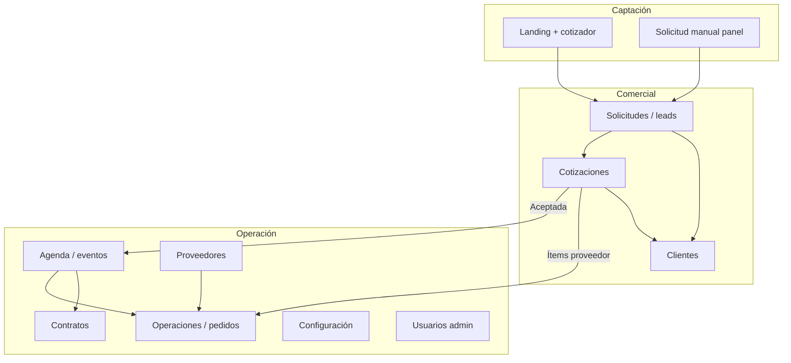
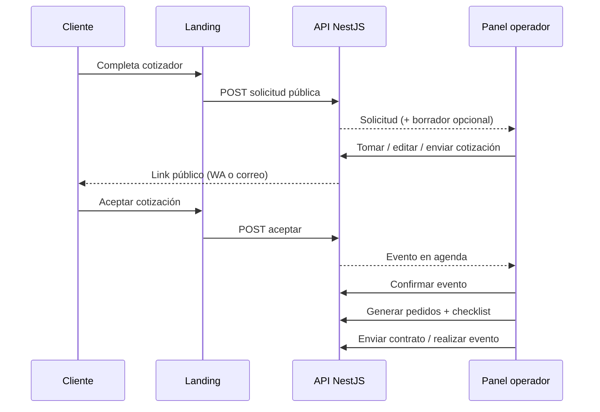
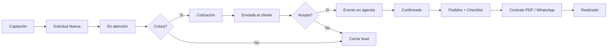
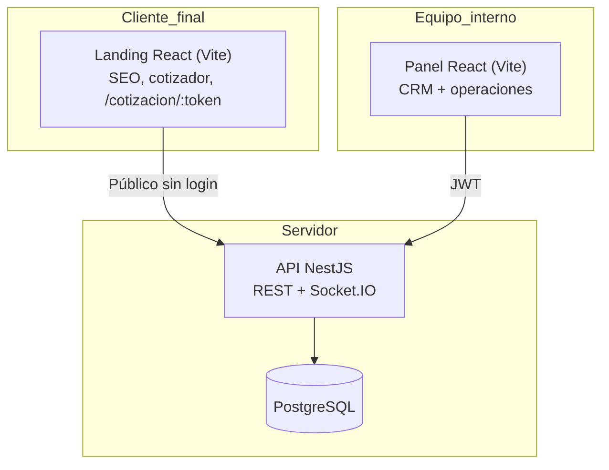

# Informe de avance — Bosque Mágico

**Para:** Gerencia  
**Versión:** 1.2  
**Fecha:** 2026-06-15  
**Producto:** Sistema comercial Bosque Mágico (landing + panel CRM + API)

---

## 1. Resumen ejecutivo

Se entregó y **validó en sandbox** un **MVP comercial completo** ampliado con **capacidades operativas** (pedidos a proveedores, checklist por evento y vista Operaciones). El equipo ya puede:

- Recibir solicitudes desde la **landing pública** o registrarlas **manualmente** en el panel.
- Gestionar leads en **Solicitudes**, con seguimiento, cierre y edición de datos de contacto.
- Armar, enviar y hacer seguimiento de **cotizaciones** (WhatsApp, correo, link público, PDF).
- Obtener **aceptación del cliente** por link público, lo que genera automáticamente el **evento** en agenda.
- Operar la **agenda** (confirmar, realizar o cancelar eventos) con vista calendario mensual.
- Gestionar **pedidos operativos** vinculados al evento (shows, catering, decoración, etc.) y verlos consolidados en **Operaciones**.
- Mantener **proveedores** y productos de origen externo en **Configuración**.
- Ejecutar **checklist** de tareas por evento confirmado.
- Generar, enviar e imprimir **contratos** vinculados al evento (PDF con términos, adelantos y snapshot de la cotización).
- Consultar el **historial por cliente** (identidad por celular/correo).
- Configurar **tarifas, turnos, catálogo y proveedores** sin redeploy.
- Administrar **usuarios y permisos** (solo rol admin).

El sistema está desplegado en **entorno sandbox** para pruebas reales del equipo. La **Fase 8 del panel** (tablas, notificaciones en tiempo real, modales unificados, UX consistente) está **completada**. El **15/06/2026** se ejecutó el script de QA de flujo comercial (`npm run qa:flujo`) contra sandbox con **21/21 pasos OK**.

**Fuera del alcance actual (decisión de producto):** pagos en línea y registro de abonos, firma electrónica legal, integración Meta Lead Ads automatizada, reportes exportables y postventa operativa. La **cobranza** sigue siendo manual fuera del sistema.

---

## 2. Objetivos del proyecto

### 2.1 Objetivos de negocio

| Objetivo | Cómo se cumple hoy |
|----------|-------------------|
| Un solo lugar para gestionar interesados en fiestas | Panel CRM: Solicitudes, Cotizaciones, Agenda, Operaciones, Clientes |
| No perder leads de la web | Landing con cotizador → API crea solicitud (y borrador de cotización si el payload es completo) |
| Respuesta comercial más rápida | Borrador automático desde landing; acciones WhatsApp/correo en una fila; detalle en modal |
| Trazabilidad del recorrido comercial | Bitácora de auditoría en solicitudes y cotizaciones; estados claros |
| Evitar tratar al mismo contacto como personas distintas | Módulo Clientes con reconocimiento por celular/correo y alerta de duplicado reciente (24 h) |
| Separar lo vendido de lo que sigue en negociación | Cotización aceptada → evento en agenda → contrato opcional → pedidos operativos |
| Coordinar logística con proveedores externos | Pedidos auto-generados desde ítems de cotización con producto `origen=proveedor`; vista Operaciones por semana |

### 2.2 Objetivos técnicos

| Objetivo | Implementación |
|----------|----------------|
| Producto web independiente y escalable | Monorepo: `apps/landing`, `apps/panel`, `apps/api` |
| Reglas de negocio centralizadas | NestJS + `CalculoPreciosService` |
| Base de datos propia del dominio | PostgreSQL con tablas del módulo Bosque |
| Seguridad básica | JWT en panel, rate limit en endpoint público, permisos `view` / `manage` / `admin` |
| Operación en sandbox antes de producción | Docker Compose + URLs públicas de API, panel y landing |
| Calidad reproducible | Scripts `qa:smoke`, `qa:flujo`, `qa:operaciones`, `db:cleanup` |

### 2.3 Principio de diseño (gentle-ai)

El sistema **asiste al vendedor** sin automatismos opacos: estados visibles simples, acciones explícitas (tomar, enviar, aceptar, confirmar) y registro en bitácora. La complejidad del CRM prototipo PHP se simplificó en la interfaz sin perder trazabilidad en backend.

---

## 3. Alcance entregado vs. pendiente

### 3.1 Entregado (MVP + Fase 8 + Contratos + Operaciones)



| Área | Entregado |
|------|-----------|
| Landing pública | Cotizador, catálogo desde API, SEO, link público de cotización |
| Solicitudes | Listado, filtros, tomar, seguimiento, cerrar, editar lead, duplicados, bitácora |
| Cotizaciones | Crear, editar borrador, enviar WA/correo, PDF, link público, aceptar desde panel |
| Agenda | Vista mes (default) y lista, confirmar, realizar, cancelar; TZ Lima; deep link `?detalle=` |
| **Operaciones** | Listado de pedidos por rango de fechas, costo estimado, enlace a evento |
| **Pedidos por evento** | CRUD en detalle de evento; generación desde cotización; estados operativos |
| **Checklist** | Tareas por evento; plantillas por área; progreso completadas/total |
| **Proveedores** | CRUD en Configuración; vinculación a productos y pedidos |
| Contratos | Generar desde evento, PDF imprimible, enviar WhatsApp, estados Borrador → Enviado → Firmado |
| Clientes | Ficha consolidada, historial, contacto WA/correo |
| Configuración | Tarifas, turnos editables, catálogo productos con imagen, proveedores |
| Panel UX Fase 8 | Filtros en tablas, paginado, WebSocket + campana, modales unificados, sidebar colapsable |
| Dashboard | KPIs por estado de solicitud; próximos eventos con fecha legible y enlace a agenda |
| Calidad | Tests unitarios de precios; smoke E2E API; **flujo paso a paso 21 pasos** |
| Sandbox | Stack desplegable; QA validado 15/06/2026 |

### 3.2 Pendiente (fases posteriores)

| Tema | Motivo de postergación |
|------|------------------------|
| Meta Lead Ads + WhatsApp automatizado (n8n / YCloud) | Integración externa en diseño; captación manual y landing ya operativas |
| Pagos y cobranza en sistema | Complejidad financiera; adelantos en contrato son referenciales |
| Cierre formal de cotización con motivo | Mejora de proceso; hoy se cierra vía solicitud o estados |
| Dashboard KPIs avanzados | Resumen básico existe; reportes gerenciales en fase siguiente |
| Exportación de auditoría / reportes | Operación diaria no lo exige aún |
| E2E automatizado del panel | Smoke y `qa:flujo` cubren API; UI manual documentada |
| Firma electrónica legal del contrato | Se marca **Firmado** manualmente |
| Notificaciones automáticas a proveedores | Pedidos se gestionan en panel; contacto WA manual |

---

## 4. Casos de uso cubiertos

### 4.1 Matriz resumida

| # | Caso de uso | Actor | Resultado |
|---|-------------|-------|-----------|
| CU-01 | Cliente cotiza en la web | Cliente / landing | Solicitud creada; opcional borrador de cotización |
| CU-02 | Vendedor registra interés por teléfono | Operador | Solicitud manual en panel |
| CU-03 | Vendedor toma y da seguimiento a un lead | Operador | Estado En atención + notas y próximo contacto |
| CU-04 | Vendedor edita datos del contacto | Operador | PATCH solicitud (modal Solicitud) |
| CU-05 | Sistema detecta posible duplicado | Sistema | Flag en solicitud (misma identidad &lt; 24 h) |
| CU-06 | Vendedor arma y envía cotización | Operador | Borrador → Enviada; mensaje WA o correo |
| CU-07 | Cliente revisa y acepta cotización en línea | Cliente | Cotización Aceptada + evento Por confirmar |
| CU-08 | Vendedor acepta cotización en nombre del cliente | Operador | Mismo resultado que CU-07 |
| CU-09 | Operación confirma y cierra el evento | Operador | Confirmado → Realizado (o Cancelado) |
| CU-10 | Consultar historial de un contacto recurrente | Operador | Módulo Clientes |
| CU-11 | Admin ajusta tarifas, turnos, catálogo o proveedores | Admin | Configuración persistida en BD |
| CU-12 | Admin gestiona usuarios del panel | Admin | CRUD en `/usuarios` |
| CU-13 | Vendedor genera contrato desde evento aceptado | Operador | Contrato en borrador con snapshot de cotización |
| CU-14 | Vendedor envía contrato e imprime PDF | Operador | WhatsApp + PDF; estado Enviado |
| CU-15 | Vendedor marca contrato firmado | Operador | Estado Firmado |
| **CU-16** | **Operación genera pedidos desde cotización** | **Operador** | **Pedidos por ítem proveedor al confirmar evento** |
| **CU-17** | **Operación gestiona pedidos semanales** | **Operador** | **Vista Operaciones con filtro de fechas y costo total** |
| **CU-18** | **Operación ejecuta checklist del evento** | **Operador** | **Tareas pendiente → completado en detalle de evento** |

### 4.2 Caso crítico: de la landing a la operación del evento

1. **Landing:** el cliente completa el cotizador y envía.
2. **API:** crea solicitud; si el payload trae paquete, fecha, turno y niños, genera **cotización en borrador**.
3. **Panel — Solicitudes:** el equipo ve la solicitud (Nueva), la toma, revisa datos y contacta.
4. **Panel — Cotizaciones:** revisa o edita el borrador, **envía** por WhatsApp o correo (Enviada).
5. **Landing — link público:** el cliente abre `/cotizacion/:token` y **acepta**.
6. **Sistema:** cotización Aceptada + **evento** en agenda (Por confirmar).
7. **Panel — Agenda:** **Confirmar evento** → se pueden generar **pedidos** desde ítems de cotización con proveedor y **checklist**.
8. **Panel — Operaciones:** revisar pedidos de la semana, costos y estado.
9. **Panel — Agenda:** generar **contrato** (opcional) → enviar PDF/WhatsApp → marcar firmado.
10. **Panel — Agenda:** al terminar la fiesta, **marcar realizado**.



---

## 5. Flujos de negocio

### 5.1 Estados visibles (simplificados para el equipo)

En pantalla se habla de **Estado** (en base de datos el campo técnico sigue llamándose `etapa`).

| Módulo | Estados | Significado para gerencia |
|--------|---------|---------------------------|
| **Solicitud** | Nueva → En atención → Cotizada → Cerrada | Embudo comercial del lead |
| **Cotización** | Borrador → Enviada → Aceptada → Cerrada | Ciclo de la propuesta |
| **Evento** | Por confirmar → Confirmado → Realizado / Cancelado | Ejecución de la fiesta vendida |
| **Contrato** | Borrador → Enviado → Firmado / Anulado | Documento formal post-venta |
| **Pedido** | Pendiente → Solicitado → Confirmado → En proceso → Entregado → Cerrado / Cancelado | Logística con proveedores o áreas internas |
| **Tarea (checklist)** | Pendiente → En proceso → Completado / Bloqueado | Preparación operativa del evento |

### 5.2 Flujo comercial + operativo



### 5.3 Identidad del cliente

- Un **cliente** agrupa solicitudes y cotizaciones por **celular o correo**.
- La landing y las solicitudes nuevas **vinculan o crean** ese registro automáticamente.

### 5.4 Reglas de negocio relevantes

| Regla | Comportamiento |
|-------|----------------|
| Precios | Calculados en backend según tarifas, día, paquete, niños e ítems |
| Doble reserva | Al aceptar cotización se valida slot **fecha + turno** |
| Link público | Solo permite aceptar si la cotización está **Enviada** |
| Pedidos | Disponibles cuando el evento está **Confirmado** o **Realizado** |
| Auto-pedidos | Al confirmar, ítems de cotización con producto `origen=proveedor` pueden generar pedidos |
| Contrato por evento | Máximo un contrato activo; requiere cotización **Aceptada** |
| Duplicado reciente | Misma identidad con solicitud en las últimas 24 h → alerta |

---

## 6. Arquitectura del sistema

### 6.1 Vista de componentes



### 6.2 Estructura del repositorio

```text
proyecto-bosque-magio/
├── apps/
│   ├── api/       NestJS, Prisma, dominio Bosque Mágico
│   ├── panel/     CRM interno (React 19, TanStack Query/Table)
│   └── landing/   Web pública (React, cotizador, cotización pública)
├── .docs/         Planificación, flujos, informes de entrega
├── scripts/       QA smoke, flujo paso a paso, operaciones demo
└── docker-compose.sandbox.yml
```

### 6.3 Modelo operativo (nuevo jun 2026)

| Entidad | Propósito |
|---------|-----------|
| `Proveedor` | Contacto externo (shows, catering, etc.) |
| `Pedido` | Orden operativa ligada a un evento (área, costo, etapa, proveedor opcional) |
| `TareaEvento` | Ítem de checklist por evento (área operaciones, decoración, etc.) |

Los productos del catálogo pueden marcarse como `origen=proveedor` y vincularse a un proveedor; al confirmar el evento, el sistema puede crear pedidos automáticamente desde los ítems de la cotización aceptada.

### 6.4 Seguridad y permisos

| Rol / permiso | Capacidades |
|---------------|-------------|
| `view` | Consultar solicitudes, cotizaciones, agenda, clientes, operaciones |
| `manage` | Crear/editar operación comercial, catálogo, proveedores (sin tarifas) |
| `admin` | Configuración de tarifas y turnos, usuarios, todo lo anterior |

---

## 7. Módulos del panel (capacidades)

| Módulo | Rol en el negocio | Capacidades clave |
|--------|-------------------|-------------------|
| **Dashboard** | Vista rápida | KPIs por estado de solicitud; próximos eventos con enlace a agenda |
| **Solicitudes** | Leads | Filtros, tomar, seguimiento, cerrar, editar lead, crear cotización, bitácora |
| **Cotizaciones** | Propuesta comercial | Borrador, enviar, PDF, link, aceptar, bitácora |
| **Agenda** | Evento vendido | Calendario mes/lista, confirmar / realizar / cancelar, pedidos, checklist, contrato |
| **Operaciones** | Logística semanal | Pedidos por rango de fechas, costo estimado, salto a evento |
| **Contratos** | Formalización | Listado, PDF, WhatsApp, marcar enviado/firmado |
| **Clientes** | Memoria comercial | Historial, frecuencia, contacto directo |
| **Configuración** | Reglas y catálogo | Tarifas, turnos, productos, **proveedores** |
| **Usuarios** | Gobierno de acceso | Solo admin |

---

## 8. Avances recientes (cierre 15 jun 2026)

| Fecha / hito | Entrega |
|--------------|---------|
| Flujo comercial panel + landing | Integración completa solicitud → cotización → agenda |
| Sandbox | Despliegue Docker con URLs públicas |
| Módulo Contratos (2026-06-10) | PDF, WhatsApp, estados Borrador/Enviado/Firmado |
| Agenda TZ Lima + vista mes default | Calendario mensual; modal de día |
| Fase 8 panel | Tablas, WS, modales, usuarios — **completada** |
| **Proveedores + Pedidos (2026-06-15)** | CRUD proveedores; pedidos en evento; vista Operaciones |
| **Checklist por evento (2026-06-15)** | Tareas generables; progreso en detalle de agenda |
| **Dashboard fix (2026-06-14)** | Fechas legibles en Próximos eventos; enlace `?detalle=` |
| **QA flujo 21/21 (14–15/06)** | Local y sandbox con correos germanhuaytalla22/23@gmail.com |
| **Limpieza demo (`db:cleanup`)** | Script para borrar datos QA sin afectar correos de prueba german |
| **Fix `generarCodigo` cotizaciones** | Evita colisión COT-##### tras limpieza parcial |

---

## 9. Entornos disponibles

### 9.1 Desarrollo local

| Servicio | URL típica |
|----------|------------|
| API | `http://localhost:3000/api` (Swagger: `/api/docs`) |
| Panel | `http://localhost:5174` |
| Landing | `http://localhost:5173` |

Credencial tras seed: `admin@bosquemagico.test` / `BosqueDev123!`

### 9.2 Sandbox (pruebas del equipo)

| Servicio | URL |
|----------|-----|
| API | `https://sandbox-api-bosque.gcbprojects.site/api` |
| Panel | `https://sandbox-panel-bosque.gcbprojects.site` |
| Landing | `https://sandbox-landing-bosque.gcbprojects.site` |

**Credencial sandbox (VPS actual):** `admin@bosquemagico.test` / `admin@@@`  
_(El `docker-compose.sandbox.yml` declara `BosqueDev123!` pero el seed en VPS dejó `admin@@@`.)_

---

## 10. Indicadores de madurez

| Criterio | Estado |
|----------|--------|
| Flujo comercial de punta a punta | ✅ Operativo |
| Flujo operativo (pedidos + checklist) | ✅ Operativo (MVP) |
| Contratos PDF + seguimiento | ✅ Operativo |
| Reglas de precio en servidor | ✅ Con tests unitarios |
| Trazabilidad (auditoría) | ✅ En solicitud y cotización |
| UX unificada en panel | ✅ Fase 8 cerrada |
| Prueba automatizada API (smoke + flujo 21 pasos) | ✅ |
| Prueba E2E UI automatizada | ⬜ Pendiente |
| Producción final (dominio cliente) | ⬜ Siguiente decisión de go-live |

---

## 11. Resultados QA (15 jun 2026)

Resumen de validación en sandbox (`npm run qa:flujo` — **21/21 OK**):

| Flujo | Correo | Resultado |
|-------|--------|-----------|
| A (landing → envío WA) | germanhuaytalla22@gmail.com | Solicitud + cotización enviada |
| B (manual → E2E completo) | germanhuaytalla23@gmail.com | Solicitud → cotización → evento realizado + 5 tareas checklist |
| C (cierre) | lead @example.test | Cerrada `sin_respuesta` |

Operaciones demo en sandbox: evento `3e93e6ce-cf03-4f3a-9e57-967572e52737` con 1 pedido SHOW-MIMO + 5 tareas.

Detalle completo: [03-PRUEBAS-Y-QA.md](./03-PRUEBAS-Y-QA.md)

---

## 12. Riesgos y mitigaciones

| Riesgo | Mitigación actual |
|--------|-------------------|
| Lead duplicado por reenvío en landing | Alerta `posibleDuplicado` + módulo Clientes |
| Doble reserva de fecha/turno | Validación al aceptar cotización |
| Spam en formulario público | Rate limit en API |
| Pedidos olvidados antes del evento | Vista Operaciones por semana + checklist |
| Dependencia de WhatsApp manual | Modal de revisión de mensaje; preapertura de pestaña |

---

## 13. Recomendaciones para gerencia

### 13.1 Uso inmediato del sandbox

1. Asignar 2–3 personas del equipo comercial para el **checklist manual** en [03-PRUEBAS-Y-QA.md](./03-PRUEBAS-Y-QA.md).
2. **Demo para gerencia:** guion integral [04-EJEMPLO-REAL-GERMAN22-GERENCIA.md](./04-EJEMPLO-REAL-GERMAN22-GERENCIA.md) con `germanhuaytalla22@gmail.com`.
3. Simular caso real: landing → cotización → aceptar → confirmar → **pedidos + checklist** → contrato.
4. Recoger feedback sobre textos, tiempos y campos faltantes antes del go-live.

### 13.2 Orden operativo sugerido

1. **Solicitudes** — priorizar lo nuevo.  
2. **Cotizaciones** — enviar y dar seguimiento.  
3. **Agenda** — confirmar lo vendido; generar pedidos y checklist.  
4. **Operaciones** — revisar pedidos de la semana y costos.  
5. **Contratos** — enviar PDF y marcar firmado.  
6. **Clientes** — contexto en recompras.

### 13.3 Próximas inversiones (prioridad negocio)

| Prioridad | Tema | Valor |
|-----------|------|-------|
| Alta | Go-live producción (dominio, SSL, backups) | Uso real con clientes |
| Media | KPIs en dashboard | Control gerencial |
| Media | Meta Lead Ads → WhatsApp (n8n / YCloud) | Automatizar campañas Instagram |
| Media | Notificación a proveedores desde pedido | Menos seguimiento manual |
| Baja | Módulo de pagos | Cuando contratos estén estables |

---

## 14. Referencias

| Documento | Ubicación |
|-----------|-----------|
| Manual operario (detalle paso a paso) | `.docs/entrega-2026-06-15/02-MANUAL-OPERARIO.md` |
| **Demo gerencia (caso german22)** | `.docs/entrega-2026-06-15/04-EJEMPLO-REAL-GERMAN22-GERENCIA.md` |
| Pruebas y QA | `.docs/entrega-2026-06-15/03-PRUEBAS-Y-QA.md` |
| Flujos y guía operativa base | `.docs/BOSQUE_FLUJOS_Y_GUIA_USO.md` |
| Estado por módulo | `.docs/MODULOS_ESTADO.md` |
| Bitácora QA junio | `.docs/PRUEBAS_FLUJO_JUNIO_2026.md` |

---

*Documento preparado para comunicación interna de avance. Versión 1.2 — 2026-06-15.*
