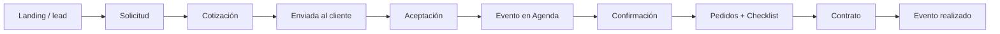

# Informe de avance — Bosque Mágico

**Para:** Gerencia  
**Versión:** 1.3  
**Fecha:** 2026-06-16  
**Producto:** Sistema comercial Bosque Mágico (landing + panel + API)

## 1. Resumen ejecutivo

Bosque Mágico ya cuenta con un **MVP comercial operativo** que cubre el flujo principal desde la captación del lead hasta la gestión del evento vendido. Sobre esa base, la entrega reciente incorporó un **bloque operativo inicial** para pedidos, proveedores, checklist y contratos, con validación en entorno local y sandbox.

Hoy el equipo puede:

- Recibir solicitudes desde la landing o registrarlas manualmente.
- Gestionar leads en `Solicitudes`.
- Preparar y enviar cotizaciones por WhatsApp o correo.
- Permitir aceptación del cliente por link público.
- Crear automáticamente el evento en `Agenda` cuando la cotización es aceptada.
- Confirmar, operar y cerrar eventos.
- Gestionar pedidos por evento y visualizarlos en `Operaciones`.
- Generar contratos PDF y registrar seguimiento de envío/firma.

## 2. Estado actual del producto

| Área | Estado actual |
|------|---------------|
| Captación | Landing pública con cotizador y creación de solicitudes |
| Comercial | Solicitudes, cotizaciones, seguimiento y aceptación |
| Operación | Agenda, pedidos, checklist y vista `Operaciones` |
| Formalización | Contratos con PDF, envío y marcado de firmado |
| Gobierno | Configuración, usuarios y permisos |
| Calidad | Scripts de QA y validación manual en sandbox |

## 3. Alcance entregado

### 3.1 Módulos ya operativos

| Módulo | Capacidades principales |
|--------|-------------------------|
| `Dashboard` | Resumen por estado y próximos eventos |
| `Solicitudes` | Tomar, editar, cerrar, seguimiento y bitácora |
| `Cotizaciones` | Borrador, envío, link público, PDF y aceptación |
| `Agenda` | Vista mes/lista, confirmar, realizar, cancelar |
| `Operaciones` | Pedidos por rango de fechas y costo estimado |
| `Contratos` | Generación, PDF, WhatsApp, enviado y firmado |
| `Clientes` | Historial por identidad |
| `Configuración` | Tarifas, turnos, catálogo y proveedores |
| `Usuarios` | Control de accesos por rol |

### 3.2 Operación integrada reciente

La capa operativa agregada permite:

- Asociar productos del catálogo a `proveedores`.
- Generar pedidos a partir de ítems de cotización.
- Visualizar pedidos del evento dentro del detalle de `Agenda`.
- Hacer seguimiento consolidado desde `Operaciones`.
- Activar un checklist por evento confirmado.

## 4. Flujo de negocio cubierto

### 4.1 Resultado esperado para gerencia

El sistema ya permite demostrar que:

1. El lead entra por la web y queda registrado.
2. Comercial toma el lead y envía la propuesta.
3. El cliente acepta en línea sin intervención técnica.
4. El evento aparece en agenda automáticamente.
5. Operación gestiona pedidos y tareas.
6. El contrato sale desde la misma información vendida.

## 5. Validación y QA

### 5.1 Validación ejecutada

| Tipo | Resultado |
|------|-----------|
| `qa:smoke` | Cobertura API y endpoints clave |
| `qa:flujo` | 21 pasos OK en flujo comercial y operativo base |
| `qa:operaciones` | Validación de pedidos/proveedor demo |
| Verificación manual | Dashboard, Agenda, Operaciones, Contratos |

### 5.2 Hallazgos ya resueltos

- Corrección del problema `INVALID DATE` en `Dashboard`.
- Flujo estable para próximos eventos con enlace a detalle.
- Código de cotización robustecido para evitar colisiones tras limpiezas parciales.

## 6. Riesgos y límites actuales

| Tema | Situación |
|------|-----------|
| Pagos y cobranza | Fuera del alcance actual |
| Firma electrónica legal | Pendiente de fase posterior |
| Integración Meta / WhatsApp automatizado | En diseño futuro |
| E2E UI automatizado | Aún no implementado |

## 7. Recomendación inmediata

La recomendación es usar el entorno sandbox para una **demo de gerencia** con un caso integral realista. Para eso se dejó preparado el documento:

- `.docs/entrega-2026-06-16/04-EJEMPLO-REAL-GERMAN22-GERENCIA.md`

Ese guion recorre de punta a punta el caso con `germanhuaytalla22@gmail.com`.

## 8. Siguiente decisión de negocio

Las próximas decisiones recomendadas para gerencia son:

1. Validar el flujo completo con el equipo comercial.
2. Ajustar textos, campos y microproceso operativo según feedback.
3. Definir checklist de go-live.
4. Priorizar si la siguiente inversión va a pagos, automatización Meta/WhatsApp o KPIs gerenciales.

## 9. Referencias

| Documento | Ubicación |
|-----------|-----------|
| Manual operario | `.docs/entrega-2026-06-16/02-MANUAL-OPERARIO.md` |
| Pruebas y QA | `.docs/entrega-2026-06-16/03-PRUEBAS-Y-QA.md` |
| Demo integral gerencia | `.docs/entrega-2026-06-16/04-EJEMPLO-REAL-GERMAN22-GERENCIA.md` |
