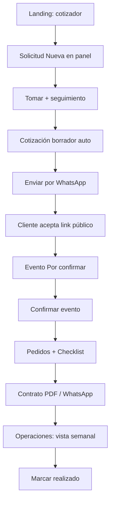

# Caso real integral — Germán Huaytalla (`germanhuaytalla22@gmail.com`)

**Para:** Gerencia y equipo comercial (demo en sandbox)  
**Versión:** 1.1  
**Fecha:** 2026-06-17  
**Duración estimada:** 45–60 minutos (recorrido completo en vivo)

Este documento es un **guion de demostración** con datos coherentes de un cliente real de prueba. Cubre el flujo **de punta a punta**: captación en la web → gestión comercial → aceptación → agenda → operaciones → contrato → cierre.

---

## 1. Ficha del caso (historia para la demo)

| Campo | Valor de ejemplo |
|-------|------------------|
| **Contacto (padre/madre)** | Germán Huaytalla |
| **Correo** | `germanhuaytalla22@gmail.com` |
| **Celular** | `910139973` (celular unificado de pruebas QA; usar uno distinto si repites la demo en producción) |
| **Cumpleañera** | Sofía, 6 años |
| **Temática** | Princesas |
| **Paquete** | Premium |
| **Fecha tentativa** | ~2 semanas desde hoy (ej. si hoy es 17/06/2026 → **01/07/2026**) |
| **Turno** | Turno 2 — 2:00 p.m. a 5:00 p.m. |
| **Niños** | 22 |
| **Extras landing** | Pintacaritas (`EXT-PINTA`), Show de magia (`SHOW-MAGIA`), Popcorn (`CAT-POPCORN`) |
| **Canal de entrada** | Landing pública (cotizador web) |

**Por qué este correo:** está reservado para pruebas (`db:cleanup` no lo borra). Con celular `910139973` compartido en QA, **Clientes** puede fusionar identidad; en **Solicitudes** busca siempre por **correo** para verificar el lead correcto.

---

## 2. Entorno y accesos

| Recurso | URL / dato |
|---------|------------|
| **Landing (cliente)** | https://sandbox-landing-bosque.gcbprojects.site |
| **Panel (equipo)** | https://sandbox-panel-bosque.gcbprojects.site |
| **Login panel** | `admin@bosquemagico.test` / `admin@@@` |
| **Buscar en panel** | Filtro por correo: `germanhuaytalla22@gmail.com` |

> **Tip para la presentación:** abre **dos ventanas** del navegador: una con la landing (rol cliente) y otra con el panel (rol vendedor). Así gerencia ve el mismo flujo desde ambos lados.

---

## 3. Mapa del recorrido completo



| Fase | Módulo | Estado clave al terminar |
|------|--------|--------------------------|
| 1 | Landing | Solicitud creada en backend |
| 2 | Solicitudes | **En atención** → **Cotizada** |
| 3 | Cotizaciones | **Enviada** |
| 4 | Landing (link) | **Aceptada** |
| 5 | Agenda | **Confirmado** |
| 6 | Agenda (detalle) | Pedidos + checklist activos |
| 7 | Contratos | **Enviado** / **Firmado** |
| 8 | Operaciones | Pedidos visibles en rango |
| 9 | Agenda | **Realizado** |

---

## 4. Fase 1 — El cliente cotiza en la web (Landing)

**Rol:** Germán (cliente)  
**URL:** https://sandbox-landing-bosque.gcbprojects.site

### Paso 1.1 — Explorar y elegir paquete

1. Entra a la landing.
2. Navega la sección de **paquetes** y selecciona **Premium**.
3. (Opcional) Revisa shows y catering en el catálogo.

**Qué decir a gerencia:** *«Así entra hoy un padre desde Instagram o la web: sin login, sin llamar. El catálogo y precios vienen del panel — no hay que redeployar para cambiar tarifas.»*

### Paso 1.2 — Completar el cotizador

1. Abre el **cotizador** (formulario de cotización).
2. Completa:

| Campo | Valor |
|-------|-------|
| Nombre contacto | Germán Huaytalla |
| Celular | `910139973` |
| Correo | `germanhuaytalla22@gmail.com` |
| Nombre cumpleañero/a | Sofía |
| Edad | 6 |
| Fecha | ~14 días adelante |
| Turno | Turno 2 (tarde) |
| Cantidad de niños | 22 |
| Temática | Princesas |

3. En opciones adicionales (si aparecen en el cotizador):
   - Extra: **Pintacaritas**
   - Show: **Show de magia**
   - Catering: **Popcorn** (u otro ítem demo)

4. Revisa el **total estimado** que calcula la landing (viene del servidor, no es un Excel aparte).
5. Pulsa **Enviar solicitud** / confirmar envío.

**Resultado esperado:**

- Mensaje de confirmación en pantalla.
- Sin errores en consola del navegador (F12 → Console).

**Qué pasa en el sistema (invisible para el cliente):**

- Se crea una **Solicitud** con canal `landing`.
- Si el payload trae paquete, fecha, turno y niños completos → se genera **cotización en borrador** automáticamente.
- Se vincula o crea el registro de **Cliente** por celular/correo.

---

## 5. Fase 2 — El equipo recibe el lead (Panel → Solicitudes)

**Rol:** Vendedor / operador  
**URL:** https://sandbox-panel-bosque.gcbprojects.site → **Solicitudes**

### Paso 2.1 — Localizar la solicitud

1. Inicia sesión (`admin@bosquemagico.test` / `admin@@@`).
2. Ve a **Solicitudes**.
3. En filtros, busca: `germanhuaytalla22@gmail.com`  
   *(o filtra **Estado → Nueva** si acabas de enviar)*.
4. Verifica que aparece la fila de **Germán Huaytalla** con fecha/hora de registro reciente.

**Qué decir a gerencia:** *«El lead aparece en segundos. La campana y el indicador En vivo pueden avisar sin refrescar la página.»*

### Paso 2.2 — Abrir detalle y revisar datos

1. Clic en el **nombre** o icono **Ver**.
2. En el modal revisa:
   - Datos de contacto (correo, celular).
   - **Canal:** Landing.
   - Preferencias del cotizador: paquete Premium, turno, niños, temática Princesas.
   - Si hay **cotización vinculada** (borrador automático).

**Estado esperado:** Solicitud **Nueva** (o **Cotizada** si el borrador auto ya la movió).

### Paso 2.3 — Tomar la solicitud

1. Pulsa **Tomar solicitud**.
2. Confirma.

**Estado esperado:** **En atención**.

### Paso 2.4 — Registrar primer contacto

1. En sección **Seguimiento**, escribe notas de ejemplo:

   > *«17/06 — Llamada inicial. Confirma fecha tentativa y paquete Premium. Interesado en show de magia. Envío cotización por WhatsApp.»*

2. Opcional: **Próximo seguimiento** → mañana 10:00.
3. Guarda.

**Qué decir a gerencia:** *«Toda la gestión queda en bitácora. Si cambia el turno del vendedor, el siguiente ve el historial.»*

---

## 6. Fase 3 — Revisar y enviar la cotización (Panel → Cotizaciones)

**Rol:** Vendedor

### Paso 3.1 — Ir a la cotización

Desde el detalle de la solicitud:

- Si hay borrador auto → **Ver cotización** o **Editar borrador**.
- Si no hay → **Crear cotización** (completar paquete, fecha, turno, 22 niños, ítems).

### Paso 3.2 — Revisar montos

En el formulario / detalle de cotización verifica:

| Concepto | Qué revisar |
|----------|-------------|
| Base paquete Premium | Según tarifa día semana / fin de semana |
| Extras e ítems | Pintacaritas, show, catering |
| Total | Calculado por el sistema |

Ajusta si hace falta (ej. quitar un extra) y **guarda**.

**Estado cotización:** **Borrador**.

**Qué decir a gerencia:** *«El precio lo define el backend con las tarifas de Configuración. El vendedor no arma un Excel paralelo.»*

### Paso 3.3 — Enviar al cliente por WhatsApp

1. En detalle de cotización → **Enviar por WhatsApp**.
2. Revisa el **modal de mensaje** (texto + link público).
3. Confirma → se abre WhatsApp (`wa.me`) con el mensaje preparado.
4. *(En demo)* puedes no enviar realmente al celular; lo importante es que la cotización pase a **Enviada**.

**Estado esperado:**

| Módulo | Estado |
|--------|--------|
| Cotización | **Enviada** |
| Solicitud | **Cotizada** |

### Paso 3.4 — Copiar link público (para la demo)

1. **Copiar link** en el detalle de la cotización.
2. Guárdalo en el portapapeles — lo usarás en la Fase 4 simulando al cliente.

Formato típico del link:

```text
https://sandbox-landing-bosque.gcbprojects.site/cotizacion/<token>
```

---

## 7. Fase 4 — El cliente acepta la propuesta (Landing → link público)

**Rol:** Germán (cliente) — ventana de landing

### Paso 4.1 — Abrir el link

1. Pega el link copiado en una pestaña **sin login** (modo incógnito recomendado).
2. Verifica que carga la página pública con:
   - Nombre del cliente / cumpleañera.
   - Fecha, turno, paquete.
   - Total de la propuesta.

### Paso 4.2 — Aceptar

1. Pulsa **Aceptar cotización**.
2. Debe aparecer mensaje de éxito: *«Cotización aceptada. Te contactaremos…»*

**Si no aparece el botón:**

| Mensaje en pantalla | Causa | Acción |
|---------------------|-------|--------|
| *«aún no está disponible para aceptar»* | Cotización en **Borrador** | Volver al panel y **Enviar** primero |
| *«ya fue aceptada»* | Ya se aceptó antes | Ir directo a **Agenda** |

**Estados tras aceptar:**

| Módulo | Estado |
|--------|--------|
| Cotización | **Aceptada** |
| Evento (Agenda) | **Por confirmar** (creado automáticamente) |

**Qué decir a gerencia:** *«El cliente no llama para confirmar: acepta en línea y el evento cae solo en agenda. Validamos además que no haya doble reserva en la misma fecha y turno.»*

---

## 8. Fase 5 — Confirmar la fiesta vendida (Panel → Agenda)

**Rol:** Vendedor / operación

### Paso 5.1 — Verificar en Dashboard

1. **Dashboard** → sección **Próximos eventos**.
2. Busca el evento de **Sofía — Germán Huaytalla**.
3. Fecha legible (ej. `JUN 29`), **no** «INVALID DATE».
4. Clic en el evento → abre Agenda con detalle.

### Paso 5.2 — Abrir evento en Agenda

**URL directa (si conoces el id):** `/agenda?detalle=<id-evento>`

O bien:

1. **Agenda** → vista **Mes** (default).
2. Navega al mes de la fecha del evento.
3. Clic en el **día** → modal con eventos del día → clic en el evento.

**Estado evento:** **Por confirmar**.

### Paso 5.3 — Confirmar evento

1. En el detalle (modal), revisa: cliente, fecha, turno, 22 niños.
2. Pulsa **Confirmar evento**.

**Estado evento:** **Confirmado**.

**Qué decir a gerencia:** *«Confirmar es el momento en que operación toma el relevo comercial: a partir de aquí se activan pedidos y checklist.»*

---

## 9. Fase 6 — Logística: pedidos y checklist (Agenda → detalle)

**Rol:** Operación

### Paso 6.1 — Generar pedidos desde cotización

En el detalle del evento **Confirmado**, sección **Pedidos operativos**:

1. Pulsa **Generar desde cotización**.
2. Si la cotización incluye productos con **origen = Proveedor externo** (ej. show), aparecerán pedidos vinculados.
3. Si no hay ítems de proveedor, crea uno manual: **+ Pedido** → nombre, área (Shows/proveedores), costo, proveedor.

**Ejemplo de pedido manual:**

| Campo | Valor |
|-------|-------|
| Nombre | Show de magia — Sofía |
| Área | Shows / proveedores |
| Proveedor | *(el configurado en catálogo)* |
| Costo | Según catálogo |
| Estado | Pendiente → **Solicitado** (tras contactar proveedor) |

### Paso 6.2 — Checklist del evento

Sección **Checklist**:

1. Pulsa **Generar checklist** (si está vacío).
2. Marca tareas según avance: **Pendiente** → **En proceso** → **Completado**.
3. Objetivo demo: mostrar progreso ej. `3/5 completadas`.

**Qué decir a gerencia:** *«Cada fiesta tiene su lista de preparación y sus pedidos a terceros, visibles en un solo lugar junto al contrato.»*

---

## 10. Fase 7 — Contrato formal (Agenda o Contratos)

**Rol:** Vendedor

### Paso 7.1 — Generar contrato

Desde el detalle del evento (pie del modal):

1. **Generar contrato**.
2. Completa:
   - **DNI:** ej. `12345678`
   - **Tipo comprobante:** Boleta o Factura
   - **Horario:** sugerido según turno 2 (14:00–17:00)
   - **Adelanto:** S/ 500 (default)
3. Guarda → contrato **Borrador** (`BM-CT-000xx`).

### Paso 7.2 — Revisar PDF

1. **Imprimir / PDF** → vista A4 con logo, servicios, términos.
2. *(Demo)* Guardar como PDF o mostrar en pantalla.

### Paso 7.3 — Enviar al cliente

1. **Enviar por WhatsApp** → mensaje con resumen + datos de adelanto.
2. O **Marcar enviado** si lo compartiste manualmente.

### Paso 7.4 — Marcar firmado

Cuando simules que Germán confirma por escrito:

1. **Marcar firmado** → estado **Firmado**.

**Qué decir a gerencia:** *«El contrato congela un snapshot de la cotización. Si después cambian precios en configuración, este documento no se altera. La firma legal electrónica es fase posterior; hoy registramos el acuerdo operativamente.»*

---

## 11. Fase 8 — Vista gerencial de operaciones (Operaciones)

**Rol:** Gerencia / jefe de operaciones  
**URL:** `/operaciones`

1. Abre **Operaciones** en el menú lateral.
2. Ajusta rango **Desde / Hasta** para incluir la fecha del evento de Sofía.
3. Verifica en la tabla:
   - Fecha del evento y turno.
   - Cliente **Germán Huaytalla**.
   - Pedido(s) con área y estado.
   - **Costo estimado** total en la cabecera.
4. Clic **Ver evento** → salta a Agenda con el detalle.

**Qué decir a gerencia:** *«En una sola pantalla veo todos los pedidos de la quincena y cuánto estamos comprometiendo con proveedores, sin abrir evento por evento.»*

---

## 12. Fase 9 — Cierre: fiesta realizada (Agenda)

**Rol:** Operación  
*(En demo puedes simular «día después de la fiesta»)*

1. **Agenda** → busca el evento **Confirmado** de Germán / Sofía.
2. Abre detalle.
3. En pedidos, marca estados finales: **Entregado** / **Cerrado**.
4. Completa checklist al 100%.
5. Pulsa **Marcar realizado**.

**Estado final del caso:**

| Entidad | Estado |
|---------|--------|
| Solicitud | Cotizada o Cerrada (ganada) |
| Cotización | Aceptada |
| Evento | **Realizado** |
| Contrato | Firmado |
| Pedidos | Entregado / Cerrado |

**Qué decir a gerencia:** *«El ciclo completo queda trazado: desde el formulario web hasta la fiesta ejecutada, con documentos y costos operativos en el medio.»*

---

## 13. Guion resumido para presentar en 15 minutos (versión corta)

Si el tiempo es limitado, prioriza estos pasos en vivo:

| # | Acción | Pantalla | Min |
|---|--------|----------|-----|
| 1 | Enviar cotizador landing con correo german22 | Landing | 3 |
| 2 | Buscar solicitud → Tomar → Ver borrador | Solicitudes | 3 |
| 3 | Enviar cotización WhatsApp | Cotizaciones | 2 |
| 4 | Abrir link → Aceptar | Landing /cotizacion/ | 2 |
| 5 | Dashboard próximos eventos → Agenda → Confirmar | Dashboard + Agenda | 3 |
| 6 | Generar pedido + checklist | Agenda detalle | 2 |
| 7 | Mostrar Operaciones + Contrato PDF | Operaciones + Contratos | 3 |

---

## 14. Atajo técnico (opcional): preparar Fases 1–3 por API

Si gerencia solo quiere ver **Fases 4–9** en vivo, un técnico puede ejecutar antes:

```bash
QA_API_URL="https://sandbox-api-bosque.gcbprojects.site/api" \
QA_EMAIL="admin@bosquemagico.test" \
QA_PASSWORD="admin@@@" \
npm run qa:flujo
```

Eso deja el flujo A (german22) en **cotización enviada**. Continúa la demo manual desde **§7 Fase 4** (aceptar link).

Para empezar totalmente limpio (sin borrar german22):

```bash
npm run db:cleanup   # solo en entorno local; en sandbox coordinar con técnico
```

---

## 15. Checklist de verificación post-demo

Marca al terminar la sesión con gerencia:

- [ ] Solicitud visible buscando `germanhuaytalla22@gmail.com`
- [ ] Cotización **Enviada** → **Aceptada**
- [ ] Evento en Agenda **Confirmado** → **Realizado**
- [ ] Al menos 1 pedido en detalle y en **Operaciones**
- [ ] Checklist con tareas completadas
- [ ] Contrato generado (PDF visible)
- [ ] Dashboard: fechas legibles en Próximos eventos
- [ ] Bitácora con acciones en solicitud y cotización

---

## 16. Preguntas frecuentes de gerencia (respuestas listas)

| Pregunta | Respuesta |
|----------|-----------|
| ¿Qué pasa si el cliente envía el formulario dos veces? | Alerta de **posible duplicado** (24 h) + módulo Clientes |
| ¿Puede aceptar sin que le enviemos antes? | No. Debe estar **Enviada**; en borrador el link lo indica |
| ¿Y si dos familias quieren la misma fecha y turno? | Al aceptar, el sistema valida **slot ocupado** |
| ¿Los precios los cambiamos sin programador? | Sí, en **Configuración → Tarifas** (admin) |
| ¿Esto ya está en producción? | No; estamos en **sandbox** para pruebas del equipo |
| ¿Cuándo Meta / WhatsApp automático? | Fase posterior; hoy captación web + gestión manual WA |

---

## 17. Referencias

| Documento | Uso |
|-----------|-----|
| [02-MANUAL-OPERARIO.md](./02-MANUAL-OPERARIO.md) | Detalle de cada botón del panel |
| [01-INFORME-GERENCIA.md](./01-INFORME-GERENCIA.md) | Visión ejecutiva y roadmap |
| [05-EJEMPLO-FLUJO-C-CONTRATO-PUBLICO.md](./05-EJEMPLO-FLUJO-C-CONTRATO-PUBLICO.md) | Demo alternativa con contrato público |
| [03-PRUEBAS-Y-QA.md](./03-PRUEBAS-Y-QA.md) | Scripts y resultados 30/30 |
| `.docs/PRUEBAS_FLUJO_JUNIO_2026.md` | Bitácora técnica del flujo A en API |

---

*Caso de demostración — Bosque Mágico. Correo de prueba reservado: `germanhuaytalla22@gmail.com`. No usar para clientes reales en producción.*
