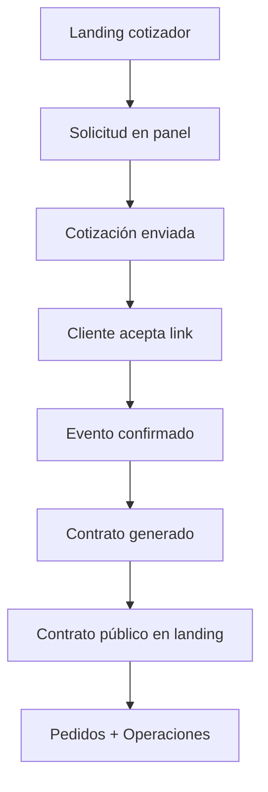

# Caso real — Flujo C: contrato público (`refugiogastronomico8222@gmail.com`)

**Para:** Gerencia y equipo comercial (demo complementaria)  
**Versión:** 1.0  
**Fecha:** 2026-06-17  
**Duración estimada:** 50–60 minutos (recorrido completo)

Este guion cubre el **flujo C** validado en QA local (**30/30** en `npm run qa:flujo`): captación landing → cotización → aceptación → evento → **contrato con vista pública en landing** → operaciones.

Complementa el caso [04-EJEMPLO-REAL-GERMAN22-GERENCIA.md](./04-EJEMPLO-REAL-GERMAN22-GERENCIA.md) (flujo A).

---

## 1. Ficha del caso

| Campo | Valor |
|-------|-------|
| **Contacto** | Cliente demo Refugio Gastronómico |
| **Correo** | `refugiogastronomico8222@gmail.com` |
| **Celular QA** | `910139973` |
| **Canal** | Landing pública |
| **Objetivo demo** | Mostrar **contrato público** consultable por el cliente |

**Preservación en limpieza:** `db:cleanup` y `db:cleanup:operativo` **no borran** este correo (reservado junto a los german).

---

## 2. Mapa del recorrido



| Fase | Estado clave |
|------|--------------|
| Cotización | **Enviada** → **Aceptada** |
| Evento | **Confirmado** |
| Contrato | **Borrador** → **Enviado** (opcional **Firmado**) |
| Landing | `/contrato/:token` accesible |

---

## 3. Entorno

| Recurso | URL / dato |
|---------|------------|
| Landing | https://sandbox-landing-bosque.gcbprojects.site |
| Panel | https://sandbox-panel-bosque.gcbprojects.site |
| Login | `admin@bosquemagico.test` / `admin@@@` |
| Buscar lead | `refugiogastronomico8222@gmail.com` |

---

## 4. Paso a paso

### Fase 1 — Landing (cliente)

1. Completar cotizador con correo `refugiogastronomico8222@gmail.com` y celular `910139973`.
2. Enviar solicitud.

**Qué decir a gerencia:** *«Segundo lead de prueba, distinto del caso german22, para validar que el sistema escala a varios contactos reales de QA.»*

### Fase 2 — Panel: Solicitudes

1. Buscar por correo `refugiogastronomico8222@gmail.com`.
2. Tomar solicitud y registrar seguimiento.
3. Revisar cotización borrador (auto o manual).

### Fase 3 — Enviar cotización

1. Enviar por **WhatsApp** o **correo** (modal con link aceptar + link PDF).
2. Copiar link público de cotización.

### Fase 4 — Cliente acepta

1. Abrir link `/cotizacion/:token` en ventana incógnito.
2. **Aceptar cotización** → evento **Por confirmar** en Agenda.

### Fase 5 — Confirmar evento

1. **Agenda** → abrir evento → **Confirmar**.
2. Generar pedidos desde cotización si hay ítems de proveedor.
3. Generar checklist.

### Fase 6 — Contrato

1. **Generar contrato** desde detalle del evento.
2. Completar DNI, adelanto, horario.
3. **Imprimir / PDF** para revisión interna.
4. **Enviar por WhatsApp** o marcar **Enviado**.

### Fase 7 — Contrato público (diferenciador del flujo C)

1. Obtener el **token público** del contrato (desde panel o API).
2. Abrir en landing:

```text
https://sandbox-landing-bosque.gcbprojects.site/contrato/<token>
```

3. Verificar que el cliente ve resumen del contrato sin login.
4. Opcional: abrir PDF público:

```text
https://sandbox-landing-bosque.gcbprojects.site/contrato/<token>/pdf
```

**Qué decir a gerencia:** *«El cliente puede consultar su contrato en la web, no solo por PDF adjunto. El equipo controla cuándo compartir el link.»*

### Fase 8 — Operaciones

1. **Operaciones** → rango mes actual → hoy.
2. Verificar pedidos del evento y costo estimado.
3. **Ver evento** → volver a Agenda.

### Fase 9 — Cierre (opcional en demo)

1. Marcar contrato **Firmado** si simulas confirmación del cliente.
2. Completar checklist y marcar evento **Realizado**.

---

## 5. Resultados QA documentados (18/06 local)

| Entidad | ID ejemplo (corrida 18-jun) |
|---------|----------------------------|
| Solicitud | `82964c89-db51-4e31-ba13-f8435581c4a7` |
| Cotización | `9a5f79f5-efad-420f-8210-a30ba50b240f` (`COT-00003`) |
| Evento | `bf88accc-de7b-4f78-9922-d91c4ab3ee88` |
| Contrato token | prefijo `d1e58046…` |

---

## 6. Versión corta (20 min)

1. Buscar solicitud `refugiogastronomico8222@gmail.com` en panel.
2. Mostrar cotización **Enviada** o enviar en vivo.
3. Aceptar por link público.
4. Confirmar en Agenda → generar contrato.
5. Abrir **contrato público** en landing.

---

## 7. Atajo técnico

```bash
npm run db:cleanup:operativo
QA_API_URL="http://localhost:3000/api" \
QA_EMAIL="admin@bosquemagico.test" \
QA_PASSWORD="admin@@@" \
QA_CELULAR="910139973" \
npm run qa:flujo
```

El script deja el flujo C preparado; continúa la demo manual desde contrato público o Agenda.

---

## 8. Referencias

| Documento | Uso |
|-----------|-----|
| [01-INFORME-GERENCIA.md](./01-INFORME-GERENCIA.md) | Visión ejecutiva |
| [03-PRUEBAS-Y-QA.md](./03-PRUEBAS-Y-QA.md) | Matriz QA y comandos |
| [04-EJEMPLO-REAL-GERMAN22-GERENCIA.md](./04-EJEMPLO-REAL-GERMAN22-GERENCIA.md) | Flujo A (german22) |

---

*Caso de demostración — Bosque Mágico. Correo reservado: `refugiogastronomico8222@gmail.com`.*
