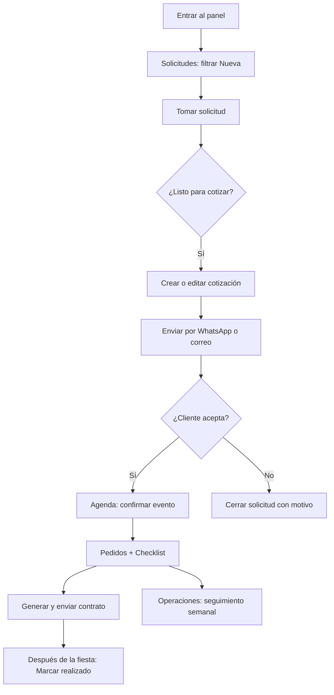

# Manual del operario — Panel Bosque Mágico

**Para:** Equipo comercial y operación  
**Versión:** 1.5  
**Fecha:** 2026-06-24  

Este manual explica **cómo usar el sistema en el día a día**: qué hace cada pantalla, en qué orden trabajar y qué significa cada estado. Incluye **Operaciones**, **checklist**, **contrato previo a agenda**, **pedido público del proveedor**, **adjuntos de contrato** y **postventa** (junio 2026).

---

## 1. Antes de empezar

### 1.1 Acceso al panel

| Entorno | URL del panel |
|---------|---------------|
| **Sandbox (pruebas)** | `https://sandbox-panel-bosque.gcbprojects.site` |
| **Local (solo desarrollo)** | `http://localhost:5174` |

1. Abre la URL en el navegador (Chrome o Edge recomendados).
2. Inicia sesión con tu correo y contraseña.
3. Si no tienes usuario, pide al **administrador** que te cree en **Usuarios** (solo admins).

**Credenciales de prueba:**

| Entorno | Correo | Contraseña |
|---------|--------|------------|
| Local (tras seed) | `admin@bosquemagico.test` | `BosqueDev123!` |
| **Sandbox (VPS)** | `admin@bosquemagico.test` | `admin@@@` |

> En producción final cada persona tendrá su propia cuenta. No compartas la contraseña de admin.

### 1.2 Qué verás al entrar

- **Barra lateral (izquierda):** Solicitudes, Cotizaciones, Clientes, Agenda, Operaciones, Contratos, **Dashboard**, **Usuarios** (admin, debajo de Dashboard), Configuración al pie.
- **Barra superior:** tu cuenta, indicador **En vivo** (tiempo real) y **campana** de notificaciones (color **marrón** si hay pendientes sin leer).
- **Notificaciones:** al abrir la campana puedes marcar como leídas; el estado se guarda por usuario.
- **Tablas:** primera columna **Registro** (fecha/hora de creación); al pie, paginado con selector **20 / 40 / 60 / 100 / 200** filas.
- **Contenido central:** listados con filtros y tablas.

**Consejo:** En computadora puedes **colapsar** el menú lateral (flecha en el borde) para ganar espacio; en celular usa el menú hamburguesa o las pestañas inferiores.

### 1.3 Conceptos que debes conocer

| Término en pantalla | Qué es |
|---------------------|--------|
| **Solicitud** | Un interesado en una fiesta (lead). Viene de la web o se crea a mano. |
| **Estado** (solicitud) | Nueva → En atención → Cotizada → Cerrada |
| **Cotización** | La propuesta con precio que envías al cliente |
| **Estado** (cotización) | Borrador → Enviada → Aceptada → Cerrada |
| **Evento** | La fiesta ya vendida, en **Agenda** |
| **Estado** (evento) | Por confirmar → Confirmado → Realizado / Cancelado |
| **Pedido** | Orden operativa del evento (show, catering, decoración, etc.) |
| **Checklist** | Lista de tareas internas para preparar el evento |
| **Proveedor** | Contacto externo que suministra un servicio (show, catering…) |
| **Contrato** | Documento formal PDF de la fiesta vendida |
| **Estado** (contrato) | Borrador → Enviado → Firmado / Anulado |
| **Cliente** | Persona agrupada por celular o correo (historial) |

**Regla de oro:** casi todo el trabajo se hace desde el **listado**, abriendo un **modal** (ventana encima) sin cambiar de página.

---

## 2. Tu flujo de trabajo diario (resumen)

Sigue este orden cada día:

```text
1. Solicitudes   →  Revisar lo NUEVO y tomar contactos
2. Cotizaciones  →  Enviar propuestas y dar seguimiento
3. Agenda        →  Confirmar fiestas vendidas; pedidos y checklist
4. Operaciones   →  Revisar pedidos de la semana (proveedores, costos)
5. Contratos     →  Generar, enviar PDF y marcar firmado
6. Clientes      →  Solo cuando necesites historial (recompra, duda)
```



---

## 3. Módulo Dashboard

**Menú:** Dashboard (Inicio)  
**Para qué sirve:** Vista rápida del pulso comercial y próximas fiestas.

### 3.1 Tarjetas KPI

Cuatro tarjetas con conteo por **Estado** de solicitud:

- **Nueva**, **En atención**, **Cotizada**, **Cerrada**

Clic en una tarjeta te lleva a Solicitudes con ese filtro aplicado.

### 3.2 Próximos eventos

Lista de eventos confirmados o por confirmar en las próximas semanas:

- Muestra **mes y día** legibles (ej. `JUN 24`).
- Clic en un evento abre **Agenda** con el detalle (`/agenda?detalle=id`).
- Enlace **Ver calendario** lleva al módulo Agenda completo.

### 3.3 Solicitudes recientes

Últimas solicitudes registradas con enlace rápido al detalle.

---

## 4. Módulo Solicitudes

**Menú:** Solicitudes  
**Para qué sirve:** Ver y gestionar todos los interesados (web, manual, etc.).

### 4.1 Pantalla principal

- **Filtros (arriba):** busca por nombre, celular o correo; filtra por **Estado**; botón refrescar.
- **Columnas:** **Cliente** (nombre del contacto) y **Contacto** (celular + correo en la misma celda).
- **Tabla:** cada fila es una solicitud.
- **Al final de la fila:** iconos rápidos (WhatsApp, correo, ver detalle, etc.).

### 4.2 Estados de una solicitud

| Estado | Qué significa | Qué debes hacer |
|--------|---------------|-----------------|
| **Nueva** | Nadie la ha tomado aún | Revisar y **Tomar solicitud** |
| **En atención** | Ya hay un responsable | Llamar, WhatsApp, registrar seguimiento |
| **Cotizada** | Ya hay cotización vinculada | Seguir en módulo Cotizaciones |
| **Cerrada** | Ya no se gestiona comercialmente | Solo consultar; revisar motivo de cierre |

### 4.3 Crear solicitud manual

Cuando el cliente llama o escribe y **no** pasó por la web:

1. Pulsa **Nueva solicitud**.
2. Completa: nombre, celular, correo (al menos uno), fecha tentativa, turno, número de niños, notas.
3. Guarda → estado **Nueva** — tómala cuando empieces a gestionarla.

### 4.4 Tomar una solicitud

1. Localiza la fila (filtro **Nueva**).
2. Pulsa **Tomar solicitud**.
3. Estado → **En atención**.

### 4.5 Ver detalle de una solicitud

- Clic en el **nombre** del contacto, o icono **Ver**.

El modal incluye:

- Datos de contacto (WhatsApp / correo)
- Fecha y hora de registro
- Canal de origen (landing, manual)
- Información del cotizador (si vino de la web)
- **Seguimiento:** notas y próximo contacto
- **Bitácora:** historial de acciones
- Botones: tomar, cerrar, crear cotización, editar solicitud

### 4.6 Editar datos del lead

1. Abre el detalle → **Editar solicitud**.
2. Modifica: nombre, celular, correo, fecha, turno, niños, notas.
3. Guarda.

> Edita la **solicitud**, no la cotización. Para precios o paquete, edita la **cotización**.

### 4.7 Registrar seguimiento

1. Sección **Seguimiento** en el detalle.
2. Escribe **notas** y opcional **Próximo seguimiento**.
3. Guarda.

### 4.8 Cerrar una solicitud

1. **Cerrar solicitud** → elige **motivo** (pérdida, sin respuesta, duplicada, otro).
2. Estado → **Cerrada**.

### 4.9 Posible duplicado

Alerta si la misma persona envió el formulario en las últimas **24 horas**.

**Qué hacer:** busca en **Clientes** por celular; gestiona una sola solicitud; cierra la duplicada.

### 4.10 Pasar a cotización

| Situación | Acción |
|-----------|--------|
| Web con datos completos | Puede existir **borrador automático** — **Ver cotización** o **Editar borrador** |
| Solo solicitud | **Crear cotización** |
| Borrador incompleto | **Editar borrador** → enviar |

---

## 5. Módulo Cotizaciones

**Menú:** Cotizaciones  
**Para qué sirve:** Armar la propuesta, enviarla al cliente y registrar si aceptó.

**Columnas del listado:** **Cliente** (nombre) y **Contacto** (celular + correo), igual que en Solicitudes.

### 5.1 Estados

| Estado | Significado | Acción |
|--------|-------------|--------|
| **Borrador** | No enviada al cliente | Revisar montos e ítems |
| **Enviada** | Cliente recibió la propuesta | Seguimiento; puede aceptar por link |
| **Aceptada** | Cliente aceptó | Revisar **Agenda** |
| **Cerrada** | No continúa | Solo consulta |

### 5.2 Crear y editar

- Desde **Solicitudes** → **Crear cotización**, o desde **Cotizaciones** → **Nueva cotización**.
- **Editar borrador** abre formulario completo (paquete, ítems, total calculado por el sistema).

### 5.3 Enviar al cliente

**Importante:** hasta **enviar**, el cliente **no puede aceptar** por link.

**WhatsApp:** **Enviar por WhatsApp** → revisa mensaje → confirma → se abre `wa.me` → envía al cliente → **Enviada**.

**Correo:** **Enviar por correo** → se abre **modal** con asunto y mensaje prellenados (link para aceptar + link PDF). Si SMTP está activo en Configuración, envía automáticamente; si no, abre tu cliente de correo. La cotización pasa a **Enviada**.

> El link PDF va **en el cuerpo del mensaje** para que el cliente lo abra cuando quiera; no se abre automáticamente al enviar.

### 5.4 Link público y PDF

- **Copiar link** — el cliente acepta solo si está **Enviada**.
- **Descargar PDF** — vista imprimible; guardar como PDF en el navegador.

### 5.5 Aceptación

- **Cliente en web:** link `/cotizacion/...` → **Aceptar** → evento **Por confirmar** en Agenda.
- **Panel:** **Aceptar cotización** (debe estar **Enviada**).

### 5.6 Ítems de proveedor en cotización

Al agregar productos del catálogo con **origen = Proveedor externo**, esos ítems pueden generar **pedidos automáticos** al confirmar el evento (ver sección 7).

---

## 6. Módulo Agenda

**Menú:** Agenda  
**Para qué sirve:** Gestionar fiestas **ya vendidas**.

### 6.1 Vistas

| Vista | Cómo acceder | Uso |
|-------|--------------|-----|
| **Mes** (default) | Al entrar a Agenda | Calendario; clic en día → modal con eventos del día |
| **Lista** | `?vista=lista` o selector | Rango de fechas en tabla |

Filtra por **Estado**. Deep link `/agenda?detalle=id` abre el detalle y navega al mes del evento.

### 6.2 Estados del evento

| Estado | Significado | Acción |
|--------|-------------|--------|
| **Por confirmar** | Recién creado al aceptar cotización | Contrato + pedidos proveedor → **Confirmar evento** |
| **Confirmado** | Fiesta aprobada en agenda | Checklist, logística; el día → **Marcar realizado** |
| **Realizado** | Fiesta ya pasó | Archivo operativo |
| **Cancelado** | No se realizará | **Cancelar** con motivo |

### 6.3 Confirmar un evento (orden obligatorio desde 24/06)

**Antes de pulsar Confirmar evento** el sistema exige:

1. **Contrato** generado y marcado **Enviado** o **Firmado** (no basta Borrador).
2. **Pedidos de proveedor** en estado **Confirmado** (el proveedor puede responder por link público `/pedido/:token`).

Pasos recomendados:

1. Busca el evento (filtro **Por confirmar** o calendario).
2. Abre **detalle** (modal).
3. Revisa cliente, fecha, turno, niños (la fecha debe respetar la **anticipación mínima** configurada, default 7 días).
4. **Generar contrato** → enviar WhatsApp/PDF → **Marcar enviado**.
5. **Generar desde cotización** (pedidos) → comparte link al proveedor → espera confirmación.
6. **Confirmar evento** → pasa a **Confirmado** y se activa checklist completo.

Si falta contrato o hay pedidos proveedor pendientes, verás un mensaje de error y no podrás confirmar.

### 6.4 Pedidos operativos (en detalle del evento)

Sección **Pedidos operativos** — visible en **Por confirmar** (para preparar) y en **Confirmado** / **Realizado**.

| Acción | Cuándo usarla |
|--------|---------------|
| **Generar desde cotización** | Crear pedidos a partir de ítems con producto de proveedor (hacer **antes** de confirmar agenda) |
| **+ Pedido** | Agregar pedido manual (show, decoración, catering, etc.) |
| **Compartir link proveedor** | Enviar URL pública para que el proveedor confirme o rechace |
| Cambiar **Estado** del pedido | Seguimiento: Pendiente → Solicitado → **Confirmado** → … → Entregado |

**Estados de pedido:** Pendiente, Solicitado, Confirmado, En proceso, Entregado, Cerrado, Cancelado.

**Áreas:** Ventas, Operaciones, Decoración, Catering, Shows/proveedores, Administración.

Mientras el evento está **Por confirmar**, puedes **generar pedidos** y gestionar el contrato; el checklist interno se activa al **Confirmar evento**.

### 6.5 Checklist (en detalle del evento)

Sección **Checklist** — tareas internas por área.

1. Tras **Confirmar evento**, pulsa **Generar checklist** (si no hay tareas).
2. Marca cada tarea: Pendiente → En proceso → **Completado**.
3. El encabezado muestra progreso (ej. `3/5 completadas`).

Mientras está **Por confirmar**: *El checklist se activa al confirmar el evento.*

### 6.6 Marcar realizado / Cancelar

- **Realizado:** evento **Confirmado** → **Marcar realizado** (después del día de la fiesta).
- **Cancelar:** **Por confirmar** o **Confirmado** → motivo → **Cancelado**.

### 6.7 Contrato desde Agenda

En el pie del detalle (también en **Por confirmar**): **Generar contrato**, enviar WhatsApp, imprimir PDF, marcar enviado/firmado, **adjuntar comprobante de pago y documento de contabilidad** (drag & drop). Ver sección 8.

---

## 7. Módulo Operaciones

**Menú:** Operaciones  
**Para qué sirve:** Vista **consolidada** de todos los pedidos operativos en un rango de fechas (logística semanal).

### 7.1 Pantalla principal

- **Filtro de fechas:** Desde / Hasta — por defecto **inicio del mes actual → hoy** (zona Lima).
- **Búsqueda:** filtra por nombre de pedido, cliente, proveedor o área.
- **Paginado:** tabla con paginación (como otros módulos).
- **Costo estimado:** suma de costos de pedidos en el rango filtrado.
- **Tabla:** fecha del evento, cliente, pedido, área, estado, costo.

### 7.2 Acciones

- **Ver evento** — salta a Agenda con el detalle del evento (`/agenda?detalle=id`).
- Desde ahí puedes cambiar estado del pedido o agregar nuevos.

### 7.3 Cuándo usar Operaciones vs. Agenda

| Situación | Dónde trabajar |
|-----------|----------------|
| Preparar un evento concreto | **Agenda** → detalle → Pedidos + Checklist |
| Ver todos los pedidos de la semana | **Operaciones** |
| Seguimiento de costos agregados | **Operaciones** (total en cabecera) |
| Contactar proveedor de un pedido | **Agenda** → detalle (datos del pedido y proveedor) |

### 7.4 Flujo típico operativo

1. Lunes: abre **Operaciones** → revisa pedidos de la semana.
2. Para cada pedido **Pendiente**, contacta al proveedor y cambia a **Solicitado** / **Confirmado**.
3. Día del evento: verifica checklist completado en **Agenda**.
4. Tras el evento: pedidos → **Entregado**; evento → **Realizado**.

---

## 8. Módulo Contratos

**Menú:** Contratos  
**Para qué sirve:** Documento PDF formal (cliente, servicios, adelantos, términos).

### 8.1 Cuándo generar

- Cotización **Aceptada** y evento en Agenda.
- No si el evento está **Cancelado**.
- Máximo un contrato activo por evento.

**Dónde:** **Agenda** → detalle → **Generar contrato**, o módulo **Contratos**.

### 8.2 Estados

| Estado | Acción |
|--------|--------|
| **Borrador** | Revisar DNI/RUC, adelantos, horario |
| **Enviado** | Compartido con cliente |
| **Firmado** | Cliente confirmó (registro interno, no firma electrónica legal) |
| **Anulado** | Ya no aplica |

### 8.3 Generar y enviar

1. Completa DNI/RUC, horario, adelantos (default S/ 500).
2. Guarda → **Borrador** (`BM-CT-00001`, etc.).
3. **Enviar por WhatsApp** o **Imprimir / PDF**.
4. **Marcar firmado** cuando el cliente confirme.

> Los datos de la cotización quedan **congelados** (snapshot) al generar el contrato.

---

## 9. Módulo Clientes

**Menú:** Clientes  
**Para qué sirve:** **Historial** por persona (no para leads nuevos del día).

- Busca por nombre, celular o correo.
- Detalle: total solicitudes, cotizaciones, contacto WA/correo.
- **No confundir:** leads nuevos → **Solicitudes**; historial → **Clientes**.

---

## 10. Configuración

**Menú:** Configuración  

| Pestaña | Quién edita | Contenido |
|---------|-------------|-----------|
| **Tarifas** | Admin | Precios base, extras, límites de niños |
| **Turnos** | Admin | Nombre y horario de turnos 1, 2, 3 |
| **Catálogo** | Admin o manage | Productos/servicios, fotos, activar/desactivar |
| **Proveedores** | Admin o manage | Contactos externos (shows, catering, etc.) |

### 10.1 Proveedores

1. Pestaña **Proveedores** → **Nuevo proveedor**.
2. Completa: nombre, contacto, celular, correo, categorías, notas.
3. Al crear productos en **Catálogo**, elige **origen = Proveedor externo** y vincula el proveedor.
4. Esos productos en cotizaciones generan pedidos al confirmar el evento.

### 10.2 Guardar cambios

Barra **Guardar cambios** al pie cuando hay modificaciones pendientes. Los nuevos precios aplican a cotizaciones **nuevas**.

---

## 11. Usuarios (solo administrador)

- Crear cuenta, permisos: **view**, **manage**, **admin**.
- Generador de contraseña con mostrar/ocultar.

---

## 12. Notificaciones y tiempo real

- **En vivo:** actualizaciones automáticas (nueva solicitud, etc.).
- **Campana:** avisos recientes; clic lleva al módulo correspondiente.

---

## 13. Landing (lo que ve el cliente)

**URL sandbox:** `https://sandbox-landing-bosque.gcbprojects.site`

El cliente puede:

1. Navegar paquetes, shows, catering y usar el **cotizador**.
2. Abrir **cotización pública** (`/cotizacion/:token`) → revisar y **Aceptar**.
3. Abrir **contrato público** (`/contrato/:token`) cuando el equipo lo comparte.
4. Ver **PDF de contrato** (`/contrato/:token/pdf`) si aplica.

---

## 14. Casos prácticos paso a paso

### Caso A — Lead nuevo desde la web

1. **Solicitudes** → **Nueva** → tomar → contactar.
2. **Editar borrador** si existe → **Enviar WhatsApp**.
3. Cliente acepta → **Agenda** → contrato enviado → pedidos proveedor OK → **Confirmar** → checklist.

### Caso B — Cliente llamó por teléfono

1. **Nueva solicitud** manual → tomar → **Crear cotización** → enviar.

### Caso C — Cliente confirmó por WhatsApp sin usar el link

1. Cotización **Enviada** → **Aceptar cotización** en panel.
2. **Agenda** → contrato + pedidos proveedor → **Confirmar**.

### Caso D — Preparar logística de la semana

1. **Operaciones** → revisar rango de fechas.
2. Por cada pedido pendiente, contactar proveedor.
3. En **Agenda** → detalle → actualizar estado del pedido.
4. Completar **checklist** antes del evento.

### Caso E — Evento con show de proveedor (ej. SHOW-MIMO)

1. En **Configuración** → producto con origen proveedor vinculado.
2. Cotización incluye ese ítem → cliente acepta.
3. **Agenda** → contrato enviado → **Generar desde cotización** → proveedor confirma por link → **Confirmar evento**.
4. Seguimiento del pedido hasta **Entregado**.

### Caso F — Cliente no responde

1. Notas de seguimiento en cada intento.
2. **Cerrar solicitud** → **sin respuesta**.

### Caso G — Día después de la fiesta

1. **Agenda** → **Confirmado** → **Marcar realizado** (si postventa está activa en Configuración, se envía formulario al correo del cliente).
2. Pedidos → **Entregado** / **Cerrado**.

---

## 15. Errores frecuentes

| Problema | Solución |
|----------|----------|
| Cliente no puede aceptar link | Cotización en **Borrador** → **Enviar** primero |
| No hay pedidos en Operaciones | Confirmar evento; generar desde cotización o crear manual |
| Checklist no aparece | Evento debe estar **Confirmado**; pulsar **Generar checklist** |
| INVALID DATE en dashboard | Corregido en versión actual; refrescar panel |
| WhatsApp no abre | Permitir pop-ups para el panel |
| Error slot ocupado al aceptar | Cambiar fecha/turno con el cliente |
| Sandbox no entra con BosqueDev123! | Usar contraseña **`admin@@@`** |
| Mismo nombre de cliente en varias cotizaciones | Si comparten **celular**, Clientes los fusiona; buscar por **correo** en Solicitudes |

---

## 16. Buenas prácticas

1. **Toma** la solicitud antes de llamar.
2. **Anota** cada contacto en seguimiento.
3. **Confirma** el evento antes de gestionar pedidos.
4. Revisa **Operaciones** al inicio de cada semana.
5. **Genera contrato** después de confirmar, no antes de aceptar cotización.
6. En sandbox, prueba el flujo completo (incl. pedidos) semanalmente.

---

## 17. Glosario

| Palabra | Significado |
|---------|-------------|
| Lead | Interesado = **Solicitud** |
| Pedido | Orden operativa ligada a un evento |
| Checklist | Tareas internas del evento |
| Proveedor | Empresa/persona externa (show, catering) |
| Snapshot | Copia congelada de cotización en contrato |
| Slot | Fecha + turno en Agenda |

---

## 18. Referencias

| Documento | Ubicación |
|-----------|-----------|
| Informe gerencia | `.docs/entrega-2026-06-17/01-INFORME-GERENCIA.md` |
| **Demo integral gerencia (german22)** | `.docs/entrega-2026-06-17/04-EJEMPLO-REAL-GERMAN22-GERENCIA.md` |
| Demo flujo C (contrato público) | `.docs/entrega-2026-06-24/05-EJEMPLO-FLUJO-C-CONTRATO-PUBLICO.md` |
| Roadmap integraciones | `.docs/entrega-2026-06-24/06-ROADMAP-INTEGRACIONES.md` |
| Pruebas sandbox | `.docs/entrega-2026-06-17/03-PRUEBAS-Y-QA.md` |
| Flujos con diagramas | `.docs/BOSQUE_FLUJOS_Y_GUIA_USO.md` |

---

*Manual operativo — Bosque Mágico. Versión 1.4 — 2026-06-17.*
