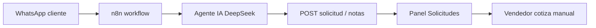

# Roadmap e integraciones — Bosque Mágico

**Para:** Gerencia / producto  
**Versión:** 1.5  
**Fecha:** 2026-06-24  
**Estado:** temas abiertos tras entrega F1–F5

---

## 1. Implementado en junio (hasta 24/06)

| ID | Tema | Estado |
|----|------|--------|
| F1 | Anticipación mínima configurable (`solicitud.min_dias_anticipacion`) | ✅ |
| F2 | Contrato enviado/firmado + pedidos proveedor OK antes de confirmar agenda | ✅ |
| F2b | Respuesta pública del proveedor (`/pedido/:token`) | ✅ |
| F3 | Adjuntos en contrato (comprobante pago, documento contabilidad) | ✅ |
| F4 | Galería + video URL en productos; catálogo público | ✅ (carousel auto en landing: ver §3) |
| F5 | Postventa configurable (toggle + URL formulario) | ✅ |
| — | Notificaciones panel persistidas por usuario | ✅ |
| — | Paginado con selector 20/40/60/100/200 filas | ✅ |
| — | Columna Registro en tablas principales | ✅ |
| — | `packages/shared` — impresión/PDF contrato unificado | ✅ |

Validación automatizada: `npm run qa:fases` → **27/27 OK** (24/06).

---

## 2. Propuesta WhatsApp + n8n (no implementada)

Documento de diseño:  
`.docs/doc-n8n/BosqueMagico-Propuesta-AgenteIA-Solicitudes-WhatsApp.md`

### Intención de negocio

- Captar consultas por **WhatsApp** (Meta / YCloud) sin perder el control del equipo.
- El agente IA **no crea borrador de cotización automático**; registra la solicitud y deja al vendedor el armado comercial en panel.

### Flujo propuesto (resumen)

### Dependencias para implementar

| Requisito | Notas |
|-----------|-------|
| Cuenta Meta Business + número WhatsApp | Aprobación plantillas |
| YCloud o proveedor BSP | Webhook hacia n8n |
| n8n self-hosted o cloud | Workflow JSON en `.docs/doc-n8n/` |
| Endpoint API estable | Ya existe solicitud manual/pública; evaluar endpoint dedicado bot |

**Prioridad sugerida:** media — después de estabilizar flujo contrato + operaciones en producción.

---

## 3. Temas abiertos (consultas 24/06 — BOSQUE_COMMANDS)

| Tema | Estado | Nota |
|------|--------|------|
| **Rediseño ítems incluidos en paquetes** (Básico / Estándar / Premium) | 🔍 Diseño | Cajitas, show, piqueos crédito, asistente, etc. — claves `paquetes.*` en config; lógica de cotización por revisar |
| **Carousel landing** — paso automático entre imágenes | 🔍 Bug UX | Galería y lightbox existen; transición auto en card pendiente de pulir |
| **Preview imágenes catálogo** en modal panel | 🔍 Mejora | Lista de galería en Configuración |
| **Campo origen** visible en catálogo panel | ✅ Parcial | Productos con `origen=proveedor` |
| **Tests E2E UI** del panel | ⬜ Pendiente | API cubierta por `qa:*`; UI manual en manual operario |
| **Batería QA exhaustiva** «todos los CU posibles» | 🔄 En curso | Ampliar scripts según nuevos CU (F1–F5 ya en `qa:fases`) |

---

## 4. Configuración de paquetes (referencia negocio)

Claves en **Configuración** (seed):

| Clave | Uso |
|-------|-----|
| `paquetes.cajitas_incluidas` | Cantidad cajitas Bosque Mágico por paquete |
| `paquetes.piqueos_credito_premium` | Crédito S/ piqueos en Premium |
| `solicitud.min_dias_anticipacion` | Días mínimos entre hoy y fecha del evento |
| `postventa.habilitado` | Toggle envío formulario post-fiesta |
| `postventa.url_formulario` | URL del formulario de satisfacción |
| `pedidos_proveedor.notificar_correo` | Notificación por correo al proveedor (cuando se habilite SMTP) |

El rediseño de **qué ítems van incluidos por paquete** en la cotización automática requiere acuerdo comercial antes de codificar reglas definitivas.

---

## 5. Próximos pasos recomendados

1. **Go-live sandbox → producción** — dominio cliente, backups, monitoreo.
2. **Capacitación operación** — nuevo orden: contrato + proveedor **antes** de confirmar en agenda (ver manual §6).
3. **Piloto n8n** — solo lectura de mensajes + creación solicitud, sin cotización auto.
4. **Workshop paquetes** — cerrar matriz Básico/Estándar/Premium con gerencia.
5. **Carousel landing** — sprint corto de UX tras definir paquetes.

---

## 6. Referencias

| Documento | Ubicación |
|-----------|-----------|
| Informe gerencia | [01-INFORME-GERENCIA.md](./01-INFORME-GERENCIA.md) |
| Manual operario | [02-MANUAL-OPERARIO.md](./02-MANUAL-OPERARIO.md) |
| QA y scripts | [03-PRUEBAS-Y-QA.md](./03-PRUEBAS-Y-QA.md) |
| Workflow n8n (JSON) | `.docs/doc-n8n/Módulo Comercial - Agente IA Consultas v3.4 + whats + deepseek.json` |
| Bitácora comandos | `.docs/BOSQUE_COMMANDS.md` |

---

*Documento preparado para seguimiento de producto. Versión 1.5 — 2026-06-24.*
