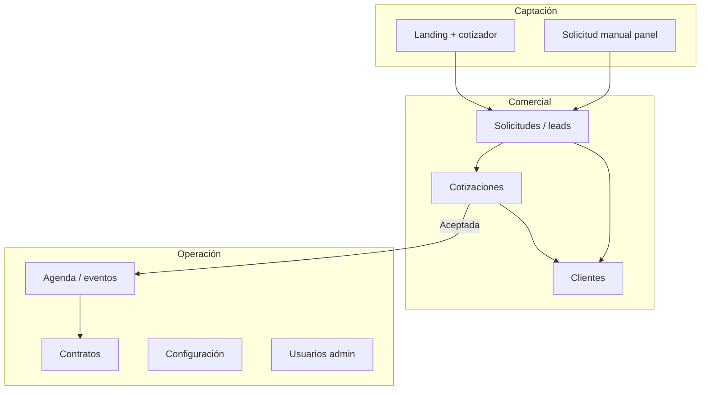
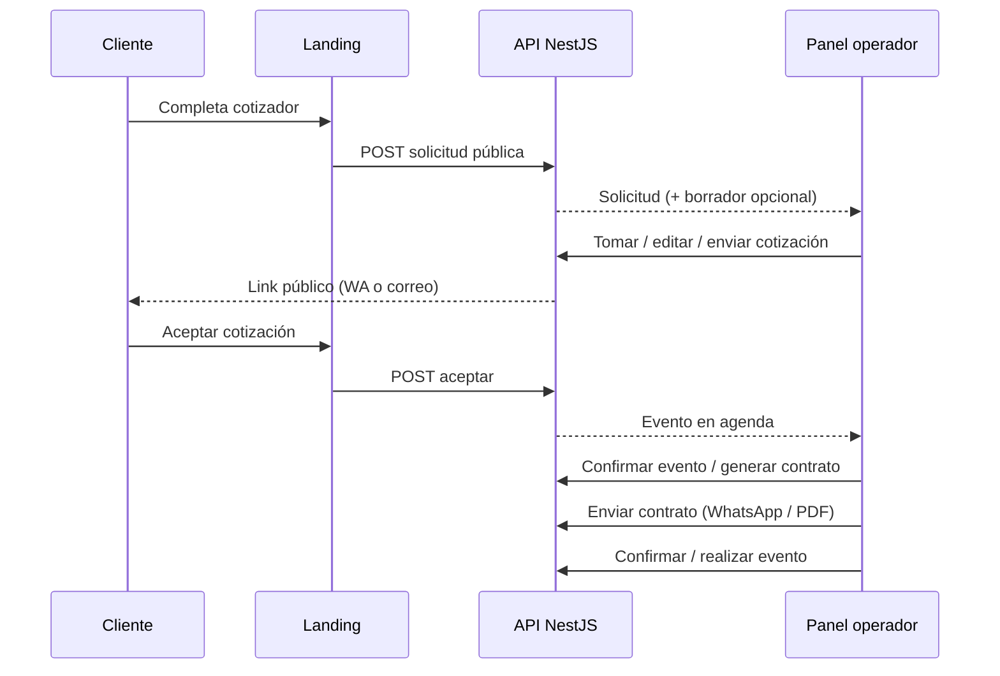
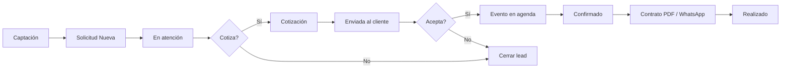
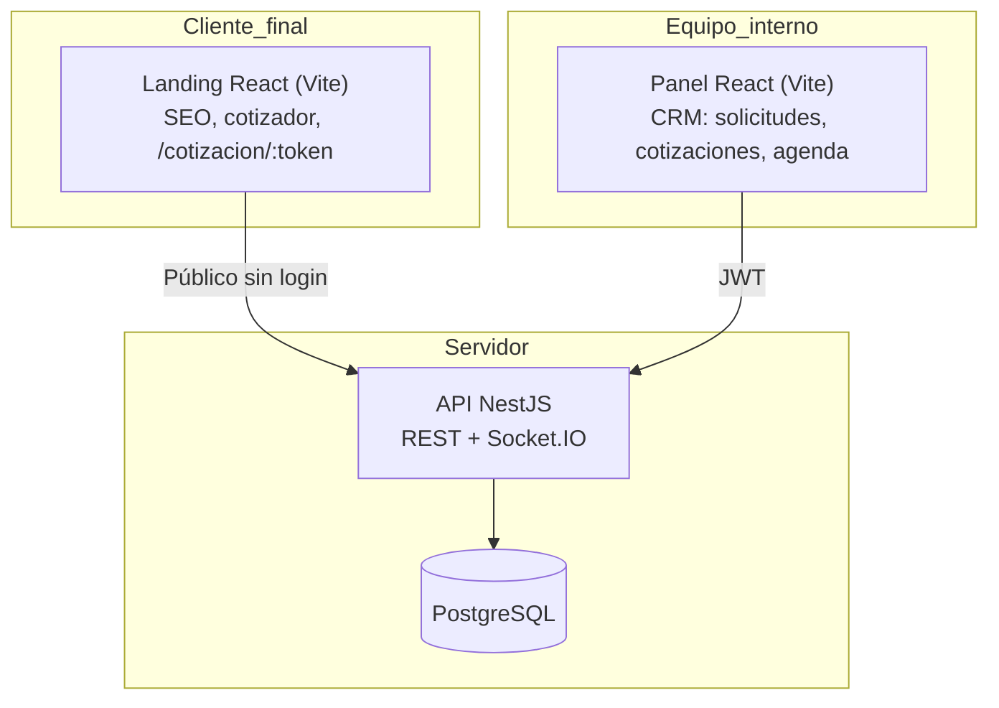

# Informe de avance — Bosque Mágico

**Para:** Gerencia  
**Versión:** 1.2  
**Fecha:** 2026-07-02  
**Producto:** Sistema comercial Bosque Mágico (landing + panel CRM + API)

---

## 1. Resumen ejecutivo

Se entregó un **MVP comercial completo** que digitaliza el recorrido desde que un padre interesa una fiesta hasta que el evento queda registrado en agenda. El equipo ya puede:

- Recibir solicitudes desde la **landing pública** o registrarlas **manualmente** en el panel.
- Gestionar leads en **Solicitudes**, con seguimiento, cierre y edición de datos de contacto.
- Armar, enviar y hacer seguimiento de **cotizaciones** (WhatsApp, correo, link público, PDF).
- Obtener **aceptación del cliente** por link público, lo que genera automáticamente el **evento** en agenda.
- Operar la **agenda** (confirmar, realizar o cancelar eventos).
- Generar, enviar e imprimir **contratos** vinculados al evento (PDF con términos, adelantos y snapshot de la cotización).
- Consultar el **historial por cliente** (identidad por celular/correo).
- Configurar **tarifas, turnos y catálogo** sin redeploy.
- Administrar **usuarios y permisos** (solo rol admin).

El sistema está desplegado en **entorno sandbox** para pruebas reales del equipo, además del entorno local de desarrollo. La **Fase 8 del panel** (tablas mejoradas, notificaciones en tiempo real, modales unificados, UX consistente) está **completada**.

**Fuera del alcance actual (decisión de producto):** pagos en línea y registro de abonos, firma electrónica legal, integración Meta Lead Ads automatizada, reportes exportables y postventa operativa. Los **contratos** ya están en panel (generación, PDF, envío por WhatsApp y seguimiento de estado); la **cobranza** sigue siendo manual fuera del sistema.

---

## 2. Objetivos del proyecto

### 2.1 Objetivos de negocio

| Objetivo | Cómo se cumple hoy |
|----------|-------------------|
| Un solo lugar para gestionar interesados en fiestas | Panel CRM con módulos Solicitudes, Cotizaciones, Agenda y Clientes |
| No perder leads de la web | Landing con cotizador → API crea solicitud (y borrador de cotización si el payload es completo) |
| Respuesta comercial más rápida | Borrador automático desde landing; acciones WhatsApp/correo en una fila; detalle en modal sin cambiar de pantalla |
| Trazabilidad del recorrido comercial | Bitácora de auditoría en solicitudes y cotizaciones; estados claros en cada etapa |
| Evitar tratar al mismo contacto como personas distintas | Módulo Clientes con reconocimiento por celular o correo y alerta de duplicado reciente (24 h) |
| Separar lo vendido de lo que sigue en negociación | Cotización aceptada → evento en agenda → contrato opcional; estados independientes por módulo |

### 2.2 Objetivos técnicos

| Objetivo | Implementación |
|----------|----------------|
| Producto web independiente y escalable | Monorepo: `apps/landing`, `apps/panel`, `apps/api` |
| Reglas de negocio centralizadas | NestJS + `CalculoPreciosService`; la landing no es la única fuente de verdad del precio |
| Base de datos propia del dominio | PostgreSQL con tablas del módulo Bosque (sin mezclar con otros productos) |
| Seguridad básica | JWT en panel, rate limit en endpoint público, permisos `view` / `manage` / `admin` |
| Operación en sandbox antes de producción | Docker Compose + URLs públicas de API, panel y landing |

### 2.3 Principio de diseño (gentle-ai)

El sistema **asiste al vendedor** sin automatismos opacos: estados visibles simples, acciones explícitas (tomar, enviar, aceptar, confirmar) y registro de lo que ocurre en bitácora. La complejidad del CRM prototipo PHP se simplificó en la interfaz sin perder trazabilidad en backend.

---

## 3. Alcance entregado vs. pendiente

### 3.1 Entregado (MVP + Fase 8 panel + Contratos)



| Área | Entregado |
|------|-----------|
| Landing pública | Cotizador, catálogo desde API, SEO, link público de cotización |
| Solicitudes | Listado, filtros, tomar, seguimiento, cerrar, editar lead, duplicados, bitácora |
| Cotizaciones | Crear, editar borrador, enviar WA/correo, PDF, link público, aceptar desde panel |
| Agenda | Vista lista y mes, confirmar, realizar, cancelar; fechas unificadas en zona Lima |
| Contratos | Generar desde evento, PDF imprimible, enviar WhatsApp, estados Borrador → Enviado → Firmado |
| Clientes | Ficha consolidada, historial, contacto WA/correo |
| Configuración | Tarifas, turnos editables, catálogo productos con imagen |
| Panel UX Fase 8 | Filtros en tablas, paginado, WebSocket + campana, modales unificados, sidebar colapsable |
| Calidad | Tests unitarios de precios y reglas; smoke E2E API (`npm run qa:smoke`) |
| Sandbox | Stack desplegable con credenciales de prueba |

### 3.2 Pendiente (fases posteriores)

| Tema | Motivo de postergación |
|------|------------------------|
| Meta Lead Ads + WhatsApp automatizado (n8n / YCloud) | Integración externa en diseño; captación manual y landing ya operativas |
| Pagos y cobranza en sistema | Complejidad financiera; adelantos se registran en contrato pero no hay módulo de pagos |
| Cierre formal de cotización con motivo | Mejora de proceso; hoy se cierra vía solicitud o estados |
| Dashboard KPIs avanzados | Resumen básico existe; reportes gerenciales en fase siguiente |
| Exportación de auditoría / reportes | Operación diaria no lo exige aún |
| E2E automatizado del panel | Smoke API cubre flujo comercial; UI manual documentada |
| Firma electrónica legal del contrato | Hoy se marca **Firmado** manualmente tras recibir documento del cliente |

---

## 4. Casos de uso cubiertos

### 4.1 Matriz resumida

| # | Caso de uso | Actor | Resultado |
|---|-------------|-------|-----------|
| CU-01 | Cliente cotiza en la web | Cliente / landing | Solicitud creada; opcional borrador de cotización |
| CU-02 | Vendedor registra interés por teléfono | Operador | Solicitud manual en panel |
| CU-03 | Vendedor toma y da seguimiento a un lead | Operador | Estado En atención + notas y próximo contacto |
| CU-04 | Vendedor edita datos del contacto | Operador | PATCH solicitud (modal Solicitud) |
| CU-05 | Sistema detecta posible duplicado | Sistema | Flag en solicitud (misma identidad &lt; 24 h) |
| CU-06 | Vendedor arma y envía cotización | Operador | Borrador → Enviada; mensaje WA o correo |
| CU-07 | Cliente revisa y acepta cotización en línea | Cliente | Cotización Aceptada + evento Por confirmar |
| CU-08 | Vendedor acepta cotización en nombre del cliente | Operador | Mismo resultado que CU-07 |
| CU-09 | Operación confirma y cierra el evento | Operador | Confirmado → Realizado (o Cancelado) |
| CU-10 | Consultar historial de un contacto recurrente | Operador | Módulo Clientes |
| CU-11 | Admin ajusta tarifas, turnos o catálogo | Admin | Configuración persistida en BD |
| CU-12 | Admin gestiona usuarios del panel | Admin | CRUD en `/usuarios` |
| CU-13 | Vendedor genera contrato desde evento aceptado | Operador | Contrato en borrador con snapshot de cotización |
| CU-14 | Vendedor envía contrato e imprime PDF | Operador | WhatsApp con mensaje preparado; estado Enviado; PDF con términos |
| CU-15 | Vendedor marca contrato firmado | Operador | Estado Firmado tras confirmación del cliente |

### 4.2 Caso crítico: de la landing a la agenda

Este es el flujo que valida el valor del MVP de punta a punta:

1. **Landing:** el cliente completa el cotizador y envía.
2. **API:** crea solicitud; si el payload trae paquete, fecha, turno y niños, genera **cotización en borrador**.
3. **Panel — Solicitudes:** el equipo ve la solicitud (estado Nueva), la toma, revisa datos y contacta.
4. **Panel — Cotizaciones:** revisa o edita el borrador, **envía** por WhatsApp o correo (pasa a Enviada).
5. **Landing — link público:** el cliente abre `/cotizacion/:token` y **acepta** (solo si está Enviada).
6. **Sistema:** cotización Aceptada + **evento** en agenda (Por confirmar).
7. **Panel — Agenda:** confirmar → confirmado → generar **contrato** (opcional) → enviar PDF/WhatsApp → marcar firmado.
8. **Panel — Agenda:** al terminar la fiesta, **marcar realizado**.



---

## 5. Flujos de negocio

### 5.1 Estados visibles (simplificados para el equipo)

En pantalla se habla de **Estado** (en base de datos el campo técnico sigue llamándose `etapa` hasta una migración futura).

| Módulo | Estados | Significado para gerencia |
|--------|---------|---------------------------|
| **Solicitud** | Nueva → En atención → Cotizada → Cerrada | Embudo comercial del lead |
| **Cotización** | Borrador → Enviada → Aceptada → Cerrada | Ciclo de la propuesta |
| **Evento** | Por confirmar → Confirmado → Realizado / Cancelado | Ejecución de la fiesta vendida |
| **Contrato** | Borrador → Enviado → Firmado / Anulado | Documento formal post-venta (1 contrato activo por evento) |

### 5.2 Flujo comercial (vista gerencia)



### 5.3 Identidad del cliente

- Un **cliente** en el módulo homónimo agrupa solicitudes y cotizaciones por **celular o correo**.
- La landing y las solicitudes nuevas **vinculan o crean** ese registro automáticamente.
- Beneficio: visibilidad de clientes recurrentes y menos trabajo duplicado.

### 5.4 Reglas de negocio relevantes

| Regla | Comportamiento |
|-------|----------------|
| Precios | Calculados en backend según tarifas, día, paquete, niños e ítems |
| Doble reserva | Al aceptar cotización se valida slot **fecha + turno** |
| Link público | Solo permite aceptar si la cotización está **Enviada** |
| Borrador | El cliente no puede aceptar; el mensaje en landing lo indica |
| Aceptación idempotente | Si ya estaba aceptada, no duplica evento |
| Contrato por evento | Máximo un contrato activo; requiere cotización **Aceptada** |
| Snapshot de contrato | Al generar se congelan datos de cotización, ítems y montos |
| Adelantos en contrato | Por defecto S/ 500 de adelanto y garantía referencial (configurable) |
| Duplicado reciente | Misma identidad con solicitud en las últimas 24 h → alerta |

---

## 6. Arquitectura del sistema

### 6.1 Vista de componentes



### 6.2 Estructura del repositorio

```text
proyecto-bosque-magio/
├── apps/
│   ├── api/       NestJS, Prisma, dominio Bosque Mágico
│   ├── panel/     CRM interno (React 19, TanStack Query/Table)
│   └── landing/   Web pública (React, cotizador, cotización pública)
├── .docs/         Planificación, flujos, este informe
├── scripts/       QA smoke, deploy sandbox
└── docker-compose.sandbox.yml
```

### 6.3 Capas del backend (NestJS)

| Capa | Responsabilidad |
|------|-----------------|
| **Controllers / HTTP** | Rutas REST públicas y autenticadas bajo `/api/bosque-magico/...` |
| **Use cases** | Tomar solicitud, enviar cotización, aceptar, confirmar evento, etc. |
| **Domain services** | Cálculo de precios, validación de slots, resolución de identidad |
| **Prisma** | Persistencia PostgreSQL |
| **Auditoría** | Registro de acciones relevantes para trazabilidad |
| **WebSocket** | Eventos `bosque:event` para refrescar listados y notificaciones |

### 6.4 Seguridad y permisos

| Rol / permiso | Capacidades |
|---------------|-------------|
| `view` | Consultar solicitudes, cotizaciones, agenda, clientes |
| `manage` | Crear/editar operación comercial, catálogo (sin tarifas) |
| `admin` | Configuración de tarifas y turnos, usuarios, todo lo anterior |

Autenticación: **JWT** tras login en panel. Endpoint público de solicitudes con **rate limiting**.

### 6.5 Patrón de experiencia en el panel (decisión UX)

Para acelerar el trabajo diario del equipo:

- **Alta y edición** → modal compartido (`Modal`), no páginas sueltas de formulario.
- **Detalle operativo** → `DetalleModal` sobre el listado (se mantiene contexto y filtros).
- **Acciones frecuentes** → al final de cada fila (WhatsApp, correo, ver, etc.).
- **URLs compartibles** → `?detalle=<id>` abre el modal sin perder el listado.

Excepciones con más espacio: edición completa de borrador de cotización, configuración amplia.

---

## 7. Módulos del panel (capacidades)

| Módulo | Rol en el negocio | Capacidades clave |
|--------|-------------------|-------------------|
| **Dashboard** | Vista rápida | Resumen por estado de solicitudes |
| **Solicitudes** | Leads / entrada comercial | Filtros, tomar, seguimiento, cerrar, editar lead, crear cotización, bitácora |
| **Cotizaciones** | Propuesta comercial | Borrador, enviar, PDF, link, aceptar, bitácora |
| **Agenda** | Operación del evento vendido | Lista por fechas, calendario mensual (TZ Lima), confirmar / realizar / cancelar, generar contrato |
| **Contratos** | Formalización post-venta | Listado, detalle modal, generar desde evento, PDF, WhatsApp, marcar enviado/firmado |
| **Clientes** | Memoria comercial del contacto | Historial, frecuencia, contacto directo |
| **Configuración** | Reglas y catálogo | Tarifas, turnos (nombre + horario), productos |
| **Usuarios** | Gobierno de acceso | Solo admin |

**Nota terminológica:** *Solicitudes* = módulo operativo de leads. *Clientes* = vista por identidad, no sustituye a Solicitudes.

---

## 8. Avances recientes (cierre junio 2026)

| Fecha / hito | Entrega |
|--------------|---------|
| Flujo comercial panel + landing | Integración completa solicitud → cotización → agenda |
| Sandbox | Despliegue Docker: API, panel y landing en URLs públicas de prueba |
| `SolicitudFormModal` | Edición del lead (contacto, fecha, turno, niños, notas) desde Solicitudes |
| PDF cotización | Descarga desde detalle (vista imprimible con logo) |
| Link público | Mensajes claros si borrador / ya aceptada; flujo Enviada → Aceptar |
| WhatsApp al enviar cotización | Corrección para abrir `wa.me` con mensaje preparado (evita bloqueo de pop-ups) |
| Socket.IO en producción | Panel conectado al origen correcto de la API; notificaciones en vivo |
| Fase 8 panel | Tablas, WS, menú usuario, modales, usuarios, config por permiso — **completada** |
| QA automatizado | Script smoke que recorre el flujo comercial vía API |
| **Módulo Contratos (2026-06-10)** | Generación desde evento, snapshot congelado, PDF con términos, envío WhatsApp, estados Borrador/Enviado/Firmado, listado `/contratos` |
| **Agenda TZ Lima (2026-06-05)** | Fechas unificadas entre vista lista y calendario mensual; hora de registro en solicitudes |
| **Detalle solicitud mejorado** | UI reorganizada; preferencias del cotizador landing más legibles |
| **Sandbox estable** | Corrección contraseña Postgres y entrypoint del contenedor |

---

## 9. Entornos disponibles

### 9.1 Desarrollo local

| Servicio | URL típica |
|----------|------------|
| API | `http://localhost:3000/api` (Swagger: `/api/docs`) |
| Panel | `http://localhost:5174` |
| Landing | `http://localhost:5173` |

Credencial de prueba tras seed: `admin@bosquemagico.test` / `BosqueDev123!`

### 9.2 Sandbox (pruebas del equipo)

| Servicio | URL |
|----------|-----|
| API | `https://sandbox-api-bosque.gcbprojects.site/api` |
| Panel | `https://sandbox-panel-bosque.gcbprojects.site` |
| Landing | `https://sandbox-landing-bosque.gcbprojects.site` |

Mismas credenciales de prueba (ver `.docs/BOSQUE_COMMANDS.md` y `PRUEBAS_CASOS_USO_LOCAL_SANDBOX.md`).

---

## 10. Indicadores de madurez

| Criterio | Estado |
|----------|--------|
| Flujo comercial de punta a punta | ✅ Operativo |
| Contratos PDF + seguimiento de estado | ✅ Operativo (sin firma electrónica legal) |
| Reglas de precio en servidor | ✅ Con tests unitarios |
| Trazabilidad (auditoría) | ✅ En solicitud y cotización |
| UX unificada en panel | ✅ Fase 8 cerrada |
| Prueba automatizada API | ✅ `npm run qa:smoke` |
| Prueba E2E UI automatizada | ⬜ Pendiente |
| Producción final (dominio cliente) | ⬜ Siguiente decisión de go-live |

---

## 11. Riesgos y mitigaciones

| Riesgo | Mitigación actual |
|--------|-------------------|
| Lead duplicado por reenvío en landing | Alerta `posibleDuplicado` + módulo Clientes |
| Doble reserva de fecha/turno | Validación al aceptar cotización |
| Spam en formulario público | Rate limit en API |
| Equipo usa estados inconsistentes | Pocos estados visibles + acciones guiadas |
| Dependencia de WhatsApp manual | Modal de revisión de mensaje antes de abrir `wa.me`; pestaña preabierta para evitar bloqueo del navegador |

---

## 12. Recomendaciones para gerencia

### 12.1 Uso inmediato del sandbox

1. Asignar 2–3 personas del equipo comercial para recorrer el **checklist manual** en `PRUEBAS_CASOS_USO_LOCAL_SANDBOX.md` (sección 4).
2. Simular un caso real: landing → tomar solicitud → enviar cotización → aceptar desde celular → confirmar en agenda → **generar y enviar contrato**.
3. Recoger feedback sobre textos, tiempos y campos faltantes antes del go-live.

### 12.2 Orden operativo sugerido para el equipo

1. **Solicitudes** — priorizar lo nuevo.  
2. **Cotizaciones** — enviar y dar seguimiento.  
3. **Agenda** — ejecutar lo vendido y generar contrato cuando corresponda.  
4. **Contratos** — enviar PDF y marcar firmado tras confirmación del cliente.  
5. **Clientes** — contexto en recompras o dudas.

### 12.3 Próximas inversiones recomendadas (prioridad negocio)

| Prioridad | Tema | Valor |
|-----------|------|-------|
| Alta | Go-live producción (dominio, SSL, backups) | Uso real con clientes |
| Media | KPIs en dashboard (conversión, tiempo de respuesta) | Control gerencial |
| Media | Automatización Meta Lead Ads → WhatsApp (n8n / YCloud) | Reducir broadcast manual de campañas Instagram |
| Media | Cierre de cotización con motivo | Métricas de pérdida |
| Baja | Módulo de pagos y cobranza | Cuando contratos estén estables en operación |
| Baja | Postventa y encuestas | Después del go-live |

---

## 13. Referencias

| Documento | Ubicación |
|-----------|-----------|
| Manual operario (detalle paso a paso) | `.docs/entrega-junio-2026/02-MANUAL-OPERARIO.md` |
| Flujos y guía operativa base | `.docs/BOSQUE_FLUJOS_Y_GUIA_USO.md` |
| Estado por módulo | `.docs/MODULOS_ESTADO.md` |
| Pruebas local y sandbox | `.docs/PRUEBAS_CASOS_USO_LOCAL_SANDBOX.md` |
| Plan técnico React + Nest | `.docs/BOSQUE_PLAN_IMPLEMENTACION_REACT_NEST.md` |
| Lógica de negocio simplificada | `.docs/BOSQUE_LOGICA_NEGOCIO_UX_SIMPLE.md` |

---

*Documento preparado para comunicación interna de avance. Para dudas técnicas de despliegue o desarrollo, ver `.docs/COMANDOS_DESARROLLO.md`.*
