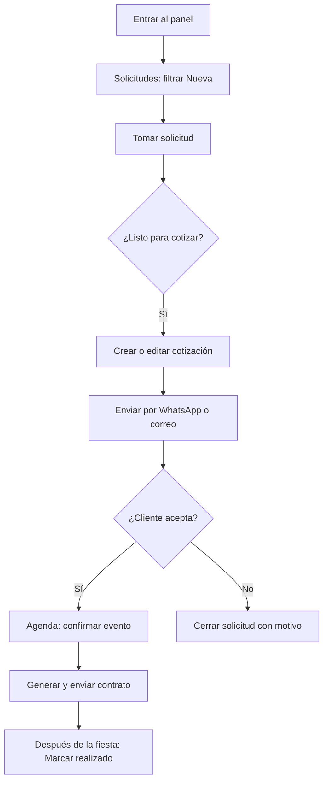

# Manual del operario — Panel Bosque Mágico

**Para:** Equipo comercial y operación  
**Versión:** 1.1  
**Fecha:** 2026-06-11  

Este manual explica **cómo usar el sistema en el día a día**: qué hace cada pantalla, en qué orden trabajar y qué significa cada estado.

---

## 1. Antes de empezar

### 1.1 Acceso al panel

| Entorno | URL del panel |
|---------|---------------|
| **Sandbox (pruebas)** | `https://sandbox-panel-bosque.gcbprojects.site` |
| **Local (solo desarrollo)** | `http://localhost:5174` |

1. Abre la URL en el navegador (Chrome o Edge recomendados).
2. Inicia sesión con tu correo y contraseña.
3. Si no tienes usuario, pide al **administrador** que te cree en **Usuarios** (solo admins).

**Credenciales de prueba (sandbox / local tras seed):**

- Correo: `admin@bosquemagico.test`
- Contraseña: `BosqueDev123!`

> En producción final cada persona tendrá su propia cuenta. No compartas la contraseña de admin.

### 1.2 Qué verás al entrar

- **Barra lateral (izquierda):** menú — Dashboard, Solicitudes, Cotizaciones, Agenda, **Contratos**, Clientes, Configuración, Usuarios (si eres admin).
- **Barra superior:** tu cuenta, indicador **En vivo** (conexión en tiempo real) y **campana** de notificaciones.
- **Contenido central:** listados con filtros y tablas.

**Consejo:** En computadora puedes **colapsar** el menú lateral (flecha en el borde) para ganar espacio; en celular usa el menú hamburguesa o las pestañas inferiores.

### 1.3 Conceptos que debes conocer

| Término en pantalla | Qué es |
|---------------------|--------|
| **Solicitud** | Un interesado en una fiesta (lead). Viene de la web o se crea a mano. |
| **Estado** (solicitud) | Nueva → En atención → Cotizada → Cerrada |
| **Cotización** | La propuesta con precio que envías al cliente |
| **Estado** (cotización) | Borrador → Enviada → Aceptada → Cerrada |
| **Evento** | La fiesta ya vendida, en **Agenda** |
| **Estado** (evento) | Por confirmar → Confirmado → Realizado / Cancelado |
| **Contrato** | Documento formal de la fiesta vendida (después de aceptar cotización) |
| **Estado** (contrato) | Borrador → Enviado → Firmado / Anulado |
| **Cliente** | La persona agrupada por celular o correo (historial de solicitudes) |

**Regla de oro:** casi todo el trabajo se hace desde el **listado**, abriendo un **modal** (ventana encima) sin cambiar de página.

---

## 2. Tu flujo de trabajo diario (resumen)

Sigue este orden cada día:

```text
1. Solicitudes  →  Revisar lo NUEVO y tomar contactos
2. Cotizaciones  →  Enviar propuestas y dar seguimiento
3. Agenda        →  Confirmar fiestas vendidas
4. Contratos     →  Generar, enviar PDF y marcar firmado
5. Clientes      →  Solo cuando necesites historial (recompra, duda)
```



---

## 3. Módulo Solicitudes

**Menú:** Solicitudes  
**Para qué sirve:** Ver y gestionar todos los interesados que llegan (web, manual, etc.).

### 3.1 Pantalla principal

- **Filtros (arriba de la tabla):** tarjeta “Filtros” — busca por nombre, celular o correo; filtra por **Estado**; botón refrescar.
- **Tabla:** cada fila es una solicitud.
- **Al final de la fila:** iconos rápidos (WhatsApp, correo, ver detalle, etc.).

### 3.2 Estados de una solicitud

| Estado | Qué significa | Qué debes hacer |
|--------|---------------|-----------------|
| **Nueva** | Nadie la ha tomado aún | Revisar y **Tomar solicitud** |
| **En atención** | Ya hay un responsable / en gestión | Llamar, WhatsApp, registrar seguimiento |
| **Cotizada** | Ya hay cotización vinculada | Seguir en módulo Cotizaciones |
| **Cerrada** | Ya no se gestiona comercialmente | Solo consultar; revisar motivo de cierre |

### 3.3 Crear solicitud manual

Cuando el cliente llama o escribe y **no** pasó por la web:

1. En Solicitudes, pulsa **Nueva solicitud** (botón superior).
2. Completa: nombre, celular, correo (al menos uno de contacto), fecha tentativa, turno, número de niños, notas.
3. Guarda.
4. La solicitud aparece en estado **Nueva** — tómala cuando empieces a gestionarla.

### 3.4 Tomar una solicitud

1. Localiza la fila (filtro **Nueva** ayuda).
2. Pulsa **Tomar solicitud** (en la fila o dentro del detalle).
3. Confirma.
4. El estado pasa a **En atención**.

> Tomar una solicitud indica que **tú** (o tu turno) la está gestionando.

### 3.5 Ver detalle de una solicitud

Puedes abrir el detalle de dos formas:

- Clic en el **nombre** del contacto, o
- Icono **Ver** al final de la fila.

Se abre un **modal grande** con:

- Datos de contacto (WhatsApp / correo desde ahí)
- **Fecha y hora de registro** de la solicitud
- Canal de origen (landing, manual, etc.)
- Información del cotizador (si vino de la web)
- **Seguimiento:** notas y fecha de próximo contacto
- **Bitácora:** historial de acciones
- Botones: tomar, cerrar, crear cotización, ver/editar cotización, **editar solicitud**

El listado queda detrás; al cerrar el modal **no pierdes** los filtros que tenías.

### 3.6 Editar datos del lead (solicitud)

Si el cliente corrige teléfono, fecha o número de niños:

1. Abre el detalle de la solicitud.
2. Pulsa **Editar solicitud** (o equivalente en sección Seguimiento).
3. Modifica: nombre, celular, correo, fecha tentativa, turno, niños, notas, próximo seguimiento.
4. Guarda.

> Esto edita la **solicitud**, no la cotización. Para cambiar precios o paquete, edita la **cotización**.

### 3.7 Registrar seguimiento

Después de llamar o escribir:

1. En el detalle, sección **Seguimiento**.
2. Escribe **notas** (qué dijo el cliente, acuerdos).
3. Opcional: **Próximo seguimiento** (fecha/hora para recordar).
4. Guarda.

### 3.8 Cerrar una solicitud

Cuando el cliente **no continúa** (precio, fecha, eligió otro lugar, no responde, etc.):

1. Abre el detalle o usa la acción en la fila.
2. Pulsa **Cerrar solicitud**.
3. Elige el **motivo** (pérdida, sin respuesta, duplicada, otro).
4. Confirma.
5. Estado → **Cerrada**.

### 3.9 Posible duplicado

Si la misma persona envió el formulario otra vez en las últimas **24 horas**, verás una **alerta de posible duplicado**.

**Qué hacer:**

1. Busca al contacto en **Clientes** por celular o correo.
2. Revisa si ya hay cotización o solicitud abierta.
3. Cierra la duplicada con motivo **duplicada** o continúa la gestión en el registro correcto.

### 3.10 Pasar a cotización desde una solicitud

| Situación | Acción |
|-----------|--------|
| Vino de la web con datos completos | Puede existir **borrador automático** — usa **Ver cotización** o **Editar borrador** |
| Solo hay solicitud, sin cotización | **Crear cotización** o **Completar cotización** |
| Borrador incompleto | **Editar borrador** y luego enviar |

---

## 4. Módulo Cotizaciones

**Menú:** Cotizaciones  
**Para qué sirve:** Armar la propuesta, enviarla al cliente y registrar si aceptó.

### 4.1 Estados de una cotización

| Estado | Qué significa | Qué debes hacer |
|--------|---------------|-----------------|
| **Borrador** | Aún no se envió al cliente | Revisar montos, ítems, total; editar si hace falta |
| **Enviada** | El cliente ya recibió la propuesta | Seguimiento; puede aceptar por link |
| **Aceptada** | Cliente aceptó (web o panel) | Revisar **Agenda** — ya hay evento |
| **Cerrada** | No continúa (futuro: motivo formal) | Solo consulta |

### 4.2 Crear cotización

**Desde Solicitudes:**

1. Abre la solicitud en detalle.
2. **Crear cotización** (si no existe).

**Desde Cotizaciones:**

1. Botón **Nueva cotización** (manual, eligiendo solicitud si aplica).

Completa: paquete, fecha, turno, cantidad de niños, ítems adicionales. El **total** lo calcula el sistema según tarifas en Configuración.

### 4.3 Editar un borrador

Si necesitas cambiar paquete, ítems o cantidades:

1. En Solicitudes o Cotizaciones, **Editar borrador**.
2. Se abre el formulario completo de cotización (más espacio que el modal corto).
3. Guarda.
4. Vuelve a revisar el **total** antes de enviar.

### 4.4 Revisar detalle de cotización

- Clic en código/número o icono **Ver**.
- Modal con: cliente, montos (base, extras, ítems), total, estado, bitácora.
- Acciones: enviar, copiar link, PDF, aceptar (panel), editar borrador.

### 4.5 Enviar cotización al cliente

**Importante:** hasta que **envíes**, la cotización sigue en **Borrador** y el cliente **no puede aceptar** por el link público.

**Por WhatsApp:**

1. En detalle o fila, **Enviar por WhatsApp**.
2. Revisa el **mensaje** en el modal previo (texto + link).
3. Confirma — se abre WhatsApp (`wa.me`) con el mensaje listo (si el navegador bloquea pop-ups, permite ventanas emergentes para el panel).
4. Envía desde tu WhatsApp al cliente.
5. La cotización pasa a **Enviada**.

**Por correo:**

1. **Enviar por correo**.
2. Confirma.
3. La cotización pasa a **Enviada**.

### 4.6 Copiar link público

1. En el detalle, **Copiar link**.
2. Pégalo en WhatsApp, correo o donde prefieras.

**Cuándo puede el cliente aceptar por el link:**

| Estado cotización | ¿Puede aceptar en la web? |
|-------------------|---------------------------|
| Borrador | **No** — mensaje en landing: aún no enviada |
| Enviada | **Sí** |
| Aceptada | **No** — ya fue aceptada |
| Cerrada | **No** |

> Copiar el link en borrador sirve para **previsualizar**, no para que el cliente confirme la fiesta.

### 4.7 Descargar PDF

1. Abre detalle de cotización.
2. **Descargar PDF**.
3. Se abre vista imprimible con logo Bosque Mágico.
4. En el navegador: **Imprimir** → **Guardar como PDF** (o envía a impresora).

Útil si el cliente pide la propuesta por archivo o quieres revisar antes de enviar.

### 4.8 Cliente acepta por la web

1. El cliente abre el link (`/cotizacion/...` en la **landing**).
2. Revisa resumen y pulsa **Aceptar cotización**.
3. En el panel: cotización → **Aceptada**; en **Agenda** aparece evento **Por confirmar**.

**Tú no tienes que crear el evento a mano** — el sistema lo hace al aceptar.

### 4.9 Aceptar desde el panel (en nombre del cliente)

Si el cliente confirmó por teléfono o WhatsApp pero no usó el link:

1. Abre la cotización (**debe estar Enviada**).
2. **Aceptar cotización**.
3. Confirma.
4. Revisa **Agenda**.

### 4.10 Doble reserva (fecha y turno)

Si otro evento ya ocupó la misma **fecha + turno**, al aceptar verás un **error**. Debes:

1. Contactar al cliente para otra fecha/turno, o
2. Revisar Agenda y resolver el conflicto con gerencia.

---

## 5. Módulo Agenda

**Menú:** Agenda  
**Para qué sirve:** Gestionar las fiestas **ya vendidas** (cotización aceptada).

### 5.1 Vistas

| Vista | Uso |
|-------|-----|
| **Lista** | Rango de fechas, tabla de eventos |
| **Mes** | Calendario; clic en un día muestra eventos de ese día (fechas en horario **Lima**) |

Filtra por **Estado** si necesitas ver solo “Por confirmar”, etc.

### 5.2 Estados del evento

| Estado | Qué significa | Acción |
|--------|---------------|--------|
| **Por confirmar** | Recién creado al aceptar cotización | Verificar fecha, turno, datos; **Confirmar evento** |
| **Confirmado** | Fiesta aprobada para operar | Coordinar logística; el día de la fiesta → **Marcar realizado** |
| **Realizado** | Fiesta ya pasó | Archivo operativo |
| **Cancelado** | No se realizará | Usar **Cancelar** con motivo |

### 5.3 Confirmar un evento

1. Busca el evento (filtro **Por confirmar** o fecha en calendario).
2. Abre **detalle** (modal).
3. Revisa: cliente, fecha, turno, niños, notas.
4. **Confirmar evento**.
5. Estado → **Confirmado**.
6. Opcional: **Generar contrato** desde el mismo detalle (ver sección 6).

### 5.4 Marcar como realizado

**Después** de que la fiesta se llevó a cabo:

1. Abre el evento en estado **Confirmado**.
2. **Marcar realizado**.
3. Estado → **Realizado**.

### 5.5 Cancelar un evento

Si el cliente cancela o se reprograma fuera del sistema:

1. Abre el evento (**Por confirmar** o **Confirmado**).
2. **Cancelar evento**.
3. Indica motivo si se pide.
4. Estado → **Cancelado**.

> Cancelar el evento **no** borra la cotización aceptada en historial; consulta con gerencia si debes cerrar también la solicitud.

---

## 6. Módulo Contratos

**Menú:** Contratos  
**Para qué sirve:** Formalizar la fiesta vendida con un documento PDF (datos del cliente, servicios, adelantos, términos y condiciones).

### 6.1 Cuándo generar un contrato

| Situación | Acción |
|-----------|--------|
| Cotización **Aceptada** y evento en Agenda | Puedes generar contrato |
| Evento **Cancelado** | No se puede generar contrato |
| Ya existe contrato para el evento | Editar solo si está en **Borrador** |

**Dónde generarlo:**

- Desde **Agenda** → detalle del evento → **Generar contrato**, o
- Desde **Contratos** → buscar el contrato ya creado.

### 6.2 Estados de un contrato

| Estado | Qué significa | Qué debes hacer |
|--------|---------------|-----------------|
| **Borrador** | Creado pero no enviado al cliente | Revisar datos, adelantos y horario; editar si hace falta |
| **Enviado** | Ya se compartió con el cliente (WhatsApp o PDF) | Seguimiento; esperar firma/confirmación |
| **Firmado** | Cliente confirmó (fuera del sistema o con documento firmado) | Solo consulta |
| **Anulado** | Ya no aplica | Solo consulta |

### 6.3 Generar contrato (primera vez)

1. Abre el **evento** en Agenda (debe tener cotización aceptada).
2. Pulsa **Generar contrato**.
3. Completa en el modal:
   - **DNI o RUC** del cliente (y tipo de comprobante: boleta o factura).
   - **Horario** de inicio y fin (se sugiere según el turno del evento).
   - **Adelanto(s):** por defecto S/ 500; puedes registrar segundo adelanto si aplica.
   - Fechas de los adelantos.
4. Revisa la **vista previa** del PDF si lo deseas.
5. Guarda → el contrato queda en **Borrador** con un número tipo `BM-CT-00001`.

> El sistema **congela** los datos de la cotización (paquete, ítems, total) en el contrato. Si cambias la cotización después, el contrato ya generado no se altera.

### 6.4 Enviar contrato al cliente

**Por WhatsApp:**

1. Abre el contrato (desde Agenda o módulo Contratos).
2. **Enviar por WhatsApp** (con o sin abrir PDF antes).
3. Se abre WhatsApp con mensaje preparado (número, cliente, fecha, total, adelanto).
4. Si estaba en Borrador, pasa automáticamente a **Enviado**.
5. Envía desde tu WhatsApp; opcionalmente adjunta el PDF que imprimiste.

**Imprimir / PDF:**

1. **Imprimir / PDF** en el detalle del contrato.
2. Se abre vista imprimible con logo, servicios, términos y condiciones.
3. En el navegador: **Imprimir** → **Guardar como PDF**.

### 6.5 Marcar contrato firmado

Cuando el cliente devuelve el contrato firmado o confirma por escrito:

1. Abre el contrato (**Borrador** o **Enviado**).
2. Pulsa **Marcar firmado**.
3. Estado → **Firmado**.

> Esto **no** es firma electrónica legal; es registro interno de que el cliente aceptó los términos.

### 6.6 Listado de contratos

En **Contratos** puedes:

- Buscar por número, cliente, celular o código de cotización.
- Filtrar por **Estado**.
- Abrir detalle en modal (igual que otros módulos).
- Ver bitácora de acciones.

---

## 7. Módulo Clientes

**Menú:** Clientes  
**Para qué sirve:** Ver el **historial** de una persona (no para el flujo diario de leads nuevos).

### 7.1 Cuándo usarlo

- El cliente **vuelve a escribir** y quieres saber si ya cotizó antes.
- Dudas sobre **duplicados**.
- Quieres ver **cuántas solicitudes** ha hecho una familia.

### 7.2 Pasos

1. Busca por **nombre, celular o correo** en filtros.
2. Abre detalle (modal): total de solicitudes, primera/última solicitud, listado histórico, cotizaciones vinculadas.
3. Contacta por **WhatsApp** o **correo** desde la fila o el modal.
4. **Copiar enlace** del cliente para compartir con un compañero (`clientes?detalle=...`).

**No confundir:** un lead nuevo se trabaja primero en **Solicitudes**; Clientes es la **ficha consolidada**.

---

## 8. Configuración (solo admin o permisos altos)

**Menú:** Configuración  

| Pestaña | Quién edita | Contenido |
|---------|-------------|-----------|
| **Tarifas** | Admin | Precios base, extras, límites de niños |
| **Turnos** | Admin | Nombre y horario de turno 1, 2, 3 |
| **Catálogo** | Admin o manage | Productos/servicios, fotos, activar/desactivar |

**Guardar cambios:**

1. Modifica valores.
2. Abajo aparece barra **Guardar cambios** (solo si hay cambios pendientes).
3. Pulsa guardar — los nuevos precios aplican a **cotizaciones nuevas** (revisa borradores viejos).

Si solo tienes permiso **view**, verás Configuración en lectura o no verás tarifas.

---

## 9. Usuarios (solo administrador)

**Menú:** Usuarios  

- Crear cuenta para nuevo vendedor.
- Asignar permisos: **view** (consultar), **manage** (operar), **admin** (todo + config + usuarios).
- Editar o desactivar usuarios.

Los vendedores del día a día **no** necesitan entrar aquí.

---

## 10. Notificaciones y tiempo real

### 10.1 Indicador “En vivo”

En la barra superior, si aparece conectado, el panel recibe **actualizaciones automáticas** (nueva solicitud, cotización enviada, etc.).

### 10.2 Campana

- Clic en la **campana** → lista de avisos recientes.
- Al hacer clic en un aviso, te lleva al módulo correspondiente.
- Si no ves algo nuevo, usa **refrescar** en los filtros del listado.

---

## 11. Landing (lo que ve el cliente)

**URL sandbox:** `https://sandbox-landing-bosque.gcbprojects.site`

El cliente:

1. Navega paquetes, shows, catering.
2. Usa el **cotizador** (fecha, turno, niños, opciones).
3. Envía → crea **solicitud** en el panel (y a veces **borrador de cotización**).
4. Recibe link de cotización por ti → abre **página pública** → puede **Aceptar**.

**Tú no gestionas la landing** en el día a día; solo debes saber que ahí entran los leads automáticos.

---

## 12. Casos prácticos paso a paso

### Caso A — Lead nuevo desde la web

1. **Solicitudes** → filtro **Nueva**.
2. Abre detalle → revisa fecha, turno, niños, notas del cotizador.
3. **Tomar solicitud**.
4. Contacta por WhatsApp (icono en fila).
5. Si hay borrador: **Editar borrador** → revisa total → **Enviar por WhatsApp**.
6. Cuando el cliente acepte en el link (o tú **Aceptar** en panel) → **Agenda** → **Confirmar evento** → **Generar contrato** → enviar PDF/WhatsApp.

### Caso B — Cliente llamó por teléfono

1. **Nueva solicitud** manual con sus datos.
2. **Tomar solicitud**.
3. **Crear cotización** → completar paquete e ítems.
4. **Enviar** por WhatsApp o correo.
5. Seguimiento en **Cotizaciones** (filtro **Enviada**).

### Caso C — Cliente dice que ya pagó / confirmó por WhatsApp

1. Verifica que la cotización esté **Enviada**.
2. Si no aceptó por link: **Aceptar cotización** en panel.
3. **Agenda** → confirma fecha y **Confirmar evento**.
4. **Generar contrato** → enviar PDF o WhatsApp → **Marcar firmado** cuando el cliente devuelva confirmación.

### Caso D — Cliente no responde después de 3 intentos

1. Registra cada intento en **notas de seguimiento**.
2. **Cerrar solicitud** → motivo **sin respuesta** (o el que aplique).
3. Si había cotización en borrador sin enviar, puede quedarse en borrador (consulta con gerencia).

### Caso E — Misma mamá envió el formulario dos veces

1. Fíjate en alerta **posible duplicado**.
2. **Clientes** → busca por celular.
3. Gestiona una sola solicitud; cierra la otra como **duplicada**.

### Caso F — Día después de la fiesta

1. **Agenda** → filtro **Confirmado** o busca la fecha.
2. **Marcar realizado**.

### Caso G — Enviar contrato después de confirmar evento

1. **Agenda** → abre evento **Confirmado** (o **Por confirmar** si ya aceptó cotización).
2. **Generar contrato** → completa DNI/RUC, adelantos y horario.
3. **Imprimir / PDF** para revisar antes de enviar.
4. **Enviar por WhatsApp** → el cliente recibe mensaje con resumen.
5. Cuando confirme por escrito → **Marcar firmado** en módulo Contratos.

---

## 13. Errores frecuentes y qué hacer

| Problema | Causa probable | Solución |
|----------|----------------|----------|
| El cliente no puede aceptar el link | Cotización aún en **Borrador** | **Enviar** primero (WhatsApp o correo) |
| “No se puede aceptar” en link | Ya **Aceptada** o **Cerrada** | Revisar Agenda; no hace falta volver a aceptar |
| No aparece evento en Agenda | Cotización no aceptada | Aceptar cotización (cliente o panel) |
| Error al aceptar: slot ocupado | Misma fecha + turno ya reservada | Cambiar fecha/turno con el cliente |
| No veo solicitudes nuevas | Filtros activos | Limpiar filtros; revisar campana; refrescar |
| WhatsApp no abre al enviar cotización o contrato | Bloqueador de ventanas | Permitir pop-ups para el panel; reintentar (el sistema preabre pestaña al enviar) |
| No puedo generar contrato | Evento cancelado o cotización no aceptada | Verificar que la cotización esté **Aceptada** y el evento activo |
| Contrato en borrador sin enviar | Falta acción del vendedor | **Enviar por WhatsApp** o compartir PDF manualmente |
| Total de cotización “raro” | Tarifas cambiadas o datos incompletos | Revisar Configuración (admin); editar borrador |
| No puedo editar tarifas | Permiso solo **view** o **manage** | Pedir a admin |

---

## 14. Buenas prácticas del equipo

1. **Toma** la solicitud antes de llamar — evita que dos personas gestionen el mismo lead.
2. **Anota** cada contacto en seguimiento — la bitácora ayuda si cambia el turno.
3. **Envía** la cotización solo cuando el total esté revisado — después el cliente puede aceptar solo.
4. **Genera el contrato** después de confirmar el evento, no antes de que el cliente acepte la cotización.
5. **No marques realizado** antes del día de la fiesta.
6. Usa **Clientes** para contexto, **Solicitudes** para trabajar el lead del día.
7. En sandbox, prueba el flujo completo (incluido contrato) una vez por semana hasta el go-live.

---

## 15. Glosario rápido

| Palabra | Significado |
|---------|-------------|
| Lead | Interesado; en el panel = **Solicitud** |
| Borrador | Cotización en preparación, no enviada |
| Link público | URL que ve el cliente para leer y aceptar |
| Modal | Ventana que se abre encima del listado |
| Contrato | Documento formal PDF vinculado al evento vendido |
| Adelanto | Pago inicial registrado en contrato (referencial S/ 500) |
| Snapshot | Copia congelada de la cotización al generar el contrato |
| Bitácora | Historial de quién hizo qué y cuándo |
| Slot | Combinación fecha + turno en Agenda |
| Seed / demo | Datos de prueba en sandbox (no son clientes reales) |

---

## 16. Ayuda y referencias

| Necesitas… | Documento |
|------------|-----------|
| Visión para gerencia | `.docs/entrega-junio-2026/01-INFORME-GERENCIA.md` |
| Pruebas en sandbox | `.docs/PRUEBAS_CASOS_USO_LOCAL_SANDBOX.md` |
| Flujos con diagramas | `.docs/BOSQUE_FLUJOS_Y_GUIA_USO.md` |

Si algo del panel no coincide con este manual (botón renombrado, pantalla nueva), avisa al administrador o al equipo técnico para actualizar la guía.

---

*Manual operativo — Bosque Mágico. Última revisión: 2026-06-11.*
